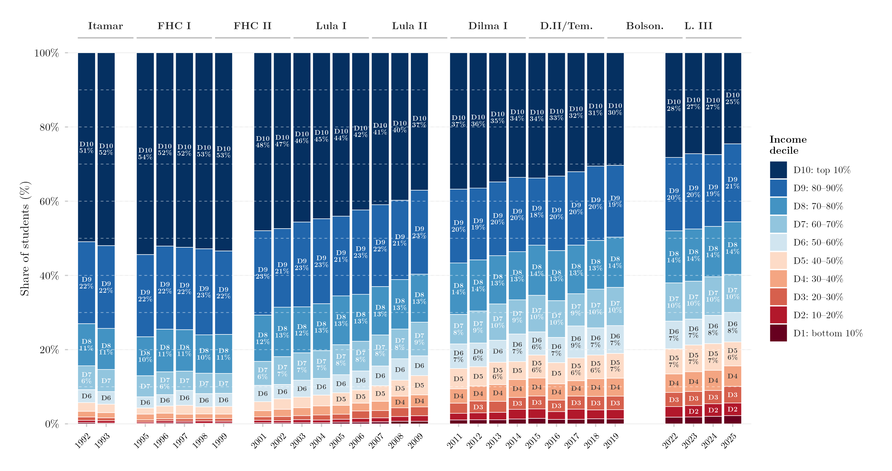

## Visão Geral

Esta figura mostra como a composição por renda dos estudantes brasileiros de 18 a 64 anos que já ingressaram no ensino superior mudou ao longo do tempo. Cada barra é um ano, empilhado em dez decis de renda da população geral (D1 = decil mais pobre, D10 = mais rico); a altura de cada segmento é a participação daquele decil entre as pessoas que já ingressaram no ensino superior alguma vez. Uma pilha mais equilibrada — mais próxima de 10% por decil — indica acesso mais distribuído ao longo da distribuição de renda, enquanto segmentos dominados pelos decis superiores indicam acesso concentrado entre domicílios de renda mais alta. Usar toda a faixa etária ativa (18–64), em vez da coorte tradicional de idade universitária, também captura o acesso obtido mais tarde na vida.

## Metodologia

Cada barra mostra a proporção de estudantes de 18 a 64 anos vinda de cada decil de renda. Variável: `ens_sup` = já ingressou no ensino superior alguma vez. Os decis de renda são calculados dentro de cada ano de pesquisa via `Hmisc::wtd.quantile`, usando os pesos amostrais. Os anos 2000 e 2010 são excluídos porque não houve PNAD em anos de Censo; 2020–2021 são excluídos por causa da COVID-19 e do Auxílio Emergencial, que distorceu a distribuição de renda. Para 2012–2015, usam-se apenas observações da PNAD Anual, para evitar contagem dupla nos anos de sobreposição PNAD/PNADC. Rótulos percentuais são exibidos para decis com participação ≥ 6%; apenas o rótulo do decil (sem percentual) para participações ≥ 3%. As linhas horizontais tracejadas indicam equidade perfeita (cada decil = 10%). Os rótulos de governo indicam o presidente em exercício.

## Como Citar

Se você usar esta figura ou o pipeline que a gera, cite tanto a dissertação quanto esta análise específica. As referências seguem a 7ª edição da APA.

**Dissertação (em elaboração; a entrada será atualizada após a defesa):**

> Mançano, T. (2026). *Inequality in access to tertiary education in Brazil: Household incomes, reforming policies, and the politics of who gets in (1990s–2020s)* [Dissertação de mestrado não publicada]. Universidade de São Paulo.

**Esta figura e o pipeline:**

> Mançano, T. (2026, 9 de agosto). *Composição por renda dos estudantes do ensino superior (18–64 anos)* [Figura e pipeline reprodutível]. Open Data Analysis. https://mancano-tales.github.io/open-data-analysis/pt/posts-pt/composicao-decil-ens-sup-18-64/

**No texto:** (Mançano, 2026) — ao citar várias análises deste catálogo no mesmo trabalho, a APA as distingue como 2026a, 2026b, … na ordem em que aparecem na lista de referências.

**BibTeX:**

```bibtex
@mastersthesis{Mancano2026Thesis,
  author = {Man\c{c}ano, Tales},
  title  = {Inequality in Access to Tertiary Education in Brazil: Household
            Incomes, Reforming Policies, and the Politics of Who Gets In
            (1990s--2020s)},
  school = {University of S\~{a}o Paulo},
  year   = {2026},
  type   = {Master's thesis},
  note   = {Unpublished; Graduate Program in Political Science}
}

@misc{Mancano2026_composicao_decil_ens_sup_18_64_pt,
  author       = {Man\c{c}ano, Tales},
  title        = {Composi\c{c}\~{a}o por renda dos estudantes do ensino superior (18--64 anos)},
  year         = {2026},
  month        = aug,
  howpublished = {Open Data Analysis, \url{https://mancano-tales.github.io/open-data-analysis/pt/posts-pt/composicao-decil-ens-sup-18-64/}},
  note         = {Figura e pipeline reprodutível. Código-fonte: \url{https://github.com/mancano-tales/open-data-analysis}, pasta posts-pt/composicao-decil-ens-sup-18-64/. Acesso em AAAA-MM-DD}
}
```

Uma versão permanente (tag do Git + DOI no Zenodo) será linkada aqui assim que a dissertação for defendida; até lá, cite a URL da página acima e acrescente a data de acesso (código-fonte: https://github.com/mancano-tales/open-data-analysis, pasta `posts-pt/composicao-decil-ens-sup-18-64/`).

## Pipeline

Esta figura usa o painel da [Harmonização PNAD / PNAD Contínua, 1992–2025](../harmonizacao-pnad-pnadc/).

Rode estes scripts nesta ordem, a partir da raiz do projeto (cada um grava em `data-raw/`, de onde o seguinte lê):

1. [`shared-pipeline/pnadc/000_PNADC_Download_Consolidate.R`](../../shared-pipeline/pnadc/000_PNADC_Download_Consolidate.R) — baixa a PNAD Contínua 2012–2025 (1ª entrevista) com `PNADcIBGE::get_pnadc()` para `data-raw/pnadc_raw/` e a consolida em `data-raw/pnadc_consolidado_2012_2025_interview1.rds`
2. [`shared-pipeline/pnadc/020_PNAD_Anual_Manual_Import_2001_2015.R`](../../shared-pipeline/pnadc/020_PNAD_Anual_Manual_Import_2001_2015.R) — baixa os microdados da PNAD Anual 2001–2015 do FTP do IBGE para `data-raw/pnad_anual_raw/` e os importa em `data-raw/harmonizing-br-data/output/PNAD_Anual_2001_2015.parquet`
3. [`shared-pipeline/pnadc/050_PNAD_Historica_Manual_Import_1992_1999.R`](../../shared-pipeline/pnadc/050_PNAD_Historica_Manual_Import_1992_1999.R) — o mesmo para a PNAD Anual 1992–1999 (`PNAD_Anual_1992_1999.parquet`)
4. [`shared-pipeline/pnadc/035_Splice_Microdados.R`](../../shared-pipeline/pnadc/035_Splice_Microdados.R) — emenda PNAD Anual e PNAD Contínua no painel harmonizado — `Microdados_Todas_Idades_1992_2025.parquet` e `Microdados_Jovens_18_24_1992_2025.parquet` em `data-raw/harmonizing-br-data/output/` (carrega `shared-pipeline/utils/codigos_curso_pnad.R`)
5. [`plot.R`](../../posts/composicao-decil-ens-sup-18-64/plot.R) — lê `Microdados_Jovens_18_24_1992_2025.parquet` e `Microdados_Todas_Idades_1992_2025.parquet`; grava a figura em `output/figures/composicao-decil-ens-sup-18-64/` — compare com o `thumbnail.png` deste post

Todas as etapas upstream acima são Tier A e também são executadas, nesta mesma ordem, por [`shared-pipeline/build_public_data.R`](../../shared-pipeline/build_public_data.R).

## Reprodutibilidade

**Tier: A**

Este pipeline usa apenas dados públicos, acessíveis via pacote/API sem necessidade de credencial (PNADcIBGE, censobr, sidrar, ipeadatar). Rode os scripts em `shared-pipeline/` na ordem numérica para reconstruir os dados intermediários.
