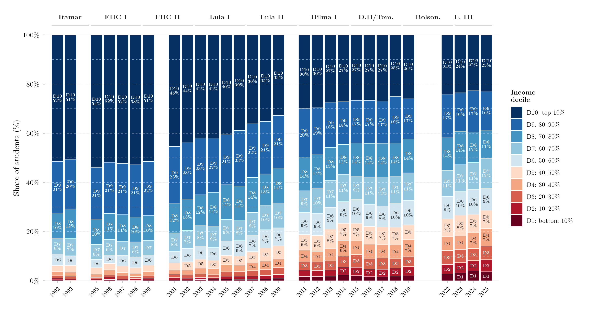

## Visão Geral

Esta figura mostra como a composição por renda dos estudantes brasileiros de 18 a 24 anos atualmente matriculados no ensino superior mudou ao longo do tempo. Cada barra é um ano, empilhado em dez decis de renda da população geral (D1 = decil mais pobre, D10 = mais rico); a altura de cada segmento é a participação daquele decil entre os matriculados atuais. Por restringir-se à matrícula ativa, e não ao acesso alguma vez ao ensino superior, esta figura exclui coortes que já concluíram ou abandonaram o curso, dando um retrato mais atual de quem está em sala de aula agora.

## Metodologia

Cada barra mostra a proporção de matriculados ativos de 18 a 24 anos vinda de cada decil de renda. Variável: `ens_sup_a` = matriculado atualmente (ativamente) no ensino superior. Os decis de renda são calculados dentro de cada ano de pesquisa via `Hmisc::wtd.quantile`, usando os pesos amostrais. Os anos 2000 e 2010 são excluídos porque não houve PNAD em anos de Censo; 2020–2021 são excluídos por causa da COVID-19 e do Auxílio Emergencial, que distorceu a distribuição de renda. Para 2012–2015, usam-se apenas observações da PNAD Anual, para evitar contagem dupla nos anos de sobreposição PNAD/PNADC. Rótulos percentuais são exibidos para decis com participação ≥ 6%; apenas o rótulo do decil (sem percentual) para participações ≥ 3%. As linhas horizontais tracejadas indicam equidade perfeita (cada decil = 10%). Os rótulos de governo indicam o presidente em exercício.

## Pipeline

Scripts desta análise:

- Plotagem: [`plot.R`](../../posts/composicao-decil-ens-sup-a-18-24/plot.R)
- Pipeline upstream:
  - [`shared-pipeline/pnadc/000_PNADC_Download_Consolidate.R`](../../shared-pipeline/pnadc/000_PNADC_Download_Consolidate.R)
  - [`shared-pipeline/pnadc/020_PNAD_Anual_Manual_Import_2001_2015.R`](../../shared-pipeline/pnadc/020_PNAD_Anual_Manual_Import_2001_2015.R)
  - [`shared-pipeline/pnadc/021_PNAD_Anual_Import_Com_Renda_Zero.R`](../../shared-pipeline/pnadc/021_PNAD_Anual_Import_Com_Renda_Zero.R)
  - [`shared-pipeline/pnadc/050_PNAD_Historica_Manual_Import_1992_1999.R`](../../shared-pipeline/pnadc/050_PNAD_Historica_Manual_Import_1992_1999.R)
  - [`shared-pipeline/pnadc/035_Splice_Microdados.R`](../../shared-pipeline/pnadc/035_Splice_Microdados.R)

## Reprodutibilidade

**Tier: A**

Este pipeline usa apenas dados públicos, acessíveis via pacote/API sem necessidade de credencial (PNADcIBGE, censobr, sidrar, ipeadatar). Rode os scripts em `shared-pipeline/` na ordem numérica para reconstruir os dados intermediários.
