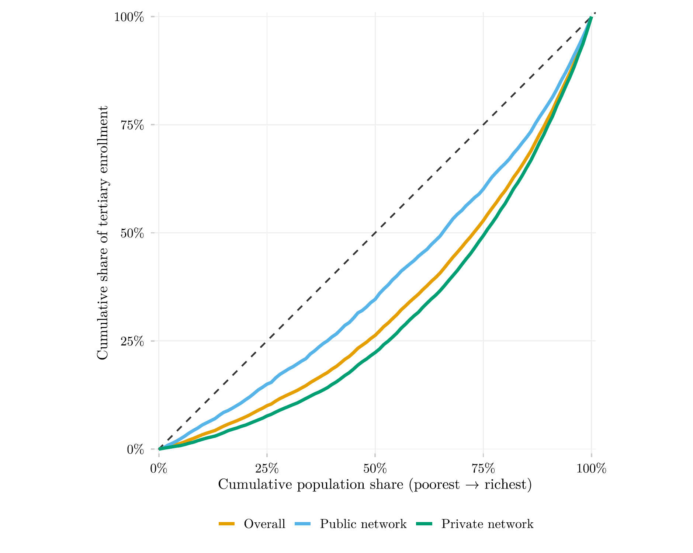

## Visão Geral

Esta figura compara curvas de concentração de renda para a matrícula geral no ensino superior contra a matrícula especificamente na rede pública e especificamente na rede privada, para jovens de 18 a 24 anos, agrupando os anos mais recentes e estáveis (2022–2024). Ela mostra qual dos dois setores recruta mais fortemente entre domicílios de renda mais alta.

## Metodologia

As curvas mostram, para cada rede, a participação acumulada dos estudantes atualmente matriculados no ensino superior explicada pelos p% mais pobres da população de 18 a 24 anos, ordenada por renda domiciliar per capita dentro de cada ano. Quanto mais próxima a curva estiver da linha de 45 graus, mais equilibradamente distribuído está o acesso àquela rede ao longo da distribuição de renda; curvas que se afastam abaixo da diagonal indicam concentração nos decis de renda mais alta. A curva agrupada é uma média simples das curvas específicas de 2022, 2023 e 2024 (cada uma reamostrada numa grade percentual uniforme de 101 pontos), de modo que cada ano contribui igualmente independentemente do tamanho da amostra. O índice de concentração de Erreygers é calculado ano a ano para os mesmos três anos. A variável de rede usada é V3002A (PNADC do IBGE), e não a variável de rede derivada de V3004 usada em outras partes deste projeto, já que V3004 nunca cobre estudantes do ensino superior em nenhum ano; V3002A é sua substituta a partir de 2015, com codificação invertida (1 = privada, 2 = pública) em relação à convenção de V3004.

## Como Citar

Se você usar esta figura ou o pipeline que a gera, cite tanto a dissertação quanto este repositório.

**Dissertação:**

> Mançano, Tales. 2026. *Inequality in Access to Tertiary Education in Brazil: Household Incomes, Reforming Policies, and the Politics of Who Gets In (1990s–2020s)*. Dissertação de Mestrado, Programa de Pós-Graduação em Ciência Política, Universidade de São Paulo.

```bibtex
@mastersthesis{Mancano2026,
  author = {Man\c{c}ano, Tales},
  title  = {Inequality in Access to Tertiary Education in Brazil: Household
            Incomes, Reforming Policies, and the Politics of Who Gets In
            (1990s--2020s)},
  school = {University of S\~{a}o Paulo},
  year   = {2026},
  type   = {Master's thesis},
  note   = {Graduate Program in Political Science}
}
```

**Esta figura e o pipeline:**

> Mançano, Tales. 2026. "Concentração de Renda na Matrícula do Ensino Superior por Tipo de Rede." Em *Open Data Analysis*. <https://github.com/mancano-tales/open-data-analysis>, `posts-pt/concentracao-rede-publica-privada/`.

```bibtex
@misc{Mancano2026OpenDataAnalysis,
  author       = {Man\c{c}ano, Tales},
  title        = {Open Data Analysis: Concentração de Renda na Matrícula do Ensino Superior por Tipo de Rede},
  year         = {2026},
  howpublished = {\url{https://github.com/mancano-tales/open-data-analysis}},
  note         = {posts/concentracao-rede-publica-privada/}
}
```

Uma versão permanente (tag do Git + DOI no Zenodo) será linkada aqui assim que a dissertação for defendida; até lá, cite a URL do repositório acima.

## Pipeline

Scripts desta análise:

- Plotagem: [`plot.R`](../../posts/concentracao-rede-publica-privada/plot.R) — script autocontido: baixa e processa os microdados diretamente, sem depender de outros scripts deste repositório.
- Fonte de dado de referência: [`shared-pipeline/pnadc/000_PNADC_Download_Consolidate.R`](../../shared-pipeline/pnadc/000_PNADC_Download_Consolidate.R)

## Reprodutibilidade

**Tier: A**

Este pipeline usa apenas dados públicos, acessíveis via pacote/API sem necessidade de credencial (PNADcIBGE, censobr, sidrar, ipeadatar). Rode os scripts em `shared-pipeline/` na ordem numérica para reconstruir os dados intermediários.
