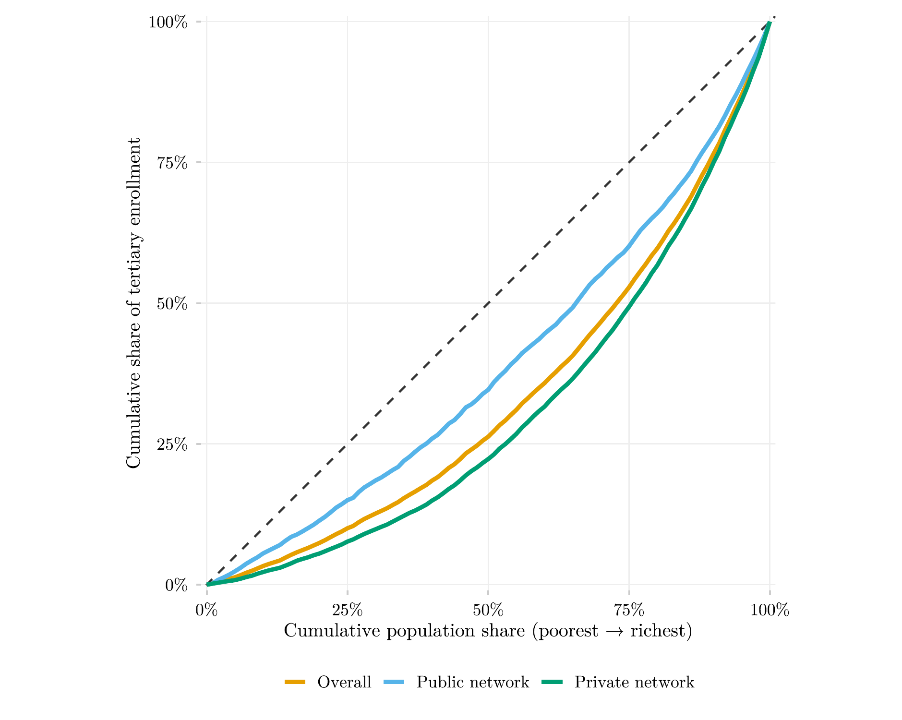

## Visão Geral

Esta figura compara curvas de concentração de renda para a matrícula geral no ensino superior contra a matrícula especificamente na rede pública e especificamente na rede privada, para jovens de 18 a 24 anos, agrupando os anos mais recentes e estáveis (2022–2024). Ela mostra qual dos dois setores recruta mais fortemente entre domicílios de renda mais alta.

## Metodologia

As curvas mostram, para cada rede, a participação acumulada dos estudantes atualmente matriculados no ensino superior explicada pelos p% mais pobres da população de 18 a 24 anos, ordenada por renda domiciliar per capita dentro de cada ano. Quanto mais próxima a curva estiver da linha de 45 graus, mais equilibradamente distribuído está o acesso àquela rede ao longo da distribuição de renda; curvas que se afastam abaixo da diagonal indicam concentração nos decis de renda mais alta. A curva agrupada é uma média simples das curvas específicas de 2022, 2023 e 2024 (cada uma reamostrada numa grade percentual uniforme de 101 pontos), de modo que cada ano contribui igualmente independentemente do tamanho da amostra. O índice de concentração de Erreygers é calculado ano a ano para os mesmos três anos. A variável de rede usada é V3002A (PNADC do IBGE), e não a variável de rede derivada de V3004 usada em outras partes deste projeto, já que V3004 nunca cobre estudantes do ensino superior em nenhum ano; V3002A é sua substituta a partir de 2015, com codificação invertida (1 = privada, 2 = pública) em relação à convenção de V3004.

## Como Citar

Se você usar esta figura ou o pipeline que a gera, cite tanto a dissertação quanto esta análise específica. As referências seguem a 7ª edição da APA.

**Dissertação (em elaboração; a entrada será atualizada após a defesa):**

> Mançano, T. (2026). *Inequality in access to tertiary education in Brazil: Household incomes, reforming policies, and the politics of who gets in (1990s–2020s)* [Dissertação de mestrado não publicada]. Universidade de São Paulo.

**Esta figura e o pipeline:**

> Mançano, T. (2026, 6 de julho). *Concentração de renda na matrícula do ensino superior por tipo de rede* [Figura e pipeline reprodutível]. Open Data Analysis. https://mancano-tales.github.io/open-data-analysis/pt/posts-pt/concentracao-rede-publica-privada/

**No texto:** (Mançano, 2026) — ao citar várias análises deste catálogo no mesmo trabalho, a APA as distingue como 2026a, 2026b, … na ordem em que aparecem na lista de referências.

**BibTeX:**

```bibtex
@mastersthesis{Mancano2026Thesis,
  author = {Man\c{c}ano, Tales},
  title  = {Inequality in Access to Tertiary Education in Brazil: Household
            Incomes, Reforming Policies, and the Politics of Who Gets In
            (1990s--2020s)},
  school = {University of S\~{a}o Paulo},
  year   = {2026},
  type   = {Master's thesis},
  note   = {Unpublished; Graduate Program in Political Science}
}

@misc{Mancano2026_concentracao_rede_publica_privada_pt,
  author       = {Man\c{c}ano, Tales},
  title        = {Concentra\c{c}\~{a}o de renda na matr\'{\i}cula do ensino superior por tipo de rede},
  year         = {2026},
  month        = jul,
  howpublished = {Open Data Analysis, \url{https://mancano-tales.github.io/open-data-analysis/pt/posts-pt/concentracao-rede-publica-privada/}},
  note         = {Figura e pipeline reprodutível. Código-fonte: \url{https://github.com/mancano-tales/open-data-analysis}, pasta posts-pt/concentracao-rede-publica-privada/. Acesso em AAAA-MM-DD}
}
```

Uma versão permanente (tag do Git + DOI no Zenodo) será linkada aqui assim que a dissertação for defendida; até lá, cite a URL da página acima e acrescente a data de acesso (código-fonte: https://github.com/mancano-tales/open-data-analysis, pasta `posts-pt/concentracao-rede-publica-privada/`).

## Pipeline

Rode estes scripts nesta ordem, a partir da raiz do projeto (cada um grava em `data-raw/`, de onde o seguinte lê):

1. [`shared-pipeline/pnadc/000_PNADC_Download_Consolidate.R`](../../shared-pipeline/pnadc/000_PNADC_Download_Consolidate.R) — *(opcional)* pré-popula o cache da PNAD Contínua em `data-raw/pnadc_raw/`; se pulado, o `plot.R` baixa os anos necessários com `PNADcIBGE::get_pnadc()` para a mesma pasta
2. [`plot.R`](../../posts/concentracao-rede-publica-privada/plot.R) — baixa a PNAD Contínua 2022–2024 com `PNADcIBGE::get_pnadc()` para `data-raw/pnadc_raw/` e constrói a figura diretamente dos microdados; grava a figura em `output/figures/concentracao-rede-publica-privada/` — compare com o `thumbnail.png` deste post

## Reprodutibilidade

**Tier: A**

Este pipeline usa apenas dados públicos, acessíveis via pacote/API sem necessidade de credencial (PNADcIBGE, censobr, sidrar, ipeadatar). Rode os scripts em `shared-pipeline/` na ordem numérica para reconstruir os dados intermediários.
