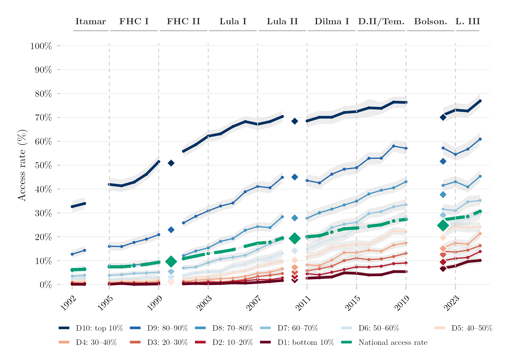

## Visão Geral

Esta figura acompanha, a partir de 1992, a proporção de jovens brasileiros de 18 a 24 anos que já ingressaram no ensino superior em algum momento da vida, segmentada por decil de renda domiciliar per capita — do decil mais pobre (D1) ao mais rico (D10). Ela mostra o quão desigual foi a expansão do acesso ao ensino superior ao longo da distribuição de renda em mais de três décadas. Marcadores em losango sobrepõem quatro anos de Censo Demográfico como verificação independente da série baseada em pesquisas amostrais. Os dados vêm das principais pesquisas domiciliares do Brasil (PNAD/PNAD Contínua) e do Censo Demográfico, ambos do IBGE.

## Metodologia

Cada série é a proporção de jovens de 18 a 24 anos que já ingressaram no ensino superior (`ens_sup`, acesso acumulado) alguma vez, por decil de renda domiciliar per capita e para a população como um todo. Os decis são calculados dentro de cada ano de pesquisa e de cada fonte, sobre a população com renda estritamente positiva. A série harmonizada usa a PNAD Anual até 2015 e a PNAD Contínua a partir de 2016, de modo que cada ano se apoia em uma única fonte; a região Norte rural está ausente da PNAD Anual entre 2004 e 2015. As linhas são interrompidas em anos sem pesquisa: 2000 e 2010 (anos de Censo) e 2020–2021 (excluídos por razões de qualidade de dados ligadas à pandemia). Os intervalos de confiança são intervalos de 95%: intervalos de Wilson com tamanho de amostra efetivo de Kish sob um efeito de delineamento de 2,0 para a PNAD Anual (1992–2015), e intervalos baseados no desenho amostral complexo via estimação exata (`survey::svydesign()`) para a PNAD Contínua (2016–2025). Os losangos marcam pontos de validação independentes das amostras do questionário da amostra dos Censos Demográficos de 1991, 2000, 2010 e 2022 (via `censobr`); seus intervalos de confiança de 95% têm no máximo 0,6 a 0,7 pontos percentuais de amplitude, mais estreitos que os próprios marcadores. O Censo de 1991 reporta a renda em catorze faixas ordinais, a partir das quais os decis são aproximados. Os rótulos no topo indicam o presidente em exercício.

## Como Citar

Se você usar esta figura ou o pipeline que a gera, cite tanto a dissertação quanto esta análise específica. As referências seguem a 7ª edição da APA.

**Dissertação (em elaboração; a entrada será atualizada após a defesa):**

> Mançano, T. (2026). *Inequality in access to tertiary education in Brazil: Household incomes, reforming policies, and the politics of who gets in (1990s–2020s)* [Dissertação de mestrado não publicada]. Universidade de São Paulo.

**Esta figura e o pipeline:**

> Mançano, T. (2026, 3 de setembro). *Taxa de acesso ao ensino superior por decil de renda, série histórica* [Figura e pipeline reprodutível]. Open Data Analysis. https://mancano-tales.github.io/open-data-analysis/pt/posts-pt/decil-acesso-serie-historica/

**No texto:** (Mançano, 2026) — ao citar várias análises deste catálogo no mesmo trabalho, a APA as distingue como 2026a, 2026b, … na ordem em que aparecem na lista de referências.

**BibTeX:**

```bibtex
@mastersthesis{Mancano2026Thesis,
  author = {Man\c{c}ano, Tales},
  title  = {Inequality in Access to Tertiary Education in Brazil: Household
            Incomes, Reforming Policies, and the Politics of Who Gets In
            (1990s--2020s)},
  school = {University of S\~{a}o Paulo},
  year   = {2026},
  type   = {Master's thesis},
  note   = {Unpublished; Graduate Program in Political Science}
}

@misc{Mancano2026_decil_acesso_serie_historica_pt,
  author       = {Man\c{c}ano, Tales},
  title        = {Taxa de acesso ao ensino superior por decil de renda, s\'{e}rie hist\'{o}rica},
  year         = {2026},
  month        = sep,
  howpublished = {Open Data Analysis, \url{https://mancano-tales.github.io/open-data-analysis/pt/posts-pt/decil-acesso-serie-historica/}},
  note         = {Figura e pipeline reprodutível. Código-fonte: \url{https://github.com/mancano-tales/open-data-analysis}, pasta posts-pt/decil-acesso-serie-historica/. Acesso em AAAA-MM-DD}
}
```

Uma versão permanente (tag do Git + DOI no Zenodo) será linkada aqui assim que a dissertação for defendida; até lá, cite a URL da página acima e acrescente a data de acesso (código-fonte: https://github.com/mancano-tales/open-data-analysis, pasta `posts-pt/decil-acesso-serie-historica/`).

## Pipeline

Esta figura usa o painel da [Harmonização PNAD / PNAD Contínua, 1992–2025](../harmonizacao-pnad-pnadc/).

Rode estes scripts nesta ordem, a partir da raiz do projeto (cada um grava em `data-raw/`, de onde o seguinte lê):

1. [`shared-pipeline/pnadc/000_PNADC_Download_Consolidate.R`](../../shared-pipeline/pnadc/000_PNADC_Download_Consolidate.R) — baixa a PNAD Contínua 2012–2025 (1ª entrevista) com `PNADcIBGE::get_pnadc()` para `data-raw/pnadc_raw/` e a consolida em `data-raw/pnadc_consolidado_2012_2025_interview1.rds`
2. [`shared-pipeline/pnadc/020_PNAD_Anual_Manual_Import_2001_2015.R`](../../shared-pipeline/pnadc/020_PNAD_Anual_Manual_Import_2001_2015.R) — baixa os microdados da PNAD Anual 2001–2015 do FTP do IBGE para `data-raw/pnad_anual_raw/` e os importa em `data-raw/harmonizing-br-data/output/PNAD_Anual_2001_2015.parquet`
3. [`shared-pipeline/pnadc/050_PNAD_Historica_Manual_Import_1992_1999.R`](../../shared-pipeline/pnadc/050_PNAD_Historica_Manual_Import_1992_1999.R) — o mesmo para a PNAD Anual 1992–1999 (`PNAD_Anual_1992_1999.parquet`)
4. [`shared-pipeline/pnadc/035_Splice_Microdados.R`](../../shared-pipeline/pnadc/035_Splice_Microdados.R) — emenda PNAD Anual e PNAD Contínua no painel harmonizado — `Microdados_Todas_Idades_1992_2025.parquet` e `Microdados_Jovens_18_24_1992_2025.parquet` em `data-raw/harmonizing-br-data/output/` (carrega `shared-pipeline/utils/codigos_curso_pnad.R`)
5. [`shared-pipeline/censo/040_Censo_Pontos_Validacao.R`](../../shared-pipeline/censo/040_Censo_Pontos_Validacao.R) — constrói os pontos de validação do Censo Demográfico com `censobr` (`Censo_Pontos_Validacao_1991_2022.parquet`). O ponto de 2022 exige os microdados da amostra em acesso controlado do IBGE (ver Reprodutibilidade abaixo); a comparação diagnóstica com Salata et al. (2025) no fim do script é pulada se o parquet de replicação deles não estiver em `data-raw/Salata-etal-2025/`
6. [`plot.R`](../../posts/decil-acesso-serie-historica/plot.R) — lê `Microdados_Jovens_18_24_1992_2025.parquet`, `Censo_Pontos_Validacao_1991_2022.parquet` e `data-raw/pnadc_consolidado_2012_2025_interview1.rds`; grava a figura em `output/figures/decil-acesso-serie-historica/` — compare com o `thumbnail.png` deste post

Todas as etapas upstream acima são Tier A e também são executadas, nesta mesma ordem, por [`shared-pipeline/build_public_data.R`](../../shared-pipeline/build_public_data.R).

## Reprodutibilidade

**Tier: A/B**

A série PNAD/PNADC e os losangos dos Censos de 1991, 2000 e 2010 são Tier A: dados públicos, acessíveis via pacote/API sem necessidade de credencial (PNADcIBGE, censobr, sidrar, ipeadatar). O losango do Censo 2022 é Tier B: depende dos microdados da amostra em acesso controlado do IBGE, solicitados manualmente em [microdados.ibge.gov.br](https://microdados.ibge.gov.br/) — `censobr::import_microdata22_controlado()` só processa um arquivo zip que você já tem em mãos, não o baixa por conta própria. Rode os scripts em `shared-pipeline/` na ordem numérica para reconstruir os dados intermediários; reproduzir tudo exceto o losango de 2022 não exige nenhuma solicitação prévia.
