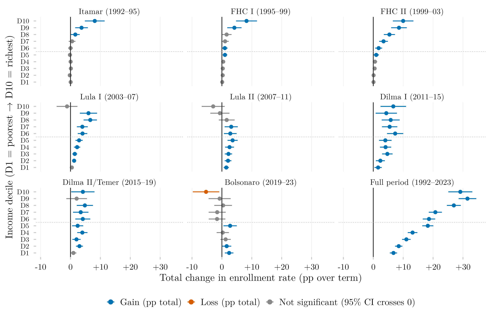

## Visão Geral

Esta figura mede o quanto a proporção de jovens de 18 a 24 anos matriculados ativamente no ensino superior mudou durante cada mandato presidencial brasileiro, decomposta por decil de renda, em um layout de dotplot (pontos de Cleveland). Cada painel é um mandato, mostrando um ponto por decil de renda com a variação total em pontos percentuais na matrícula, do início ao fim daquele mandato. A figura oferece uma visão governo a governo de quem ganhou ou perdeu terreno no acesso ao ensino superior.

## Metodologia

Cada ponto mostra a variação total em pontos percentuais na proporção de jovens de 18 a 24 anos matriculados ativamente no ensino superior (`ens_sup_a`), do primeiro ano de cada mandato presidencial ao primeiro ano do mandato seguinte; as linhas horizontais são intervalos de confiança de 95%. A cor codifica significância estatística, não o sinal: um ponto fica cinza sempre que seu intervalo contém zero. O intervalo é o da própria diferença, com seu erro padrão calculado como a raiz da soma dos erros padrão ao quadrado dos dois anos, tratando as duas pesquisas como independentes — o teste é, portanto, conservador. As duas pesquisas de origem são emendadas por mandato presidencial, não por ano: cada painel de mandato usa uma única pesquisa nos dois extremos, PNAD Anual até 2015 e PNAD Contínua a partir de 2015, de modo que nenhuma diferença atravessa a troca de instrumento. O painel do período completo é o único que permanece emendado entre pesquisas. A matrícula ativa é um critério conservador que exclui coortes que já se formaram ou abandonaram o curso.

## Como Citar

Se você usar esta figura ou o pipeline que a gera, cite tanto a dissertação quanto esta análise específica. As referências seguem a 7ª edição da APA.

**Dissertação (em elaboração; a entrada será atualizada após a defesa):**

> Mançano, T. (2026). *Inequality in access to tertiary education in Brazil: Household incomes, reforming policies, and the politics of who gets in (1990s–2020s)* [Dissertação de mestrado não publicada]. Universidade de São Paulo.

**Esta figura e o pipeline:**

> Mançano, T. (2026, 7 de agosto). *Variação da taxa de matrícula no ensino superior por decil de renda e mandato presidencial (dotplot)* [Figura e pipeline reprodutível]. Open Data Analysis. https://mancano-tales.github.io/open-data-analysis/pt/posts-pt/delta-matriculados-decil-governo-dotplot/

**No texto:** (Mançano, 2026) — ao citar várias análises deste catálogo no mesmo trabalho, a APA as distingue como 2026a, 2026b, … na ordem em que aparecem na lista de referências.

**BibTeX:**

```bibtex
@mastersthesis{Mancano2026Thesis,
  author = {Man\c{c}ano, Tales},
  title  = {Inequality in Access to Tertiary Education in Brazil: Household
            Incomes, Reforming Policies, and the Politics of Who Gets In
            (1990s--2020s)},
  school = {University of S\~{a}o Paulo},
  year   = {2026},
  type   = {Master's thesis},
  note   = {Unpublished; Graduate Program in Political Science}
}

@misc{Mancano2026_delta_matriculados_decil_governo_dotplot_pt,
  author       = {Man\c{c}ano, Tales},
  title        = {Varia\c{c}\~{a}o da taxa de matr\'{\i}cula no ensino superior por decil de renda e mandato presidencial (dotplot)},
  year         = {2026},
  month        = aug,
  howpublished = {Open Data Analysis, \url{https://mancano-tales.github.io/open-data-analysis/pt/posts-pt/delta-matriculados-decil-governo-dotplot/}},
  note         = {Figura e pipeline reprodutível. Código-fonte: \url{https://github.com/mancano-tales/open-data-analysis}, pasta posts-pt/delta-matriculados-decil-governo-dotplot/. Acesso em AAAA-MM-DD}
}
```

Uma versão permanente (tag do Git + DOI no Zenodo) será linkada aqui assim que a dissertação for defendida; até lá, cite a URL da página acima e acrescente a data de acesso (código-fonte: https://github.com/mancano-tales/open-data-analysis, pasta `posts-pt/delta-matriculados-decil-governo-dotplot/`).

## Pipeline

Esta figura usa o painel da [Harmonização PNAD / PNAD Contínua, 1992–2025](../harmonizacao-pnad-pnadc/).

Rode estes scripts nesta ordem, a partir da raiz do projeto (cada um grava em `data-raw/`, de onde o seguinte lê):

1. [`shared-pipeline/pnadc/000_PNADC_Download_Consolidate.R`](../../shared-pipeline/pnadc/000_PNADC_Download_Consolidate.R) — baixa a PNAD Contínua 2012–2025 (1ª entrevista) com `PNADcIBGE::get_pnadc()` para `data-raw/pnadc_raw/` e a consolida em `data-raw/pnadc_consolidado_2012_2025_interview1.rds`
2. [`shared-pipeline/pnadc/020_PNAD_Anual_Manual_Import_2001_2015.R`](../../shared-pipeline/pnadc/020_PNAD_Anual_Manual_Import_2001_2015.R) — baixa os microdados da PNAD Anual 2001–2015 do FTP do IBGE para `data-raw/pnad_anual_raw/` e os importa em `data-raw/harmonizing-br-data/output/PNAD_Anual_2001_2015.parquet`
3. [`shared-pipeline/pnadc/050_PNAD_Historica_Manual_Import_1992_1999.R`](../../shared-pipeline/pnadc/050_PNAD_Historica_Manual_Import_1992_1999.R) — o mesmo para a PNAD Anual 1992–1999 (`PNAD_Anual_1992_1999.parquet`)
4. [`shared-pipeline/pnadc/035_Splice_Microdados.R`](../../shared-pipeline/pnadc/035_Splice_Microdados.R) — emenda PNAD Anual e PNAD Contínua no painel harmonizado — `Microdados_Todas_Idades_1992_2025.parquet` e `Microdados_Jovens_18_24_1992_2025.parquet` em `data-raw/harmonizing-br-data/output/` (carrega `shared-pipeline/utils/codigos_curso_pnad.R`)
5. [`plot.R`](../../posts/delta-matriculados-decil-governo-dotplot/plot.R) — lê `Microdados_Jovens_18_24_1992_2025.parquet` mais `data-raw/pnadc_consolidado_2012_2025_interview1.rds` (variáveis de desenho amostral para os anos da PNAD Contínua); grava a figura em `output/figures/delta-matriculados-decil-governo-dotplot/` — compare com o `thumbnail.png` deste post

Todas as etapas upstream acima são Tier A e também são executadas, nesta mesma ordem, por [`shared-pipeline/build_public_data.R`](../../shared-pipeline/build_public_data.R).

## Reprodutibilidade

**Tier: A**

Este pipeline usa apenas dados públicos, acessíveis via pacote/API sem necessidade de credencial (PNADcIBGE, censobr, sidrar, ipeadatar). Rode os scripts em `shared-pipeline/` na ordem numérica para reconstruir os dados intermediários.
