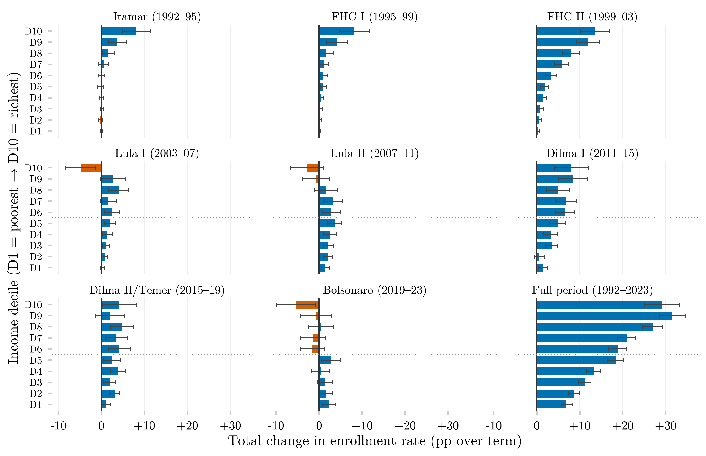

## Visão Geral

Esta figura mede o quanto a proporção de jovens de 18 a 24 anos matriculados ativamente no ensino superior mudou durante cada mandato presidencial brasileiro, decomposta por decil de renda. Cada painel é um mandato, mostrando dez barras — uma por decil de renda — com a variação total em pontos percentuais na matrícula, do início ao fim daquele mandato. A figura oferece uma visão governo a governo de quem ganhou ou perdeu terreno no acesso ao ensino superior.

## Metodologia

Cada barra mostra a variação total em pontos percentuais na proporção de jovens de 18 a 24 anos matriculados ativamente no ensino superior (`ens_sup_a`), do primeiro ano de cada mandato presidencial ao primeiro ano do mandato seguinte; as barras de erro são intervalos de confiança de 95%. A cor codifica significância estatística, não o sinal: uma barra fica cinza sempre que seu intervalo contém zero. O intervalo é o da própria diferença, com seu erro padrão calculado como a raiz da soma dos erros padrão ao quadrado dos dois anos, tratando as duas pesquisas como independentes — o teste é, portanto, conservador. As duas pesquisas de origem são emendadas por mandato presidencial, não por ano: cada painel de mandato usa uma única pesquisa nos dois extremos, PNAD Anual até 2015 e PNAD Contínua a partir de 2015, de modo que nenhuma diferença atravessa a troca de instrumento. O painel do período completo é o único que permanece emendado entre pesquisas. A matrícula ativa é um critério conservador que exclui coortes que já se formaram ou abandonaram o curso.

## Como Citar

Se você usar esta figura ou o pipeline que a gera, cite tanto a dissertação quanto este repositório.

**Dissertação:**

> Mançano, Tales. 2026. *Inequality in Access to Tertiary Education in Brazil: Household Incomes, Reforming Policies, and the Politics of Who Gets In (1990s–2020s)*. Dissertação de Mestrado, Programa de Pós-Graduação em Ciência Política, Universidade de São Paulo.

```bibtex
@mastersthesis{Mancano2026,
  author = {Man\c{c}ano, Tales},
  title  = {Inequality in Access to Tertiary Education in Brazil: Household
            Incomes, Reforming Policies, and the Politics of Who Gets In
            (1990s--2020s)},
  school = {University of S\~{a}o Paulo},
  year   = {2026},
  type   = {Master's thesis},
  note   = {Graduate Program in Political Science}
}
```

**Esta figura e o pipeline:**

> Mançano, Tales. 2026. "Variação da Taxa de Matrícula no Ensino Superior por Decil de Renda e Mandato Presidencial." Em *Open Data Analysis*. <https://github.com/mancano-tales/open-data-analysis>, `posts-pt/delta-matriculados-decil-governo/`.

```bibtex
@misc{Mancano2026OpenDataAnalysis,
  author       = {Man\c{c}ano, Tales},
  title        = {Open Data Analysis: Variação da Taxa de Matrícula no Ensino Superior por Decil de Renda e Mandato Presidencial},
  year         = {2026},
  howpublished = {\url{https://github.com/mancano-tales/open-data-analysis}},
  note         = {posts/delta-matriculados-decil-governo/}
}
```

Uma versão permanente (tag do Git + DOI no Zenodo) será linkada aqui assim que a dissertação for defendida; até lá, cite a URL do repositório acima.

## Pipeline

Esta figura usa o painel da [Harmonização PNAD / PNAD Contínua, 1992–2025](../harmonizacao-pnad-pnadc/).


Scripts desta análise:

- Plotagem: [`plot.R`](../../posts/delta-matriculados-decil-governo/plot.R)
- Pipeline upstream:
  - [`shared-pipeline/pnadc/035_Splice_Microdados.R`](../../shared-pipeline/pnadc/035_Splice_Microdados.R)

## Reprodutibilidade

**Tier: A**

Este pipeline usa apenas dados públicos, acessíveis via pacote/API sem necessidade de credencial (PNADcIBGE, censobr, sidrar, ipeadatar). Rode os scripts em `shared-pipeline/` na ordem numérica para reconstruir os dados intermediários.

**Nota**: a cópia deste script neste post continha um caminho absoluto de fallback apontando para a máquina local do autor (`C:/Users/Mancano/...`); esse caminho foi corrigido para `here::here("data-raw", ...)` ao ser copiado para este repositório, seguindo a mesma convenção usada em `shared-pipeline/`.
