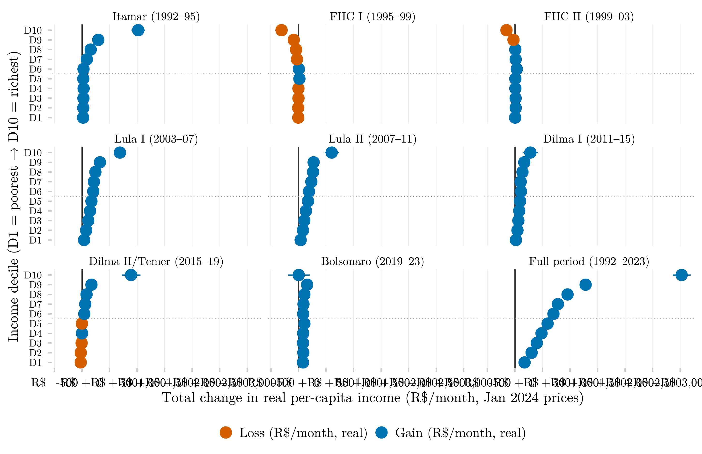

## Visão Geral

Esta figura mede a variação total da renda domiciliar real, em reais por mês, para cada decil de renda, ao longo de todos os mandatos presidenciais brasileiros desde 1992. Cada painel é um mandato; os pontos mostram o ganho ou a perda absoluta de cada decil em poder de compra mensal, permitindo comparar o crescimento de renda diretamente em termos monetários, e não em percentuais.

## Metodologia

Cada ponto é a variação total na renda domiciliar per capita real média (R$/mês, preços de janeiro de 2024) para cada decil de renda, do primeiro ano disponível de um mandato presidencial ao primeiro ano disponível do mandato seguinte (azul = ganho, laranja = perda); as linhas horizontais são intervalos de confiança de 95%. O painel inferior direito cobre o período completo de 1992–2023. Os intervalos de confiança são intervalos de aproximação normal de 95% que propagam o erro padrão de cada extremo: se_Δ = √(se1² + se0²). O erro padrão de cada extremo é a variância amostral ponderada dividida pelo tamanho de amostra efetivo de Kish (efeito de delineamento = 2). Os decis de renda e a variável de renda subjacente são calculados sobre a população total (não restrita a 18–24 anos), já que a renda domiciliar per capita descreve o domicílio inteiro.

## Pipeline

Scripts desta análise:

- Plotagem: [`plot.R`](../../posts/delta-renda-abs-decil-governo/plot.R)
- Pipeline upstream:
  - [`shared-pipeline/pnadc/035_Splice_Microdados.R`](../../shared-pipeline/pnadc/035_Splice_Microdados.R)

## Reprodutibilidade

**Tier: A**

Este pipeline usa apenas dados públicos, acessíveis via pacote/API sem necessidade de credencial (PNADcIBGE, censobr, sidrar, ipeadatar). Rode os scripts em `shared-pipeline/` na ordem numérica para reconstruir os dados intermediários.
