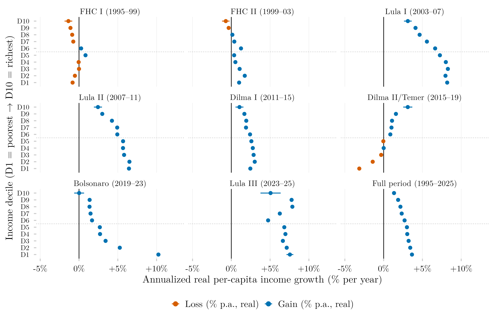

## Visão Geral

Esta figura mede o crescimento anualizado da renda real por decil de renda ao longo dos mandatos presidenciais brasileiros, de 1995 a 2025. Expressar o crescimento como uma taxa anual composta, em vez de uma variação total, torna diretamente comparáveis mandatos de durações muito diferentes — quatro anos completos contra, no mandato mais recente mostrado, apenas dois.

## Metodologia

Cada ponto é a taxa de crescimento geométrico anualizado da renda real (% ao ano, preços de janeiro de 2024) para cada decil de renda, do primeiro ano disponível de um mandato presidencial ao primeiro ano disponível do mandato seguinte (azul = ganho, laranja = perda); as linhas horizontais são intervalos de confiança de 95%. O mandato de Itamar Franco (1992–1995) é omitido, já que a série usada aqui começa em 1995. O painel de Lula III cobre dois anos de crescimento (2023–2025). O painel inferior direito cobre o período completo de 1995–2025. Os intervalos de confiança são calculados pelo método delta para f(t1,t0) = ((t1/t0)^(1/n) − 1) × 100, onde n é o número de anos do mandato: se = (100/n)·(t1/t0)^(1/n)·√((se1/t1)² + (se0/t0)²). O erro padrão de cada extremo é a variância amostral ponderada dividida pelo tamanho de amostra efetivo de Kish (efeito de delineamento = 2).

## Como Citar

Se você usar esta figura ou o pipeline que a gera, cite tanto a dissertação quanto esta análise específica. As referências seguem a 7ª edição da APA.

**Dissertação (em elaboração; a entrada será atualizada após a defesa):**

> Mançano, T. (2026). *Inequality in access to tertiary education in Brazil: Household incomes, reforming policies, and the politics of who gets in (1990s–2020s)* [Dissertação de mestrado não publicada]. Universidade de São Paulo.

**Esta figura e o pipeline:**

> Mançano, T. (2026, 9 de agosto). *Crescimento anualizado da renda real por decil de renda e mandato presidencial* [Figura e pipeline reprodutível]. Open Data Analysis. https://mancano-tales.github.io/open-data-analysis/pt/posts-pt/delta-renda-anualizada-decil-governo/

**No texto:** (Mançano, 2026) — ao citar várias análises deste catálogo no mesmo trabalho, a APA as distingue como 2026a, 2026b, … na ordem em que aparecem na lista de referências.

**BibTeX:**

```bibtex
@mastersthesis{Mancano2026Thesis,
  author = {Man\c{c}ano, Tales},
  title  = {Inequality in Access to Tertiary Education in Brazil: Household
            Incomes, Reforming Policies, and the Politics of Who Gets In
            (1990s--2020s)},
  school = {University of S\~{a}o Paulo},
  year   = {2026},
  type   = {Master's thesis},
  note   = {Unpublished; Graduate Program in Political Science}
}

@misc{Mancano2026_delta_renda_anualizada_decil_governo_pt,
  author       = {Man\c{c}ano, Tales},
  title        = {Crescimento anualizado da renda real por decil de renda e mandato presidencial},
  year         = {2026},
  month        = aug,
  howpublished = {Open Data Analysis, \url{https://mancano-tales.github.io/open-data-analysis/pt/posts-pt/delta-renda-anualizada-decil-governo/}},
  note         = {Figura e pipeline reprodutível. Código-fonte: \url{https://github.com/mancano-tales/open-data-analysis}, pasta posts-pt/delta-renda-anualizada-decil-governo/. Acesso em AAAA-MM-DD}
}
```

Uma versão permanente (tag do Git + DOI no Zenodo) será linkada aqui assim que a dissertação for defendida; até lá, cite a URL da página acima e acrescente a data de acesso (código-fonte: https://github.com/mancano-tales/open-data-analysis, pasta `posts-pt/delta-renda-anualizada-decil-governo/`).

## Pipeline

Esta figura usa o painel da [Harmonização PNAD / PNAD Contínua, 1992–2025](../harmonizacao-pnad-pnadc/).

Rode estes scripts nesta ordem, a partir da raiz do projeto (cada um grava em `data-raw/`, de onde o seguinte lê):

1. [`shared-pipeline/pnadc/000_PNADC_Download_Consolidate.R`](../../shared-pipeline/pnadc/000_PNADC_Download_Consolidate.R) — baixa a PNAD Contínua 2012–2025 (1ª entrevista) com `PNADcIBGE::get_pnadc()` para `data-raw/pnadc_raw/` e a consolida em `data-raw/pnadc_consolidado_2012_2025_interview1.rds`
2. [`shared-pipeline/pnadc/020_PNAD_Anual_Manual_Import_2001_2015.R`](../../shared-pipeline/pnadc/020_PNAD_Anual_Manual_Import_2001_2015.R) — baixa os microdados da PNAD Anual 2001–2015 do FTP do IBGE para `data-raw/pnad_anual_raw/` e os importa em `data-raw/harmonizing-br-data/output/PNAD_Anual_2001_2015.parquet`
3. [`shared-pipeline/pnadc/050_PNAD_Historica_Manual_Import_1992_1999.R`](../../shared-pipeline/pnadc/050_PNAD_Historica_Manual_Import_1992_1999.R) — o mesmo para a PNAD Anual 1992–1999 (`PNAD_Anual_1992_1999.parquet`)
4. [`shared-pipeline/pnadc/035_Splice_Microdados.R`](../../shared-pipeline/pnadc/035_Splice_Microdados.R) — emenda PNAD Anual e PNAD Contínua no painel harmonizado — `Microdados_Todas_Idades_1992_2025.parquet` e `Microdados_Jovens_18_24_1992_2025.parquet` em `data-raw/harmonizing-br-data/output/` (carrega `shared-pipeline/utils/codigos_curso_pnad.R`)
5. [`plot.R`](../../posts/delta-renda-anualizada-decil-governo/plot.R) — lê `Microdados_Todas_Idades_1992_2025.parquet`; grava a figura em `output/figures/delta-renda-anualizada-decil-governo/` — compare com o `thumbnail.png` deste post

Todas as etapas upstream acima são Tier A e também são executadas, nesta mesma ordem, por [`shared-pipeline/build_public_data.R`](../../shared-pipeline/build_public_data.R).

## Reprodutibilidade

**Tier: A**

Este pipeline usa apenas dados públicos, acessíveis via pacote/API sem necessidade de credencial (PNADcIBGE, censobr, sidrar, ipeadatar). Rode os scripts em `shared-pipeline/` na ordem numérica para reconstruir os dados intermediários.
