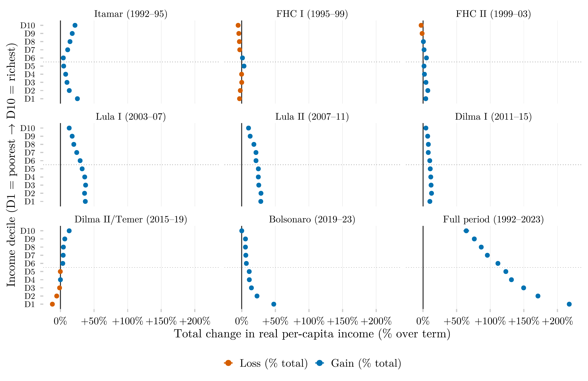

## Visão Geral

Esta figura mede a variação percentual total da renda domiciliar real para cada decil de renda, ao longo de todos os mandatos presidenciais brasileiros desde 1992. Por expressar a variação em relação à renda inicial de cada decil, e não em reais absolutos, ela permite comparar taxas de crescimento de forma justa entre decis com níveis de renda muito diferentes.

## Metodologia

Cada ponto é a variação percentual na renda domiciliar per capita real média para cada decil de renda, do primeiro ano disponível de um mandato presidencial ao primeiro ano disponível do mandato seguinte (azul = ganho, laranja = perda); as linhas horizontais são intervalos de confiança de 95%. O painel inferior direito cobre o período completo de 1992–2023. Os intervalos de confiança são calculados pelo método delta para f(t1,t0) = (t1/t0 − 1) × 100: se_Δ = √((100·se1/t0)² + (100·t1·se0/t0²)²). O erro padrão de cada extremo é a variância amostral ponderada dividida pelo tamanho de amostra efetivo de Kish (efeito de delineamento = 2).

## Pipeline

Scripts desta análise:

- Plotagem: [`plot.R`](../../posts/delta-renda-rel-decil-governo/plot.R)
- Pipeline upstream:
  - [`shared-pipeline/pnadc/035_Splice_Microdados.R`](../../shared-pipeline/pnadc/035_Splice_Microdados.R)

## Reprodutibilidade

**Tier: A**

Este pipeline usa apenas dados públicos, acessíveis via pacote/API sem necessidade de credencial (PNADcIBGE, censobr, sidrar, ipeadatar). Rode os scripts em `shared-pipeline/` na ordem numérica para reconstruir os dados intermediários.
