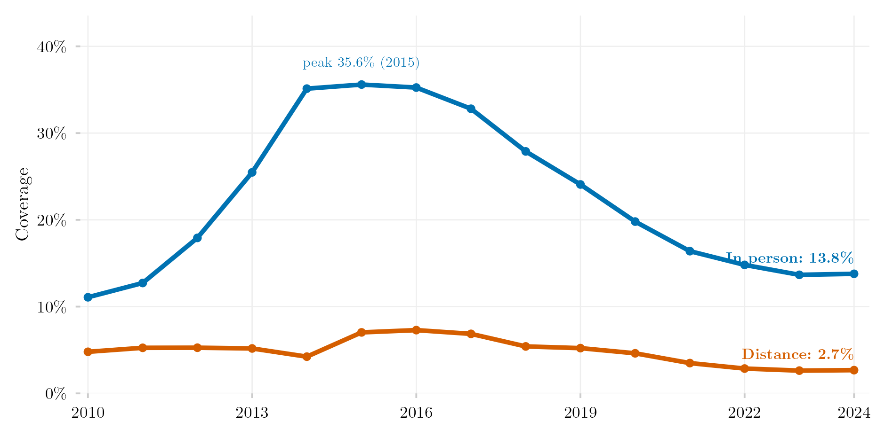

## Visão Geral

Esta figura pergunta se os principais programas de assistência estudantil do setor privado brasileiro (bolsas ProUni e financiamentos FIES) acompanharam o crescimento explosivo das matrículas em ensino a distância (EaD). Em vez de olhar para o número bruto de estudantes cobertos pela assistência, ela olha para qual fração da matrícula privada, dentro de cada modalidade de ensino, está coberta — uma forma mais relevante, do ponto de vista de política pública, de perguntar se a assistência chegou onde o sistema de fato cresceu.

## Metodologia

Extraída da mesma base do SEDAP+ usada na figura de matrículas por setor e via de acesso. A grandeza plotada é uma razão dentro de cada modalidade de ensino (EaD vs. presencial): matrículas com bolsa ProUni ou financiamento FIES, sobre o total de matrículas privadas naquela modalidade. As matrículas do setor público são excluídas, já que uma vaga sem preço não pode ser descrita como coberta ou descoberta por assistência. Em termos absolutos, a cobertura do ProUni no EaD parece estável — mas a razão mostrada aqui revela que essa mesma contagem absoluta passou a cobrir uma fração cada vez menor de uma modalidade que mais que dobrou de tamanho, o que é a leitura mais relevante, do ponto de vista de política pública, sobre se os instrumentos de assistência chegaram onde o sistema de fato cresceu.

## Como Citar

Se você usar esta figura ou o pipeline que a gera, cite tanto a dissertação quanto esta análise específica. As referências seguem a 7ª edição da APA.

**Dissertação (em elaboração; a entrada será atualizada após a defesa):**

> Mançano, T. (2026). *Inequality in access to tertiary education in Brazil: Household incomes, reforming policies, and the politics of who gets in (1990s–2020s)* [Dissertação de mestrado não publicada]. Universidade de São Paulo.

**Esta figura e o pipeline:**

> Mançano, T. (2026, 6 de agosto). *Ensino a distância e o alcance das políticas de assistência estudantil* [Figura e pipeline reprodutível]. Open Data Analysis. https://mancano-tales.github.io/open-data-analysis/pt/posts-pt/descolamento-ead-politicas/

**No texto:** (Mançano, 2026) — ao citar várias análises deste catálogo no mesmo trabalho, a APA as distingue como 2026a, 2026b, … na ordem em que aparecem na lista de referências.

**BibTeX:**

```bibtex
@mastersthesis{Mancano2026Thesis,
  author = {Man\c{c}ano, Tales},
  title  = {Inequality in Access to Tertiary Education in Brazil: Household
            Incomes, Reforming Policies, and the Politics of Who Gets In
            (1990s--2020s)},
  school = {University of S\~{a}o Paulo},
  year   = {2026},
  type   = {Master's thesis},
  note   = {Unpublished; Graduate Program in Political Science}
}

@misc{Mancano2026_descolamento_ead_politicas_pt,
  author       = {Man\c{c}ano, Tales},
  title        = {Ensino a dist\^{a}ncia e o alcance das pol\'{\i}ticas de assist\^{e}ncia estudantil},
  year         = {2026},
  month        = aug,
  howpublished = {Open Data Analysis, \url{https://mancano-tales.github.io/open-data-analysis/pt/posts-pt/descolamento-ead-politicas/}},
  note         = {Figura e pipeline reprodutível. Código-fonte: \url{https://github.com/mancano-tales/open-data-analysis}, pasta posts-pt/descolamento-ead-politicas/. Acesso em AAAA-MM-DD}
}
```

Uma versão permanente (tag do Git + DOI no Zenodo) será linkada aqui assim que a dissertação for defendida; até lá, cite a URL da página acima e acrescente a data de acesso (código-fonte: https://github.com/mancano-tales/open-data-analysis, pasta `posts-pt/descolamento-ead-politicas/`).

## Pipeline

Rode estes scripts nesta ordem, a partir da raiz do projeto (cada um grava em `data-raw/`, de onde o seguinte lê):

1. [`shared-pipeline/sedap/010_SEDAP_Cliente.R`](../../shared-pipeline/sedap/010_SEDAP_Cliente.R) — cliente da API SEDAP+, carregado pelo script abaixo — exige a variável de ambiente `SEDAP_TOKEN`
2. [`shared-pipeline/sedap/020_Extrair_Nicho_2020_2024.R`](../../shared-pipeline/sedap/020_Extrair_Nicho_2020_2024.R) — extrai matrículas por setor × via de acesso × turno/modalidade das tabelas SUP_ALUNO 2010–2024 via SEDAP+ e grava `data-raw/INEP/derived/nicho_agregado_sedap_2010_2024.csv`
3. [`plot.R`](../../posts/descolamento-ead-politicas/plot.R) — lê `data-raw/INEP/derived/nicho_agregado_sedap_2010_2024.csv`; grava a figura em `output/figures/descolamento-ead-politicas/` — compare com o `thumbnail.png` deste post

As etapas via SEDAP+ só rodam com uma credencial aprovada pelo INEP exportada como `SEDAP_TOKEN` (ver Reprodutibilidade abaixo); o CSV extraído não é redistribuído aqui.

## Reprodutibilidade

**Tier: B**

Este pipeline depende de dado restrito do INEP acessível via credencial SEDAP+ (variável de ambiente `SEDAP_TOKEN`). Sem uma credencial aprovada, os scripts em `shared-pipeline/sedap/` não rodam — a lógica fica disponível para auditoria, mas a reprodução completa exige solicitar acesso ao INEP.
