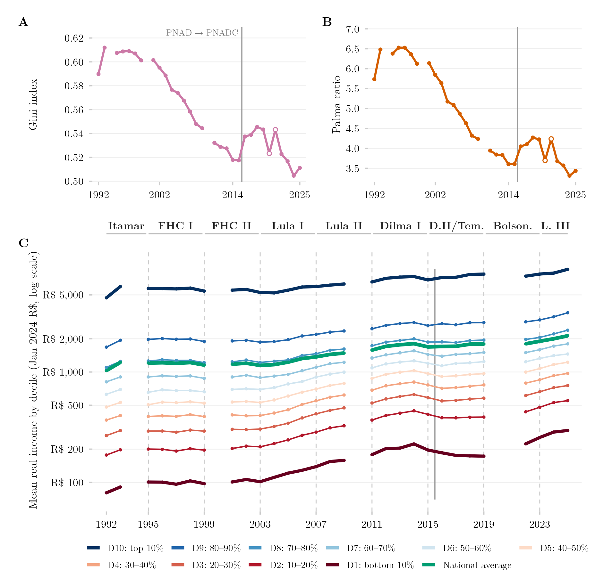

## Visão Geral

Esta figura combina três visões da desigualdade de renda brasileira entre 1992 e 2024: (A) o índice de Gini, um resumo escalar padrão da desigualdade geral; (B) a razão de Palma, comparando a participação de renda do decil mais rico contra a dos 40% mais pobres; e (C) a trajetória real da renda média de cada decil individualmente, em escala logarítmica. Juntos, os três painéis vão de um único número-resumo até a anatomia completa de quem ganhou e quem ficou para trás.

## Metodologia

O painel A mostra o índice de Gini da renda per capita real. O painel B mostra a razão de Palma — a participação de renda do decil mais rico dividida pela dos quatro decis mais pobres. Os painéis A e B seguem o universo oficial, que mantém os domicílios sem rendimento declarado, e reproduzem a série publicada pelo próprio IBGE (desvio médio de −0,0001). O painel C mostra a renda per capita real média por decil, em reais de janeiro de 2024, em eixo logarítmico; aqui os decis se apoiam no universo de trabalho de rendas positivas apenas, de modo que os níveis do painel C não são estritamente os oficiais. As linhas são interrompidas em anos sem pesquisa (1994, 2000, 2010, 2020–2021); marcadores vazados nos painéis A e B indicam 2020 e 2021, provenientes da quinta visita da PNAD Contínua, coletada por telefone. A unidade de renda é a família até 2015 (PNAD) e o domicílio a partir de 2016 (PNAD Contínua); as duas coincidem exceto onde várias famílias dividem uma moradia, e uma linha vertical sólida marca essa mudança de fonte. Como as duas pesquisas rodaram simultaneamente em 2012–2015, o efeito da troca de instrumento pode ser medido diretamente, em vez de suposto: para o mesmo ano, a PNAD Contínua retorna um índice de Gini em média 0,008 mais alto e uma razão de Palma em média 0,15 mais alta. Do degrau observado entre 2015 e 2016 (+0,020 no Gini, +0,44 na Palma), portanto, cerca de um terço é artefato da emenda entre pesquisas, não um aumento genuíno da desigualdade. Essa linha vertical é distinta das linhas tracejadas do painel C, que marcam trocas de governo; o bloco de governo 2015–2019 une o segundo mandato de Dilma Rousseff ao de Michel Temer, de modo que o impeachment de agosto de 2016 não aparece como fronteira na figura.

## Pipeline

Scripts desta análise:

- Plotagem: [`plot.R`](../../posts/desigualdade-renda-gini-palma-decil/plot.R)
- Pipeline upstream:
  - [`shared-pipeline/pnadc/238_Serie_Desigualdade_Oficial.R`](../../shared-pipeline/pnadc/238_Serie_Desigualdade_Oficial.R)
  - [`shared-pipeline/pnadc/035_Splice_Microdados.R`](../../shared-pipeline/pnadc/035_Splice_Microdados.R)
  - [`shared-pipeline/pnadc/000_PNADC_Download_Consolidate.R`](../../shared-pipeline/pnadc/000_PNADC_Download_Consolidate.R)

## Reprodutibilidade

**Tier: A**

Este pipeline usa apenas dados públicos, acessíveis via pacote/API sem necessidade de credencial (PNADcIBGE, censobr, sidrar, ipeadatar). Rode os scripts em `shared-pipeline/` na ordem numérica para reconstruir os dados intermediários.
