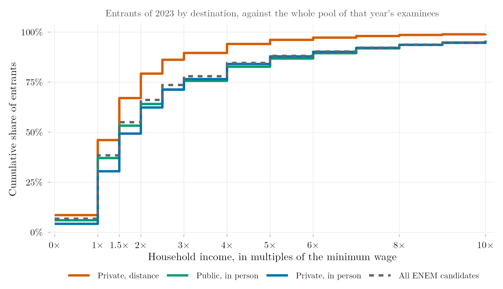

## Visão Geral

Esta figura mostra a distribuição de renda domiciliar dos estudantes que ingressam em cada setor do ensino superior, comparada não com a população geral, mas com todos os que fizeram o mesmo exame nacional de acesso à universidade naquela coorte. Isso permite mostrar se um setor recruta desproporcionalmente candidatos de renda mais alta ou mais baixa em relação ao conjunto de pessoas que de fato disputaram uma vaga, e não apenas em relação à sociedade em geral.

## Metodologia

Distribuição de renda dos ingressantes (registros combinados ENEM×Censo) por setor, comparada contra o conjunto completo de participantes do ENEM (exame nacional do ensino médio) naquela mesma coorte — ou seja, contra todos que fizeram a prova, não apenas os que se matricularam. Isso permite à figura mostrar se a turma de ingressantes de um setor é enviesada por renda em relação ao conjunto de candidatos do qual ela é extraída, e não apenas em relação à população geral.

## Pipeline

Scripts desta análise:

- Plotagem: [`plot.R`](../../posts/distribuicao-renda-setor/plot.R)
- Pipeline upstream:
  - [`shared-pipeline/sedap/070_Perfil_Renda_Modalidade.R`](../../shared-pipeline/sedap/070_Perfil_Renda_Modalidade.R)
  - [`shared-pipeline/sedap/010_SEDAP_Cliente.R`](../../shared-pipeline/sedap/010_SEDAP_Cliente.R)

## Reprodutibilidade

**Tier: B**

Este pipeline depende de dado restrito do INEP acessível via credencial SEDAP+ (variável de ambiente `SEDAP_TOKEN`). Sem uma credencial aprovada, os scripts em `shared-pipeline/sedap/` não rodam — a lógica fica disponível para auditoria, mas a reprodução completa exige solicitar acesso ao INEP.
