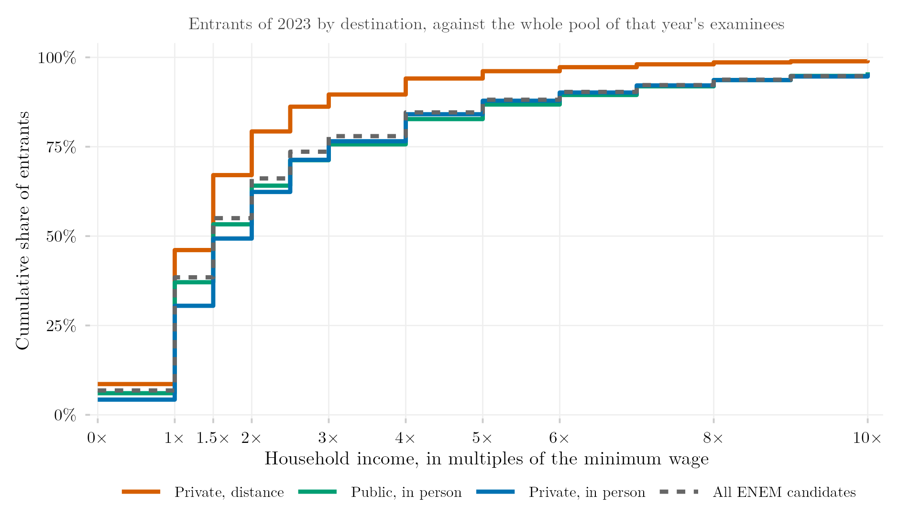

## Visão Geral

Esta figura mostra a distribuição de renda domiciliar dos estudantes que ingressam em cada setor do ensino superior, comparada não com a população geral, mas com todos os que fizeram o mesmo exame nacional de acesso à universidade naquela coorte. Isso permite mostrar se um setor recruta desproporcionalmente candidatos de renda mais alta ou mais baixa em relação ao conjunto de pessoas que de fato disputaram uma vaga, e não apenas em relação à sociedade em geral.

## Metodologia

Distribuição de renda dos ingressantes (registros combinados ENEM×Censo) por setor, comparada contra o conjunto completo de participantes do ENEM (exame nacional do ensino médio) naquela mesma coorte — ou seja, contra todos que fizeram a prova, não apenas os que se matricularam. Isso permite à figura mostrar se a turma de ingressantes de um setor é enviesada por renda em relação ao conjunto de candidatos do qual ela é extraída, e não apenas em relação à população geral.

## Como Citar

Se você usar esta figura ou o pipeline que a gera, cite tanto a dissertação quanto esta análise específica. As referências seguem a 7ª edição da APA.

**Dissertação (em elaboração; a entrada será atualizada após a defesa):**

> Mançano, T. (2026). *Inequality in access to tertiary education in Brazil: Household incomes, reforming policies, and the politics of who gets in (1990s–2020s)* [Dissertação de mestrado não publicada]. Universidade de São Paulo.

**Esta figura e o pipeline:**

> Mançano, T. (2026, 6 de agosto). *Distribuição de renda domiciliar por setor do ensino superior* [Figura e pipeline reprodutível]. Open Data Analysis. https://mancano-tales.github.io/open-data-analysis/pt/posts-pt/distribuicao-renda-setor/

**No texto:** (Mançano, 2026) — ao citar várias análises deste catálogo no mesmo trabalho, a APA as distingue como 2026a, 2026b, … na ordem em que aparecem na lista de referências.

**BibTeX:**

```bibtex
@mastersthesis{Mancano2026Thesis,
  author = {Man\c{c}ano, Tales},
  title  = {Inequality in Access to Tertiary Education in Brazil: Household
            Incomes, Reforming Policies, and the Politics of Who Gets In
            (1990s--2020s)},
  school = {University of S\~{a}o Paulo},
  year   = {2026},
  type   = {Master's thesis},
  note   = {Unpublished; Graduate Program in Political Science}
}

@misc{Mancano2026_distribuicao_renda_setor_pt,
  author       = {Man\c{c}ano, Tales},
  title        = {Distribui\c{c}\~{a}o de renda domiciliar por setor do ensino superior},
  year         = {2026},
  month        = aug,
  howpublished = {Open Data Analysis, \url{https://mancano-tales.github.io/open-data-analysis/pt/posts-pt/distribuicao-renda-setor/}},
  note         = {Figura e pipeline reprodutível. Código-fonte: \url{https://github.com/mancano-tales/open-data-analysis}, pasta posts-pt/distribuicao-renda-setor/. Acesso em AAAA-MM-DD}
}
```

Uma versão permanente (tag do Git + DOI no Zenodo) será linkada aqui assim que a dissertação for defendida; até lá, cite a URL da página acima e acrescente a data de acesso (código-fonte: https://github.com/mancano-tales/open-data-analysis, pasta `posts-pt/distribuicao-renda-setor/`).

## Pipeline

Rode estes scripts nesta ordem, a partir da raiz do projeto (cada um grava em `data-raw/`, de onde o seguinte lê):

1. [`shared-pipeline/sedap/010_SEDAP_Cliente.R`](../../shared-pipeline/sedap/010_SEDAP_Cliente.R) — cliente da API SEDAP+, carregado pelo script abaixo — exige a variável de ambiente `SEDAP_TOKEN`
2. [`shared-pipeline/sedap/070_Perfil_Renda_Modalidade.R`](../../shared-pipeline/sedap/070_Perfil_Renda_Modalidade.R) — extrai o perfil de renda dos ingressantes por modalidade via SEDAP+ e grava `data-raw/sedap/extraido_perfil_renda_modalidade_2014_2024.csv`
3. [`plot.R`](../../posts/distribuicao-renda-setor/plot.R) — lê `data-raw/sedap/extraido_perfil_renda_modalidade_2014_2024.csv`; grava a figura em `output/figures/distribuicao-renda-setor/` — compare com o `thumbnail.png` deste post

As etapas via SEDAP+ só rodam com uma credencial aprovada pelo INEP exportada como `SEDAP_TOKEN` (ver Reprodutibilidade abaixo); o CSV extraído não é redistribuído aqui.

## Reprodutibilidade

**Tier: B**

Este pipeline depende de dado restrito do INEP acessível via credencial SEDAP+ (variável de ambiente `SEDAP_TOKEN`). Sem uma credencial aprovada, os scripts em `shared-pipeline/sedap/` não rodam — a lógica fica disponível para auditoria, mas a reprodução completa exige solicitar acesso ao INEP.
