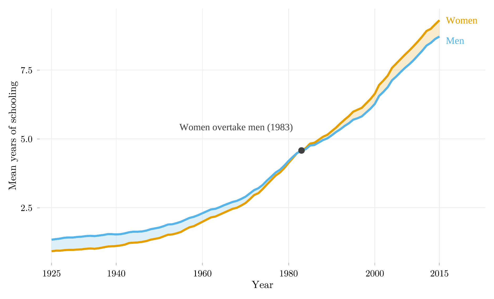

## Visão Geral

Esta figura acompanha os anos médios de escolaridade de mulheres e homens brasileiros, de 15 a 64 anos, entre 1925 e 2015. Ela mostra uma reversão de longo prazo: as mulheres começaram o século com menos escolaridade que os homens e o terminaram com mais, e a figura marca o ano exato em que essa inversão ocorreu.

## Metodologia

A faixa sombreada é o hiato de escolaridade entre os sexos; sua cor muda quando o sinal do hiato se inverte. As mulheres brasileiras passaram de um déficit persistente de escolaridade para uma vantagem duradoura ao longo do século XX — o ano da inversão é marcado diretamente na série.

## Como Citar

Se você usar esta figura ou o pipeline que a gera, cite tanto a dissertação quanto esta análise específica. As referências seguem a 7ª edição da APA.

**Dissertação (em elaboração; a entrada será atualizada após a defesa):**

> Mançano, T. (2026). *Inequality in access to tertiary education in Brazil: Household incomes, reforming policies, and the politics of who gets in (1990s–2020s)* [Dissertação de mestrado não publicada]. Universidade de São Paulo.

**Esta figura e o pipeline:**

> Mançano, T. (2026, 12 de julho). *Anos médios de escolaridade por sexo* [Figura e pipeline reprodutível]. Open Data Analysis. https://mancano-tales.github.io/open-data-analysis/pt/posts-pt/educabr2-schooling-sex/

**No texto:** (Mançano, 2026) — ao citar várias análises deste catálogo no mesmo trabalho, a APA as distingue como 2026a, 2026b, … na ordem em que aparecem na lista de referências.

**BibTeX:**

```bibtex
@mastersthesis{Mancano2026Thesis,
  author = {Man\c{c}ano, Tales},
  title  = {Inequality in Access to Tertiary Education in Brazil: Household
            Incomes, Reforming Policies, and the Politics of Who Gets In
            (1990s--2020s)},
  school = {University of S\~{a}o Paulo},
  year   = {2026},
  type   = {Master's thesis},
  note   = {Unpublished; Graduate Program in Political Science}
}

@misc{Mancano2026_educabr2_schooling_sex_pt,
  author       = {Man\c{c}ano, Tales},
  title        = {Anos m\'{e}dios de escolaridade por sexo},
  year         = {2026},
  month        = jul,
  howpublished = {Open Data Analysis, \url{https://mancano-tales.github.io/open-data-analysis/pt/posts-pt/educabr2-schooling-sex/}},
  note         = {Figura e pipeline reprodutível. Código-fonte: \url{https://github.com/mancano-tales/open-data-analysis}, pasta posts-pt/educabr2-schooling-sex/. Acesso em AAAA-MM-DD}
}
```

Uma versão permanente (tag do Git + DOI no Zenodo) será linkada aqui assim que a dissertação for defendida; até lá, cite a URL da página acima e acrescente a data de acesso (código-fonte: https://github.com/mancano-tales/open-data-analysis, pasta `posts-pt/educabr2-schooling-sex/`).

## Pipeline

Scripts desta análise:

- Plotagem: [`plot.R`](../../posts/educabr2-schooling-sex/plot.R) — grava a figura em `output/figures/educabr2-schooling-sex/` — compare com o `thumbnail.png` deste post
- Pipeline upstream: nenhum script upstream neste repositório — os dados vêm embutidos no pacote R [`educabr2`](https://github.com/mancano-tales/educabr2) (`remotes::install_github("mancano-tales/educabr2")`).

## Reprodutibilidade

**Tier: A (cross-repo)**

Este pipeline depende do pacote R público `educabr2` (`remotes::install_github("mancano-tales/educabr2")`), que embute os dados necessários.
