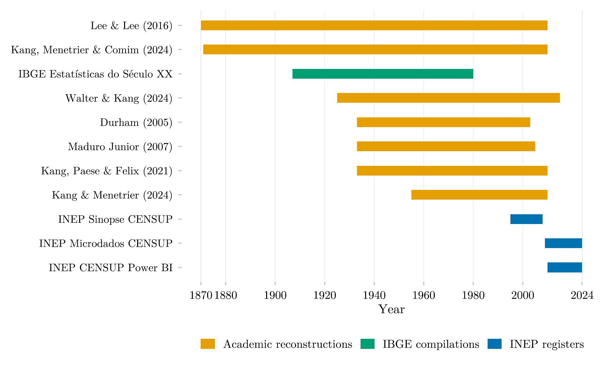

## Visão Geral

Esta figura explica por que o pacote `educabr2` existe: ela mostra as onze fontes de dados históricas que ele harmoniza, e exatamente quais anos cada uma cobre, de 1870 a 2024. Nenhuma fonte isolada cobre todo o período — o trabalho do pacote é costurar registros oficiais, compilações históricas e reconstruções acadêmicas num único painel contínuo.

## Metodologia

Cada barra abrange os anos cobertos por uma das fontes incluídas no pacote. Nenhuma fonte isolada cobre o século inteiro: os registros oficiais começam apenas em 1995, as compilações históricas param em 1980, e a lacuna entre elas é preenchida por reconstruções acadêmicas. Harmonizar essas séries parciais e sobrepostas num único painel contínuo é a razão de existir do pacote.

## Como Citar

Se você usar esta figura ou o pipeline que a gera, cite tanto a dissertação quanto este repositório.

**Dissertação:**

> Mançano, Tales. 2026. *Inequality in Access to Tertiary Education in Brazil: Household Incomes, Reforming Policies, and the Politics of Who Gets In (1990s–2020s)*. Dissertação de Mestrado, Programa de Pós-Graduação em Ciência Política, Universidade de São Paulo.

```bibtex
@mastersthesis{Mancano2026,
  author = {Man\c{c}ano, Tales},
  title  = {Inequality in Access to Tertiary Education in Brazil: Household
            Incomes, Reforming Policies, and the Politics of Who Gets In
            (1990s--2020s)},
  school = {University of S\~{a}o Paulo},
  year   = {2026},
  type   = {Master's thesis},
  note   = {Graduate Program in Political Science}
}
```

**Esta figura e o pipeline:**

> Mançano, Tales. 2026. "Cobertura Temporal das Fontes Harmonizadas pelo educabr2." Em *Open Data Analysis*. <https://github.com/mancano-tales/open-data-analysis>, `posts-pt/educabr2-source-coverage/`.

```bibtex
@misc{Mancano2026OpenDataAnalysis,
  author       = {Man\c{c}ano, Tales},
  title        = {Open Data Analysis: Cobertura Temporal das Fontes Harmonizadas pelo educabr2},
  year         = {2026},
  howpublished = {\url{https://github.com/mancano-tales/open-data-analysis}},
  note         = {posts/educabr2-source-coverage/}
}
```

Uma versão permanente (tag do Git + DOI no Zenodo) será linkada aqui assim que a dissertação for defendida; até lá, cite a URL do repositório acima.

## Pipeline

Scripts desta análise:

- Plotagem: [`plot.R`](../../posts/educabr2-source-coverage/plot.R)
- Pipeline upstream: nenhum script neste repositório — os dados vêm embutidos no pacote R [`educabr2`](https://github.com/mancano-tales/educabr2).

## Reprodutibilidade

**Tier: A (cross-repo)**

Este pipeline depende do pacote R público `educabr2` (`remotes::install_github("mancano-tales/educabr2")`), que embute os dados necessários.
