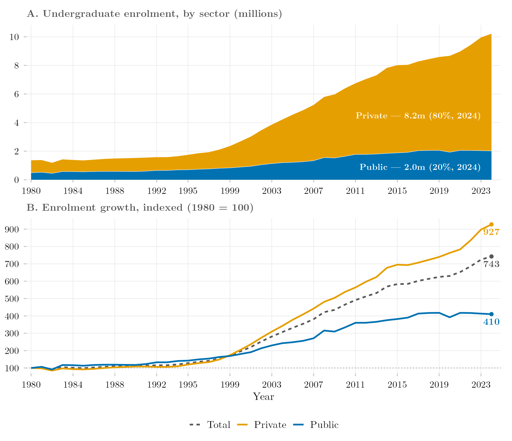

## Visão Geral

Esta figura mostra a expansão de longo prazo da matrícula de graduação brasileira entre 1980 e 2024, decomposta por categoria administrativa — federal pública, estadual pública, municipal pública e privada. Ela oferece o pano de fundo histórico mais profundo deste catálogo, remontando a bem antes dos pipelines de microdados da PNAD/PNADC usados no restante do projeto, para traçar como o equilíbrio entre ensino superior público e privado mudou ao longo de quatro décadas e meia.

## Metodologia

Série de longo prazo (1980–2024) da matrícula total de graduação e de sua composição por categoria administrativa (federal pública, estadual pública, municipal pública, privada), a partir do pacote R `educabr2`, que reúne estatísticas históricas do ensino superior brasileiro do Censo da Educação Superior do INEP e de suas pesquisas antecessoras (Censo do Ensino Superior, Sinopses Estatísticas) numa única série harmonizada de longo prazo. O período anterior à era moderna de microdados do INEP (antes de 1995) não é coberto por nenhum dos pipelines de PNAD/PNADC/CENSUP usados no restante deste repositório.

## Como Citar

Se você usar esta figura ou o pipeline que a gera, cite tanto a dissertação quanto este repositório.

**Dissertação:**

> Mançano, Tales. 2026. *Inequality in Access to Tertiary Education in Brazil: Household Incomes, Reforming Policies, and the Politics of Who Gets In (1990s–2020s)*. Dissertação de Mestrado, Programa de Pós-Graduação em Ciência Política, Universidade de São Paulo.

```bibtex
@mastersthesis{Mancano2026,
  author = {Man\c{c}ano, Tales},
  title  = {Inequality in Access to Tertiary Education in Brazil: Household
            Incomes, Reforming Policies, and the Politics of Who Gets In
            (1990s--2020s)},
  school = {University of S\~{a}o Paulo},
  year   = {2026},
  type   = {Master's thesis},
  note   = {Graduate Program in Political Science}
}
```

**Esta figura e o pipeline:**

> Mançano, Tales. 2026. "Expansão e Composição da Matrícula de Graduação, 1980–2024." Em *Open Data Analysis*. <https://github.com/mancano-tales/open-data-analysis>, `posts-pt/expansao-composicao-matriculas/`.

```bibtex
@misc{Mancano2026OpenDataAnalysis,
  author       = {Man\c{c}ano, Tales},
  title        = {Open Data Analysis: Expansão e Composição da Matrícula de Graduação, 1980–2024},
  year         = {2026},
  howpublished = {\url{https://github.com/mancano-tales/open-data-analysis}},
  note         = {posts/expansao-composicao-matriculas/}
}
```

Uma versão permanente (tag do Git + DOI no Zenodo) será linkada aqui assim que a dissertação for defendida; até lá, cite a URL do repositório acima.

## Pipeline

Scripts desta análise:

- Plotagem: [`plot.R`](../../posts/expansao-composicao-matriculas/plot.R)
- Pipeline upstream: nenhum script neste repositório — os dados vêm embutidos no pacote R [`educabr2`](https://github.com/mancano-tales/educabr2).

## Reprodutibilidade

**Tier: A (cross-repo)**

Este pipeline depende do pacote R público `educabr2` (`remotes::install_github("mancano-tales/educabr2")`), que embute os dados necessários.
