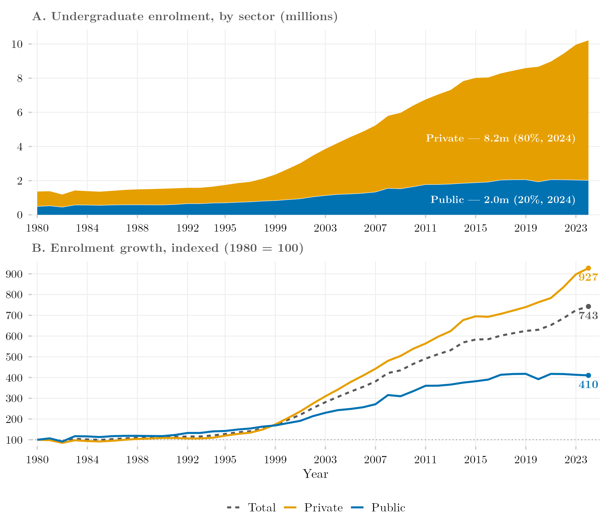

## Visão Geral

Esta figura mostra a expansão de longo prazo da matrícula de graduação brasileira entre 1980 e 2024, decomposta por categoria administrativa — federal pública, estadual pública, municipal pública e privada. Ela oferece o pano de fundo histórico mais profundo deste catálogo, remontando a bem antes dos pipelines de microdados da PNAD/PNADC usados no restante do projeto, para traçar como o equilíbrio entre ensino superior público e privado mudou ao longo de quatro décadas e meia.

## Metodologia

Série de longo prazo (1980–2024) da matrícula total de graduação e de sua composição por categoria administrativa (federal pública, estadual pública, municipal pública, privada), a partir do pacote R `educabr2`, que reúne estatísticas históricas do ensino superior brasileiro do Censo da Educação Superior do INEP e de suas pesquisas antecessoras (Censo do Ensino Superior, Sinopses Estatísticas) numa única série harmonizada de longo prazo. O período anterior à era moderna de microdados do INEP (antes de 1995) não é coberto por nenhum dos pipelines de PNAD/PNADC/CENSUP usados no restante deste repositório.

## Como Citar

Se você usar esta figura ou o pipeline que a gera, cite tanto a dissertação quanto esta análise específica. As referências seguem a 7ª edição da APA.

**Dissertação (em elaboração; a entrada será atualizada após a defesa):**

> Mançano, T. (2026). *Inequality in access to tertiary education in Brazil: Household incomes, reforming policies, and the politics of who gets in (1990s–2020s)* [Dissertação de mestrado não publicada]. Universidade de São Paulo.

**Esta figura e o pipeline:**

> Mançano, T. (2026, 27 de agosto). *Expansão e composição da matrícula de graduação, 1980–2024* [Figura e pipeline reprodutível]. Open Data Analysis. https://mancano-tales.github.io/open-data-analysis/pt/posts-pt/expansao-composicao-matriculas/

**No texto:** (Mançano, 2026) — ao citar várias análises deste catálogo no mesmo trabalho, a APA as distingue como 2026a, 2026b, … na ordem em que aparecem na lista de referências.

**BibTeX:**

```bibtex
@mastersthesis{Mancano2026Thesis,
  author = {Man\c{c}ano, Tales},
  title  = {Inequality in Access to Tertiary Education in Brazil: Household
            Incomes, Reforming Policies, and the Politics of Who Gets In
            (1990s--2020s)},
  school = {University of S\~{a}o Paulo},
  year   = {2026},
  type   = {Master's thesis},
  note   = {Unpublished; Graduate Program in Political Science}
}

@misc{Mancano2026_expansao_composicao_matriculas_pt,
  author       = {Man\c{c}ano, Tales},
  title        = {Expans\~{a}o e composi\c{c}\~{a}o da matr\'{\i}cula de gradua\c{c}\~{a}o, 1980--2024},
  year         = {2026},
  month        = aug,
  howpublished = {Open Data Analysis, \url{https://mancano-tales.github.io/open-data-analysis/pt/posts-pt/expansao-composicao-matriculas/}},
  note         = {Figura e pipeline reprodutível. Código-fonte: \url{https://github.com/mancano-tales/open-data-analysis}, pasta posts-pt/expansao-composicao-matriculas/. Acesso em AAAA-MM-DD}
}
```

Uma versão permanente (tag do Git + DOI no Zenodo) será linkada aqui assim que a dissertação for defendida; até lá, cite a URL da página acima e acrescente a data de acesso (código-fonte: https://github.com/mancano-tales/open-data-analysis, pasta `posts-pt/expansao-composicao-matriculas/`).

## Pipeline

Scripts desta análise:

- Plotagem: [`plot.R`](../../posts/expansao-composicao-matriculas/plot.R) — grava a figura em `output/figures/expansao-composicao-matriculas/` — compare com o `thumbnail.png` deste post
- Pipeline upstream: nenhum script upstream neste repositório — na primeira execução baixa a planilha-fonte `data_tertiary_v6_clean.xlsx` do repositório público [`educabr2`](https://github.com/mancano-tales/educabr2) (`data-raw/sources/tertiary_multisource/`) para `data-raw/educabr2/`.

## Reprodutibilidade

**Tier: A (cross-repo)**

Esta figura depende do repositório público [`educabr2`](https://github.com/mancano-tales/educabr2): o `plot.R` baixa dele a planilha-fonte (`data-raw/sources/tertiary_multisource/data_tertiary_v6_clean.xlsx`) na primeira execução — sem credencial e sem download manual.
