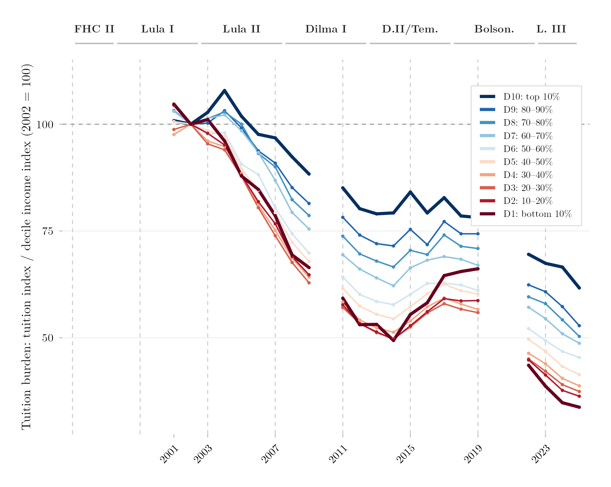

## Visão Geral

Esta figura pergunta se a mesma mensalidade nominal ficou mais fácil ou mais difícil de pagar para domicílios em diferentes pontos da distribuição de renda. Ela combina a série de preços de mensalidade do ensino superior com a renda domiciliar por decil, acompanhando como a razão entre as duas se moveu para os decis mais pobre e mais rico desde 2002.

## Metodologia

O índice de fardo de mensalidade divide a mesma série real de reajuste de mensalidade usada na figura de mensalidade via IPCA pela renda domiciliar per capita real média ponderada de cada decil, ambas expressas com base 2002 = 100 e ambas deflacionadas pela mesma base do IPCA. Os decis são calculados dentro de cada ano de pesquisa e de cada fonte; a série harmonizada usa a PNAD Anual até 2015 e a PNAD Contínua a partir de 2016, com 2012–2015 restrito a observações da PNAD Anual. Como o fardo é uma razão entre dois índices ancorados no mesmo ano-base, ele nada diz sobre a acessibilidade absoluta da mensalidade em qualquer ano isolado — apenas sobre como uma mensalidade nominal fixa se moveu em relação à própria trajetória de renda de cada decil desde 2002. A série de mensalidade subjacente é um índice de reajuste de painel fixo e não registra o barateamento composicional adicional trazido pela migração pós-2015 para o EaD, de modo que o fardo mostrado é, se algo, um limite superior de quanto a mensalidade de fato ficou mais leve para os decis inferiores.

## Pipeline

Scripts desta análise:

- Plotagem: [`plot.R`](../../posts/fardo-mensalidade-decil/plot.R)
- Pipeline upstream:
  - [`shared-pipeline/pnadc/035_Splice_Microdados.R`](../../shared-pipeline/pnadc/035_Splice_Microdados.R)
  - [`shared-pipeline/ipca/010_IPCA_Curso_Superior_Series.R`](../../shared-pipeline/ipca/010_IPCA_Curso_Superior_Series.R)

## Reprodutibilidade

**Tier: A**

Este pipeline usa apenas dados públicos, acessíveis via pacote/API sem necessidade de credencial (PNADcIBGE, censobr, sidrar, ipeadatar). Rode os scripts em `shared-pipeline/` na ordem numérica para reconstruir os dados intermediários.
