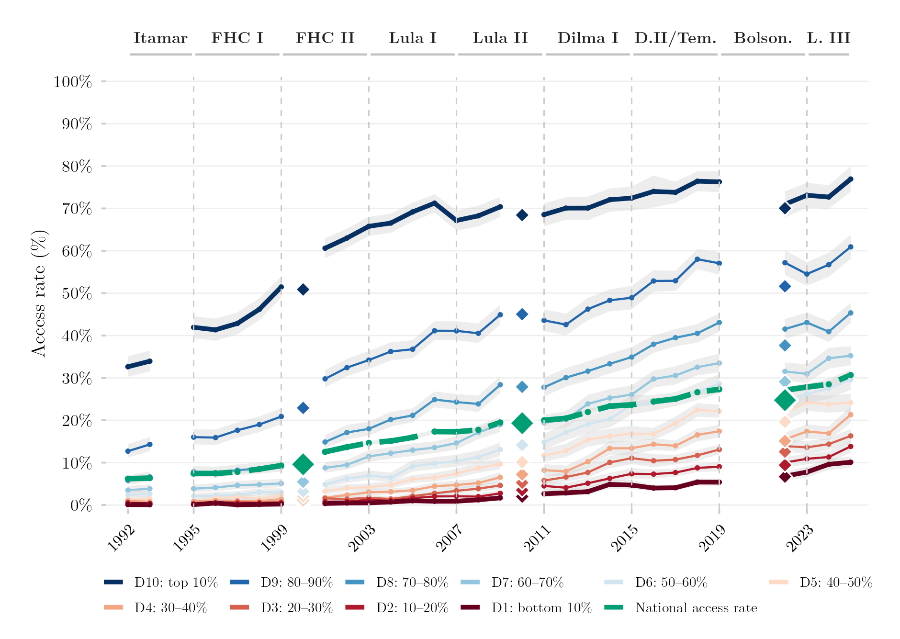

## Visão Geral

Vinte e uma das figuras deste catálogo não leem de uma única pesquisa domiciliar — elas leem de um **painel harmonizado** que emenda duas pesquisas diferentes numa série internamente consistente: a PNAD Anual (a principal pesquisa domiciliar anual do Brasil, 1992–2015) e a PNAD Contínua (a pesquisa contínua que a substituiu, 2016–2025). Combiná-las permite que toda figura deste catálogo trate 1992–2025 como um período comparável, em vez de dois fragmentos incompatíveis. Esta página documenta a harmonização em si — as fontes, as decisões, as variáveis resultantes e como o resultado foi validado — não uma figura específica construída em cima dela.

## Metodologia

**Fontes de dado.** A PNAD Anual (1992–2011, coletada pelo IBGE) traz microdados anuais sobre renda, educação e mercado de trabalho; sua região Norte rural foi excluída em 2004–2015 para comparabilidade com a cobertura geográfica inicial da PNAD Contínua. A PNAD Contínua (2012–2025) é a pesquisa contínua redesenhada, com desenho amostral mais complexo (painéis rotativos, amostragem estratificada por unidade primária), exigindo estimação exata de desenho amostral complexo via `survey::svydesign()`. Os Censos Demográficos decenais (1991, 2000, 2010, 2022), acessados via o pacote R `censobr`, são usados separadamente como pontos de validação independentes — não fazem parte do painel harmonizado em si.

**Decisões metodológicas centrais.** Um log numerado de decisões documenta toda escolha consequente feita ao harmonizar as duas pesquisas. As mais importantes:

| Decisão | Descrição |
|---|---|
| D01 | Deflaciona todos os valores monetários a preços de janeiro de 2024 via IPCA (pacote `deflateBR`) |
| D02 | Exclui observações com renda domiciliar per capita zero |
| D03 | Exclui a região Norte rural (UFs 11–16) da PNAD Anual em 2004–2015, para comparabilidade com a cobertura inicial da PNAD Contínua |
| D11 | Exclui 2020–2021 da série harmonizada (problemas de qualidade de dado da PNAD Contínua na pandemia) |
| D19 | Indicador de matrícula no ensino superior = matriculado atualmente (variável separada de "já ingressou alguma vez") |
| D20 | Trata o código-sentinela de renda não declarada da PNAD 1992–1999 como ausente na importação, em vez de deixá-lo no topo da distribuição de renda |
| D21 | Mantém a unidade de agregação de renda própria de cada pesquisa através da emenda — família na PNAD Anual, domicílio na PNAD Contínua — em vez de reconstruir as duas numa unidade só |

**Bancos e variáveis resultantes.** O pipeline produz dois arquivos prontos para análise: o subconjunto de 18–24 anos usado nas figuras de acesso ao ensino superior, e a população total com renda válida, usada na construção dos decis de renda. Ambos são restritos a indivíduos com renda domiciliar per capita estritamente positiva; a PNAD Contínua é restrita aos respondentes da primeira entrevista para evitar que sua estrutura de painel infle o tamanho da amostra. A série cobre 1992–1999, 2001–2009, 2011–2019 e 2022–2025 — 2000 e 2010 estão ausentes porque não houve PNAD em anos de Censo. As variáveis centrais incluem renda (nominal e corrigida pela inflação), um indicador de acesso ao ensino superior validado contra uma série de referência externa com precisão de ±0,3 pontos percentuais no nível nacional, decil e vintil de renda (calculados dentro de cada ano e fonte, usando pesos amostrais), e uma flag de fonte (2012–2015 existe nas duas pesquisas, uma sobreposição intencional mantida para validar a emenda — qualquer análise que atravesse esses anos precisa escolher uma única fonte para não contar em dobro).

**Validação externa.** A série harmonizada de acesso ao ensino superior foi comparada contra a série independente de Salata et al. (2025), que usa um pipeline de processamento de dado inteiramente diferente. Depois de corrigir um erro de codificação inicial (a construção original omitia respondentes que já haviam concluído ou abandonado o ensino superior, concentrado no decil de renda mais alto), as duas séries concordam de perto em toda a janela:

| Período | Fonte | Diferença vs. referência | Avaliação |
|---|---|---|---|
| 1992–1999 | PNAD histórica | −0,08 a +0,09 pp | Alinhado |
| 2001–2006 | PNAD Anual | +1,47 a +1,66 pp | Documentado — exclusão do Norte rural |
| 2007–2015 | PNAD Anual | +0,09 a +0,33 pp | Alinhado |
| 2016–2019 | PNAD Contínua | −0,01 a −0,08 pp | Alinhado |
| 2022 | PNAD Contínua | −0,71 pp | Aceitável — Norte rural mantido |

Nenhuma quebra artificial foi detectada no ponto de emenda PNAD/PNAD Contínua (2012–2015), onde as duas fontes acompanham a série de referência de forma independente, com diferença de até 0,4 pontos percentuais entre si.

## Como Citar

Se você usar este painel harmonizado ou qualquer figura construída sobre ele, cite tanto a dissertação quanto este repositório.

**Dissertação:**

> Mançano, Tales. 2026. *Inequality in Access to Tertiary Education in Brazil: Household Incomes, Reforming Policies, and the Politics of Who Gets In (1990s–2020s)*. Dissertação de Mestrado, Programa de Pós-Graduação em Ciência Política, Universidade de São Paulo.

```bibtex
@mastersthesis{Mancano2026,
  author = {Man\c{c}ano, Tales},
  title  = {Inequality in Access to Tertiary Education in Brazil: Household
            Incomes, Reforming Policies, and the Politics of Who Gets In
            (1990s--2020s)},
  school = {University of S\~{a}o Paulo},
  year   = {2026},
  type   = {Master's thesis},
  note   = {Graduate Program in Political Science}
}
```

**Este painel harmonizado:**

> Mançano, Tales. 2026. "Harmonização PNAD / PNAD Contínua, 1992–2025." Em *Open Data Analysis*. <https://github.com/mancano-tales/open-data-analysis>, `posts-pt/harmonizacao-pnad-pnadc/`.

```bibtex
@misc{Mancano2026OpenDataAnalysis,
  author       = {Man\c{c}ano, Tales},
  title        = {Open Data Analysis: Harmoniza\c{c}\~{a}o PNAD / PNAD Cont\'{i}nua, 1992--2025},
  year         = {2026},
  howpublished = {\url{https://github.com/mancano-tales/open-data-analysis}},
  note         = {posts-pt/harmonizacao-pnad-pnadc/}
}
```

Uma versão permanente (tag do Git + DOI no Zenodo) será linkada aqui assim que a dissertação for defendida; até lá, cite a URL do repositório acima.

## Pipeline

Scripts desta harmonização, em ordem de execução:

- [`shared-pipeline/pnadc/000_PNADC_Download_Consolidate.R`](../../shared-pipeline/pnadc/000_PNADC_Download_Consolidate.R) — baixa e consolida a PNAD Contínua, 2012–2025
- [`shared-pipeline/pnadc/020_PNAD_Anual_Manual_Import_2001_2015.R`](../../shared-pipeline/pnadc/020_PNAD_Anual_Manual_Import_2001_2015.R) — importa a PNAD Anual 2001–2015 a partir dos microdados brutos em formato SAS
- [`shared-pipeline/pnadc/050_PNAD_Historica_Manual_Import_1992_1999.R`](../../shared-pipeline/pnadc/050_PNAD_Historica_Manual_Import_1992_1999.R) — importa a PNAD Anual 1992–1999
- [`shared-pipeline/pnadc/021_PNAD_Anual_Import_Com_Renda_Zero.R`](../../shared-pipeline/pnadc/021_PNAD_Anual_Import_Com_Renda_Zero.R) — importação alternativa da PNAD Anual, usada por um subconjunto de figuras
- [`shared-pipeline/pnadc/035_Splice_Microdados.R`](../../shared-pipeline/pnadc/035_Splice_Microdados.R) — emenda tudo acima nos dois bancos analíticos harmonizados
- [`shared-pipeline/pnadc/238_Serie_Desigualdade_Oficial.R`](../../shared-pipeline/pnadc/238_Serie_Desigualdade_Oficial.R) — deriva a série oficial de desigualdade de renda (Gini, Palma) a partir do painel harmonizado
- [`shared-pipeline/censo/040_Censo_Pontos_Validacao.R`](../../shared-pipeline/censo/040_Censo_Pontos_Validacao.R) — pontos de validação independentes via Censo Demográfico (não fazem parte do painel em si)

Ou rode [`shared-pipeline/build_public_data.R`](../../shared-pipeline/build_public_data.R), que executa esses scripts na ordem certa automaticamente.

**Figuras deste catálogo construídas sobre esta harmonização:** todo post com a tag "PNAD/PNADC" linka de volta pra esta página na sua própria seção de Pipeline.

## Reprodutibilidade

**Tier: A**

Este pipeline usa apenas dados públicos, acessíveis via pacote/API sem necessidade de credencial (PNADcIBGE, censobr). Rode os scripts acima — ou `shared-pipeline/build_public_data.R` — em ordem para reconstruir o painel harmonizado do zero.
