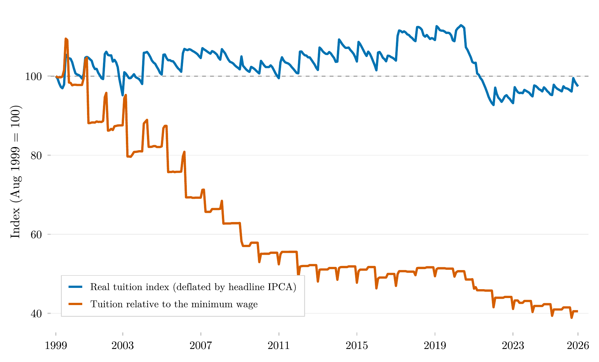

## Visão Geral

Esta figura acompanha como o custo das mensalidades do ensino superior no Brasil se moveu em relação a dois referenciais desde 1999: a inflação geral ao consumidor e o salário mínimo. Ela mostra se as mensalidades ficaram mais ou menos caras em termos reais e, separadamente, se ficaram mais ou menos acessíveis em relação ao piso salarial ao qual a renda de boa parte dos domicílios brasileiros está ancorada.

## Metodologia

Ambas as séries acompanham o subitem de mensalidade de curso superior do IPCA, o índice oficial de preços ao consumidor do Brasil, emendado a partir das quatro versões da série do SIDRA no nível de subitem (tabelas 655, 2938, 1419 e 7060) e expresso como índice acumulado com agosto de 1999 = 100. A série azul deflaciona os reajustes acumulados de mensalidade pelo IPCA geral: valores acima de 100 indicam que as mensalidades subiram mais rápido que os preços ao consumidor em geral após agosto de 1999. A série laranja divide o mesmo índice de mensalidade pelo salário mínimo nominal (série do IPEADATA `MTE12_SALMIN12`), medindo como o custo da mesma mensalidade evoluiu em relação ao piso salarial. O subitem do IPCA é um índice de variação de preços calculado sobre um painel fixo de instituições: ele mede reajuste, não o nível de preço nem o ticket médio de mercado, e não captura o barateamento composicional pela migração para o EaD e para instituições de menor preço. Em termos reais, as mensalidades acompanharam ou superaram a inflação geral até 2020 e só caíram abaixo do patamar de 1999 depois dos cortes nominais de mensalidade de 2021; em relação ao salário mínimo, as mensalidades caíram cerca de 60%, com a maior parte da queda concentrada entre 2001 e 2012.

## Como Citar

Se você usar esta figura ou o pipeline que a gera, cite tanto a dissertação quanto esta análise específica. As referências seguem a 7ª edição da APA.

**Dissertação (em elaboração; a entrada será atualizada após a defesa):**

> Mançano, T. (2026). *Inequality in access to tertiary education in Brazil: Household incomes, reforming policies, and the politics of who gets in (1990s–2020s)* [Dissertação de mestrado não publicada]. Universidade de São Paulo.

**Esta figura e o pipeline:**

> Mançano, T. (2026, 6 de julho). *Preços de mensalidades do ensino superior em relação à inflação e ao salário mínimo* [Figura e pipeline reprodutível]. Open Data Analysis. https://mancano-tales.github.io/open-data-analysis/pt/posts-pt/ipca-mensalidade-curso-superior/

**No texto:** (Mançano, 2026) — ao citar várias análises deste catálogo no mesmo trabalho, a APA as distingue como 2026a, 2026b, … na ordem em que aparecem na lista de referências.

**BibTeX:**

```bibtex
@mastersthesis{Mancano2026Thesis,
  author = {Man\c{c}ano, Tales},
  title  = {Inequality in Access to Tertiary Education in Brazil: Household
            Incomes, Reforming Policies, and the Politics of Who Gets In
            (1990s--2020s)},
  school = {University of S\~{a}o Paulo},
  year   = {2026},
  type   = {Master's thesis},
  note   = {Unpublished; Graduate Program in Political Science}
}

@misc{Mancano2026_ipca_mensalidade_curso_superior_pt,
  author       = {Man\c{c}ano, Tales},
  title        = {Pre\c{c}os de mensalidades do ensino superior em rela\c{c}\~{a}o \`{a} infla\c{c}\~{a}o e ao salário m\'{\i}nimo},
  year         = {2026},
  month        = jul,
  howpublished = {Open Data Analysis, \url{https://mancano-tales.github.io/open-data-analysis/pt/posts-pt/ipca-mensalidade-curso-superior/}},
  note         = {Figura e pipeline reprodutível. Código-fonte: \url{https://github.com/mancano-tales/open-data-analysis}, pasta posts-pt/ipca-mensalidade-curso-superior/. Acesso em AAAA-MM-DD}
}
```

Uma versão permanente (tag do Git + DOI no Zenodo) será linkada aqui assim que a dissertação for defendida; até lá, cite a URL da página acima e acrescente a data de acesso (código-fonte: https://github.com/mancano-tales/open-data-analysis, pasta `posts-pt/ipca-mensalidade-curso-superior/`).

## Pipeline

Scripts desta análise:

- Plotagem: [`plot.R`](../../posts/ipca-mensalidade-curso-superior/plot.R) — grava a figura em `output/figures/ipca-mensalidade-curso-superior/` — compare com o `thumbnail.png` deste post
- Pipeline upstream: autocontido — baixa as séries do subitem do IPCA (SIDRA) e do salário mínimo (IPEADATA) e as guarda em `data-raw/ipca-mensalidades/output/`. É o mesmo script de [`shared-pipeline/ipca/010_IPCA_Curso_Superior_Series.R`](../../shared-pipeline/ipca/010_IPCA_Curso_Superior_Series.R).

## Reprodutibilidade

**Tier: A**

Este pipeline usa apenas dados públicos, acessíveis via pacote/API sem necessidade de credencial (PNADcIBGE, censobr, sidrar, ipeadatar). Rode os scripts em `shared-pipeline/` na ordem numérica para reconstruir os dados intermediários.
