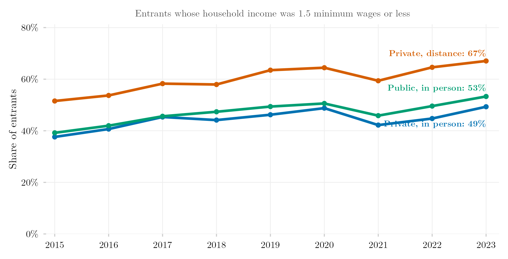

## Visão Geral

Esta figura compara o perfil de renda domiciliar dos estudantes que ingressam no ensino superior por diferentes setores e modalidades de ensino (EaD vs. presencial). Ela mostra se o EaD e o ensino presencial, e as instituições públicas e privadas, recrutam suas turmas de ingressantes em pontos diferentes da distribuição de renda.

## Metodologia

Perfil de renda domiciliar dos ingressantes por modalidade de ensino (EaD vs. presencial), extraído de uma base do SEDAP+ que cruza o ENEM (exame nacional do ensino médio, que reporta renda domiciliar) com os registros de matrícula do Censo da Educação Superior. As faixas de renda vêm do questionário socioeconômico preenchido por todo participante do ENEM, permitindo classificar a renda domiciliar per capita declarada pelo ingressante contra as mesmas faixas de renda usadas em outras partes deste projeto.

## Pipeline

Scripts desta análise:

- Plotagem: [`plot.R`](../../posts/perfil-renda-modalidade/plot.R)
- Pipeline upstream:
  - [`shared-pipeline/sedap/070_Perfil_Renda_Modalidade.R`](../../shared-pipeline/sedap/070_Perfil_Renda_Modalidade.R)
  - [`shared-pipeline/sedap/010_SEDAP_Cliente.R`](../../shared-pipeline/sedap/010_SEDAP_Cliente.R)

## Reprodutibilidade

**Tier: B**

Este pipeline depende de dado restrito do INEP acessível via credencial SEDAP+ (variável de ambiente `SEDAP_TOKEN`). Sem uma credencial aprovada, os scripts em `shared-pipeline/sedap/` não rodam — a lógica fica disponível para auditoria, mas a reprodução completa exige solicitar acesso ao INEP.
