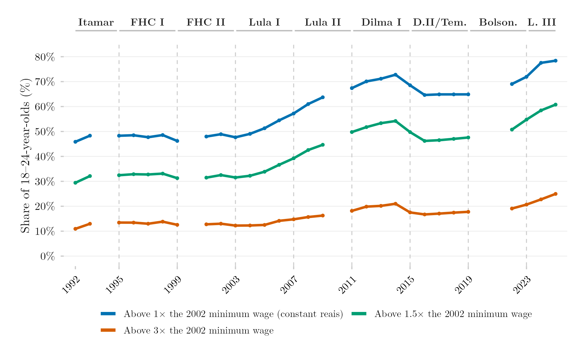

## Visão Geral

Esta figura mostra como mudou ao longo do tempo a proporção de jovens brasileiros vivendo em domicílios acima de limiares fixos de renda, ajustados pelo poder de compra. Em vez de usar uma medida relativa como os decis de renda (que sempre dividem a população em grupos de tamanho fixo, independentemente de como a renda evolui), a figura fixa uma barra absoluta — um nível de renda real expresso como múltiplos do salário mínimo — e acompanha quantas pessoas superaram essa barra a cada ano.

## Metodologia

Para cada ano de pesquisa, o valor nominal do salário mínimo de janeiro daquele ano (série do IPEADATA `MTE12_SALMIN12`) é deflacionado a preços de janeiro de 2024 via `deflateBR::deflate()`, e o valor real de janeiro de 2002 (R$ 675 a preços de janeiro de 2024) é mantido fixo como limiar para todos os anos seguintes. As proporções ponderadas pela amostra de jovens de 18 a 24 anos com renda domiciliar per capita real igual ou superior a 1, 1,5 e 3 vezes esse limiar fixo são calculadas ano a ano a partir da série harmonizada (PNAD Anual até 2015, PNAD Contínua a partir de 2016).

## Pipeline

Scripts desta análise:

- Plotagem: [`plot.R`](../../posts/populacao-limiares-sm/plot.R)
- Pipeline upstream:
  - [`shared-pipeline/pnadc/035_Splice_Microdados.R`](../../shared-pipeline/pnadc/035_Splice_Microdados.R)

## Reprodutibilidade

**Tier: A**

Este pipeline usa apenas dados públicos, acessíveis via pacote/API sem necessidade de credencial (PNADcIBGE, censobr, sidrar, ipeadatar). Rode os scripts em `shared-pipeline/` na ordem numérica para reconstruir os dados intermediários.
