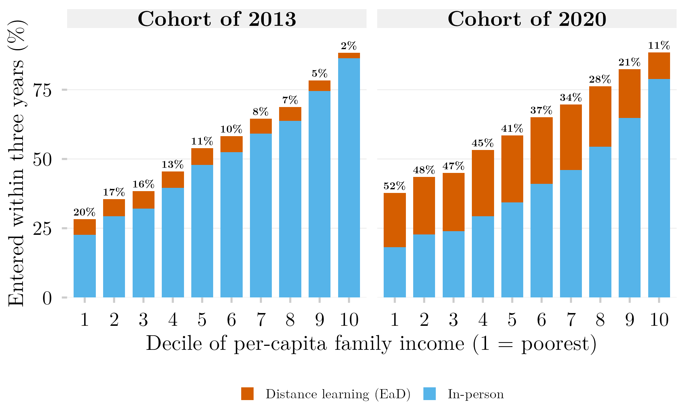
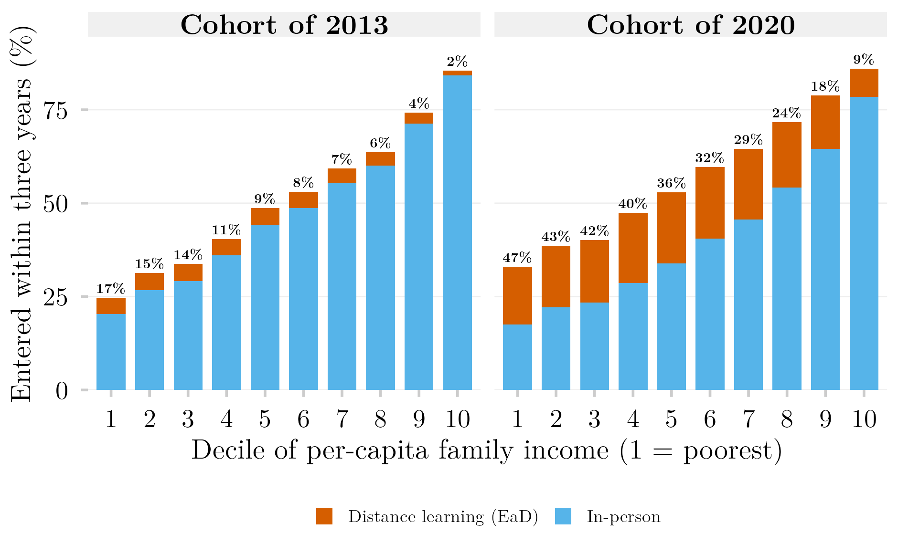

## Visão Geral

Cada barra é a parcela de um decil de renda de uma coorte do ensino médio que ingressou no ensino superior em até três anos depois do último ano escolar, dividida entre ensino a distância (EaD) e presencial. A porcentagem acima de cada barra é a parcela do EaD entre os ingressantes daquele decil. Entre as coortes de 2013 e 2020, o ingresso presencial cai em todos os decis, 4,4 pontos percentuais no mais pobre e até 13,5 no meio da distribuição, enquanto o ingresso a distância sobe em todos os decis. O ingresso total sobe 9,4 pontos no decil mais pobre e 0,2 no mais rico. No decil mais pobre, o EaD passa de 20% para 52% dos ingressantes; no mais rico, de 2% para 11%.

Os dados são registros administrativos vinculados (Censo Escolar, ENEM, Censo da Educação Superior) consultados pela plataforma SEDAP+ do INEP, que devolve apenas tabelas agregadas. As tabelas agregadas que a figura lê e o SQL exato de cada consulta que as produziu são publicados com este post, de modo que a figura reproduz sem credencial.

## Metodologia

**Coorte, vínculo e decis.** Mesmo desenho da [figura irmã sobre portas de entrada](../portas-renda-coortes-empilhado/): todo estudante matriculado na última série do ensino médio no Censo Escolar de 2013 ou de 2020, com 16 a 22 anos, que fez o ENEM do mesmo ano, vinculado por CPF mascarado; decis de renda familiar per capita construídos a partir da faixa de renda do ENEM dividida pelo grupo de número de moradores, cortados dentro de cada coorte.

**Ingresso e modalidade.** O estudante conta como ingressante se qualquer registro de matrícula com ano de ingresso nos três anos seguintes aparece no Censo da Educação Superior, qualquer que seja a situação posterior desse registro. A modalidade vem de `TP_MODALIDADE_ENSINO` (1 presencial, 2 a distância). Quando a mesma pessoa tem uma matrícula presencial e outra a distância na janela, o EaD prevalece por convenção: a pergunta é quem estuda a distância.

**Por que isto é um piso para o EaD.** O ingresso no EaD não exige ENEM, e muitos ingressantes a distância nunca aparecem numa coorte construída a partir do exame. A cobertura do vínculo também difere por modalidade: medida para 2022, chegou a cerca de 0,68 vez a contagem esperada no EaD privado, contra 1,71 vez no presencial público. Toda proporção de EaD aqui deve ser lida como "pelo menos isto"; pela mesma razão, a mudança entre as coortes é uma leitura conservadora do deslocamento.

**Camada de privacidade.** O SEDAP+ devolve contagens sob orçamento de privacidade diferencial ($\varepsilon = 1$) e suprime células pequenas do resultado: 0,49% das células em 2013 e nenhuma em 2020. Fora isso, as contagens são exatas nesse nível de agregação, e por isso nenhuma faixa de confiança é desenhada.

## Uma definição anterior de ingresso

A primeira versão desta figura contava apenas registros de matrícula marcados com `IN_MATRICULA = 1`, que indica matrícula ativa ou concluída na data de referência do censo. Nessa definição, quem ingressou e saiu antes do censo do ano de ingresso contava como se nunca tivesse ingressado. A diferença é maior no EaD: na coorte de 2020, o ingresso a distância sobe de 4 a 5 pontos percentuais nos oito decis inferiores quando o filtro sai, e no decil mais pobre vai de 15,5% para 19,5%. A figura abaixo reproduz a definição anterior para comparação.



## Como Citar

Se você usar esta figura ou o pipeline que a gera, cite tanto a dissertação quanto esta análise específica. As referências seguem a 7ª edição da APA.

**Dissertação (em elaboração; a entrada será atualizada após a defesa):**

> Mançano, T. (2026). *Inequality in access to tertiary education in Brazil: Household incomes, reforming policies, and the politics of who gets in (1990s–2020s)* [Dissertação de mestrado não publicada]. Universidade de São Paulo.

**Esta figura e o pipeline:**

> Mançano, T. (2026, 23 de setembro). *Ingresso a distância e presencial por decil de renda per capita: As coortes do ensino médio de 2013 e 2020* [Figura e pipeline reprodutível]. Open Data Analysis. https://mancano-tales.github.io/open-data-analysis/pt/posts-pt/portas-renda-coortes-ead/

**No texto:** (Mançano, 2026) — ao citar várias análises deste catálogo no mesmo trabalho, a APA as distingue como 2026a, 2026b, … na ordem em que aparecem na lista de referências.

**BibTeX:**

```bibtex
@mastersthesis{Mancano2026Thesis,
  author = {Man\c{c}ano, Tales},
  title  = {Inequality in Access to Tertiary Education in Brazil: Household
            Incomes, Reforming Policies, and the Politics of Who Gets In
            (1990s--2020s)},
  school = {University of S\~{a}o Paulo},
  year   = {2026},
  type   = {Master's thesis},
  note   = {Unpublished; Graduate Program in Political Science}
}

@misc{Mancano2026_portas_renda_coortes_ead_pt,
  author       = {Man\c{c}ano, Tales},
  title        = {Ingresso a dist\^{a}ncia e presencial por decil de renda per capita: As coortes do ensino m\'{e}dio de 2013 e 2020},
  year         = {2026},
  month        = sep,
  howpublished = {Open Data Analysis, \url{https://mancano-tales.github.io/open-data-analysis/pt/posts-pt/portas-renda-coortes-ead/}},
  note         = {Figura e pipeline reprodutível. Código-fonte: \url{https://github.com/mancano-tales/open-data-analysis}, pasta posts/portas-renda-coortes-ead/. Acesso em AAAA-MM-DD}
}
```

Uma versão permanente (tag do Git + DOI no Zenodo) será linkada aqui assim que a dissertação for defendida; até lá, cite a URL da página acima e acrescente a data de acesso (código-fonte: https://github.com/mancano-tales/open-data-analysis, pasta `posts/portas-renda-coortes-ead/`).

## Pipeline

A figura lê quatro tabelas agregadas redistribuídas na pasta [`data/`](../../posts/portas-renda-coortes-ead/data/) do post, uma por coorte e definição de ingresso. Cada linha é uma contagem de estudantes numa célula de faixa de renda (`FAIXA_RENDA`, A–Q) × grupo de moradores (`MORADORES_GRUPO`) × modalidade (`COD_MODALIDADE`: 0 sem ingresso, 1 a distância, 2 presencial).

| Tabela | Coorte | Definição de ingresso | SQL enviado ao SEDAP+ |
|---|---|---|---|
| [`matriz_2013_fina_ead.csv`](../../posts/portas-renda-coortes-ead/data/matriz_2013_fina_ead.csv) | 2013 | qualquer registro (figura acima) | [`sql/matriz_2013_fina_ead.sql`](../../posts/portas-renda-coortes-ead/sql/matriz_2013_fina_ead.sql) |
| [`matriz_2020_fina_ead.csv`](../../posts/portas-renda-coortes-ead/data/matriz_2020_fina_ead.csv) | 2020 | qualquer registro (figura acima) | [`sql/matriz_2020_fina_ead.sql`](../../posts/portas-renda-coortes-ead/sql/matriz_2020_fina_ead.sql) |
| [`matriz_2013_fina_ead_com_in_matricula.csv`](../../posts/portas-renda-coortes-ead/data/matriz_2013_fina_ead_com_in_matricula.csv) | 2013 | `IN_MATRICULA = 1` (anterior) | [`sql/matriz_2013_fina_ead_com_in_matricula.sql`](../../posts/portas-renda-coortes-ead/sql/matriz_2013_fina_ead_com_in_matricula.sql) |
| [`matriz_2020_fina_ead_com_in_matricula.csv`](../../posts/portas-renda-coortes-ead/data/matriz_2020_fina_ead_com_in_matricula.csv) | 2020 | `IN_MATRICULA = 1` (anterior) | [`sql/matriz_2020_fina_ead_com_in_matricula.sql`](../../posts/portas-renda-coortes-ead/sql/matriz_2020_fina_ead_com_in_matricula.sql) |

Cada arquivo `.sql` é o texto exato enviado à API do SEDAP+, copiado do log de consultas, com um cabeçalho que registra quando rodou, os parâmetros de privacidade e a parcela de células suprimidas. Para desenhar as duas figuras a partir das tabelas:

1. [`plot.R`](../../posts/portas-renda-coortes-ead/plot.R) — constrói os decis de renda per capita e grava as duas figuras em `output/figures/portas-renda-coortes-ead/` e `output/figures/portas-renda-coortes-ead-in-matricula/` — compare com o `thumbnail.png` e o `thumbnail-in-matricula.png` deste post

Para reextrair as tabelas dos microdados vinculados (exige credencial SEDAP+ do INEP exportada como `SEDAP_TOKEN`), rode, a partir da raiz do projeto:

1. [`shared-pipeline/sedap/010_SEDAP_Cliente.R`](../../shared-pipeline/sedap/010_SEDAP_Cliente.R) — cliente da API SEDAP+, carregado pelo script abaixo
2. [`shared-pipeline/sedap/portas/054_Extrair_EaD.R`](../../shared-pipeline/sedap/portas/054_Extrair_EaD.R) — monta e roda as consultas das duas coortes e grava `data-raw/sedap/portas/matriz_<ano>_fina_ead.csv`; rode de novo com `FILTRO_IN_MATRICULA=TRUE` no ambiente para reproduzir a definição anterior. Quando esses arquivos existem, o `plot.R` os lê de preferência às cópias redistribuídas

## Reprodutibilidade

**Tier: B (agregado redistribuído)** — a figura reproduz sem credencial a partir das tabelas em `data/`; a reextração exige acesso ao SEDAP+.

As tabelas não carregam registro individual: cada linha é uma contagem de estudantes numa célula de faixa de renda × grupo de moradores × modalidade, tal como liberada pela plataforma depois do seu próprio controle de divulgação. O script de extração só roda com credencial aprovada do INEP; sem ela, a lógica e o SQL exato permanecem disponíveis para auditoria.
