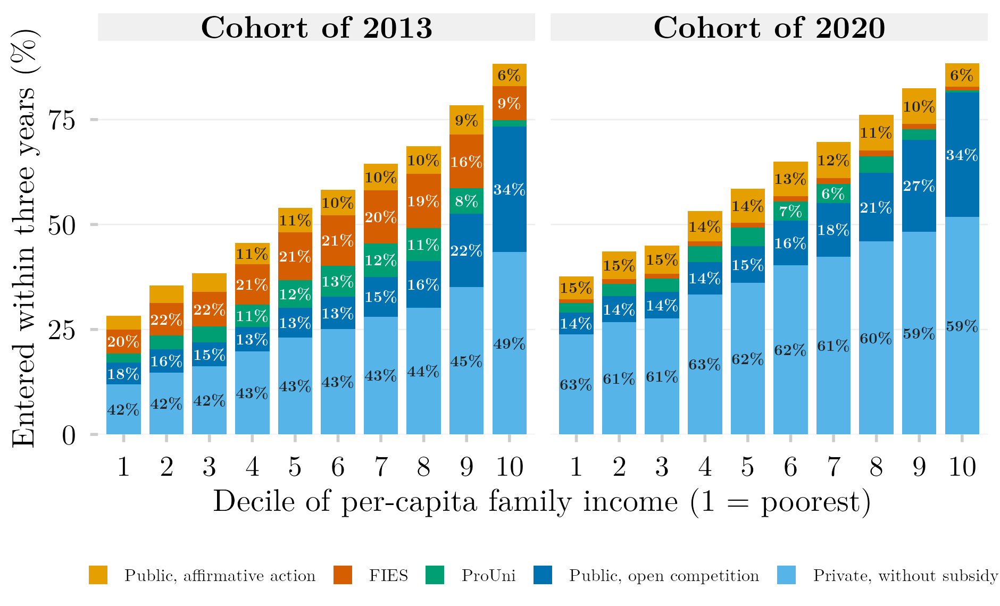
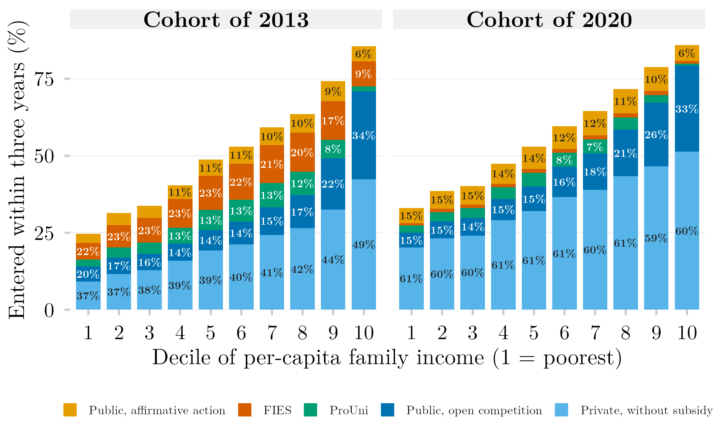

## Visão Geral

Cada barra é a parcela de um decil de renda de uma coorte do ensino médio que ingressou no ensino superior em até três anos depois do último ano escolar. Os segmentos dividem esse ingresso por porta de entrada: instituição pública por reserva de vaga, instituição pública por ampla concorrência, ProUni, FIES ou instituição privada sem subsídio. A altura da barra é a probabilidade total de ingresso do decil; a porcentagem impressa em cada segmento é a parcela daquela porta entre os ingressantes do decil. Entre as coortes de 2013 e 2020, o FIES quase desaparece em todos os níveis de renda, a reserva de vagas cresce e a privada sem subsídio passa a responder por cerca de 60% do ingresso em todos os decis, contra 42–49% em 2013.

Os dados são registros administrativos vinculados (Censo Escolar, ENEM, Censo da Educação Superior) consultados pela plataforma SEDAP+ do INEP, que devolve apenas tabelas agregadas. As tabelas agregadas que a figura lê e o SQL exato de cada consulta que as produziu são publicados com este post, de modo que a figura reproduz sem credencial.

## Metodologia

**Coorte e vínculo.** A coorte é todo estudante matriculado na última série do ensino médio no Censo Escolar de 2013 ou de 2020 (`TP_ETAPA_ENSINO` em 27, 28, 29, 32, 33, 34, 37, 38), com 16 a 22 anos, que fez o ENEM do mesmo ano. Os estudantes são vinculados entre os três registros por CPF mascarado. As coortes têm 1.229.035 (2013) e 867.132 (2020) estudantes.

**Ingresso.** O estudante conta como ingressante se qualquer registro de matrícula com ano de ingresso nos três anos seguintes (2014–2016 ou 2021–2023) aparece no Censo da Educação Superior, qualquer que seja a situação posterior desse registro. Quem evadiu, trancou ou se transferiu no primeiro ano conta, portanto, como ingressante.

**Porta de entrada.** Cada ingressante recebe uma única porta por uma regra de prioridade aplicada a todos os seus registros na janela: pública com reserva de vaga (`IN_RESERVA_VAGAS`), depois pública em ampla concorrência, depois ProUni (integral ou parcial), depois FIES, depois privada sem subsídio. Quando a mesma pessoa tem marcação de ProUni e de FIES, o ProUni prevalece por convenção; invertê-la desloca massa entre os dois segmentos subsidiados sem alterar a altura somada deles.

**Decis de renda.** A renda é a faixa de renda familiar declarada no ENEM (dezessete faixas, com pontos médios em salários mínimos de 0; 0,5; 1,25; 1,75; 2,25; 2,75; 3,5; 4,5; 5,5; 6,5; 7,5; 8,5; 9,5; 11; 13,5; 17,5 e 25), dividida pelo ponto médio do grupo de número de moradores declarado (1,8; 3,5; 5,4 e 7,8). As sessenta e oito células resultantes são ordenadas pela renda per capita e cortadas em decis dentro de cada coorte; células que atravessam um corte são divididas proporcionalmente.

**Camada de privacidade.** O SEDAP+ devolve contagens sob orçamento de privacidade diferencial ($\varepsilon = 1$) e suprime células pequenas do resultado: 0,49% das células em 2013 e 2,24% em 2020, todas de ProUni ou FIES e em rendas per capita de 0,83 salário mínimo ou mais. Fora isso, as contagens são exatas nesse nível de agregação, e por isso nenhuma faixa de confiança é desenhada.

**Limites.** Tudo é condicional a ter feito o ENEM no ano de conclusão, e a participação no ENEM é estratificada por rede escolar, de modo que o ingresso dos mais pobres fica subestimado. Os indicadores de financiamento faltam na maior parte dos registros de matrícula, e a ausência é absorvida pela categoria privada sem subsídio, de modo que ProUni e FIES são pisos. "Pública" inclui instituições estaduais e municipais, que a lei federal de cotas de 2012 não vincula.

## Uma definição anterior de ingresso

A primeira versão desta figura contava apenas registros de matrícula marcados com `IN_MATRICULA = 1`, que indica matrícula ativa ou concluída na data de referência do censo. Nessa definição, quem ingressou e saiu antes do censo do ano de ingresso contava como se nunca tivesse ingressado. Retirar o filtro acrescenta cerca de 55 mil ingressantes à coorte de 2013 (+8,7%) e 41 mil à de 2020 (+8,2%). Quase todos caem na privada sem subsídio, que sobe de 2,8 a 4,4 pontos percentuais nos sete decis inferiores; ProUni e FIES variam menos de meio ponto. A figura abaixo reproduz a definição anterior para comparação.



## Como Citar

Se você usar esta figura ou o pipeline que a gera, cite tanto a dissertação quanto esta análise específica. As referências seguem a 7ª edição da APA.

**Dissertação (em elaboração; a entrada será atualizada após a defesa):**

> Mançano, T. (2026). *Inequality in access to tertiary education in Brazil: Household incomes, reforming policies, and the politics of who gets in (1990s–2020s)* [Dissertação de mestrado não publicada]. Universidade de São Paulo.

**Esta figura e o pipeline:**

> Mançano, T. (2026, 23 de setembro). *Portas de entrada no ensino superior por decil de renda per capita: As coortes do ensino médio de 2013 e 2020* [Figura e pipeline reprodutível]. Open Data Analysis. https://mancano-tales.github.io/open-data-analysis/pt/posts-pt/portas-renda-coortes-empilhado/

**No texto:** (Mançano, 2026) — ao citar várias análises deste catálogo no mesmo trabalho, a APA as distingue como 2026a, 2026b, … na ordem em que aparecem na lista de referências.

**BibTeX:**

```bibtex
@mastersthesis{Mancano2026Thesis,
  author = {Man\c{c}ano, Tales},
  title  = {Inequality in Access to Tertiary Education in Brazil: Household
            Incomes, Reforming Policies, and the Politics of Who Gets In
            (1990s--2020s)},
  school = {University of S\~{a}o Paulo},
  year   = {2026},
  type   = {Master's thesis},
  note   = {Unpublished; Graduate Program in Political Science}
}

@misc{Mancano2026_portas_renda_coortes_empilhado_pt,
  author       = {Man\c{c}ano, Tales},
  title        = {Portas de entrada no ensino superior por decil de renda per capita: As coortes do ensino m\'{e}dio de 2013 e 2020},
  year         = {2026},
  month        = sep,
  howpublished = {Open Data Analysis, \url{https://mancano-tales.github.io/open-data-analysis/pt/posts-pt/portas-renda-coortes-empilhado/}},
  note         = {Figura e pipeline reprodutível. Código-fonte: \url{https://github.com/mancano-tales/open-data-analysis}, pasta posts/portas-renda-coortes-empilhado/. Acesso em AAAA-MM-DD}
}
```

Uma versão permanente (tag do Git + DOI no Zenodo) será linkada aqui assim que a dissertação for defendida; até lá, cite a URL da página acima e acrescente a data de acesso (código-fonte: https://github.com/mancano-tales/open-data-analysis, pasta `posts/portas-renda-coortes-empilhado/`).

## Pipeline

A figura lê quatro tabelas agregadas redistribuídas na pasta [`data/`](../../posts/portas-renda-coortes-empilhado/data/) do post, uma por coorte e definição de ingresso. Cada linha é uma contagem de estudantes numa célula de faixa de renda (`FAIXA_RENDA`, A–Q) × grupo de moradores (`MORADORES_GRUPO`) × porta (`COD_PORTA`: 0 sem ingresso, 1 pública com reserva, 2 pública em ampla concorrência, 3 ProUni, 4 FIES, 5 privada sem subsídio).

| Tabela | Coorte | Definição de ingresso | SQL enviado ao SEDAP+ |
|---|---|---|---|
| [`matriz_2013_fina_prouni_fies.csv`](../../posts/portas-renda-coortes-empilhado/data/matriz_2013_fina_prouni_fies.csv) | 2013 | qualquer registro (figura acima) | [`sql/matriz_2013_fina_prouni_fies.sql`](../../posts/portas-renda-coortes-empilhado/sql/matriz_2013_fina_prouni_fies.sql) |
| [`matriz_2020_fina_prouni_fies.csv`](../../posts/portas-renda-coortes-empilhado/data/matriz_2020_fina_prouni_fies.csv) | 2020 | qualquer registro (figura acima) | [`sql/matriz_2020_fina_prouni_fies.sql`](../../posts/portas-renda-coortes-empilhado/sql/matriz_2020_fina_prouni_fies.sql) |
| [`matriz_2013_fina_prouni_fies_com_in_matricula.csv`](../../posts/portas-renda-coortes-empilhado/data/matriz_2013_fina_prouni_fies_com_in_matricula.csv) | 2013 | `IN_MATRICULA = 1` (anterior) | [`sql/matriz_2013_fina_prouni_fies_com_in_matricula.sql`](../../posts/portas-renda-coortes-empilhado/sql/matriz_2013_fina_prouni_fies_com_in_matricula.sql) |
| [`matriz_2020_fina_prouni_fies_com_in_matricula.csv`](../../posts/portas-renda-coortes-empilhado/data/matriz_2020_fina_prouni_fies_com_in_matricula.csv) | 2020 | `IN_MATRICULA = 1` (anterior) | [`sql/matriz_2020_fina_prouni_fies_com_in_matricula.sql`](../../posts/portas-renda-coortes-empilhado/sql/matriz_2020_fina_prouni_fies_com_in_matricula.sql) |

Cada arquivo `.sql` é o texto exato enviado à API do SEDAP+, copiado do log de consultas, com um cabeçalho que registra quando rodou, os parâmetros de privacidade e a parcela de células suprimidas. Para desenhar as duas figuras a partir das tabelas:

1. [`plot.R`](../../posts/portas-renda-coortes-empilhado/plot.R) — constrói os decis de renda per capita e grava as duas figuras em `output/figures/portas-renda-coortes-empilhado/` e `output/figures/portas-renda-coortes-empilhado-in-matricula/` — compare com o `thumbnail.png` e o `thumbnail-in-matricula.png` deste post

Para reextrair as tabelas dos microdados vinculados (exige credencial SEDAP+ do INEP exportada como `SEDAP_TOKEN`), rode, a partir da raiz do projeto:

1. [`shared-pipeline/sedap/010_SEDAP_Cliente.R`](../../shared-pipeline/sedap/010_SEDAP_Cliente.R) — cliente da API SEDAP+, carregado pelo script abaixo
2. [`shared-pipeline/sedap/portas/031_Extrair_ProUni_FIES.R`](../../shared-pipeline/sedap/portas/031_Extrair_ProUni_FIES.R) — monta e roda as consultas das duas coortes e grava `data-raw/sedap/portas/matriz_<ano>_fina_prouni_fies.csv`; rode de novo com `FILTRO_IN_MATRICULA=TRUE` no ambiente para reproduzir a definição anterior. Quando esses arquivos existem, o `plot.R` os lê de preferência às cópias redistribuídas

## Reprodutibilidade

**Tier: B (agregado redistribuído)** — a figura reproduz sem credencial a partir das tabelas em `data/`; a reextração exige acesso ao SEDAP+.

As tabelas não carregam registro individual: cada linha é uma contagem de estudantes numa célula de faixa de renda × grupo de moradores × porta, tal como liberada pela plataforma depois do seu próprio controle de divulgação. O script de extração só roda com credencial aprovada do INEP; sem ela, a lógica e o SQL exato permanecem disponíveis para auditoria.
