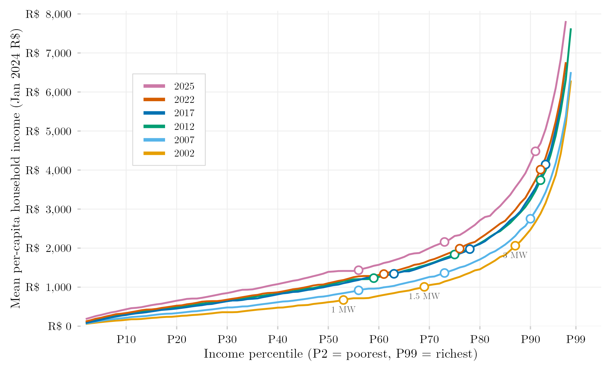

## Visão Geral

Esta figura plota a renda domiciliar média ao longo de toda a distribuição de renda, do centil mais pobre ao mais rico, para um conjunto selecionado de anos. Ela mostra diretamente o formato da desigualdade de renda: uma linha mais achatada na maior parte dos centis seguida de uma subida abrupta bem no topo significa que a renda está concentrada numa pequena elite, enquanto uma inclinação mais gradual e uniforme indica uma distribuição mais igualitária. Marcadores de referência mostram onde a renda cruza uma, uma vez e meia e três vezes o salário mínimo.

## Metodologia

Cada linha mostra a renda domiciliar per capita real média ponderada (deflacionada a preços de janeiro de 2024 via IPCA) dentro de cada grupo de centil de renda, para os anos selecionados. Os centis ordenam todos os indivíduos com renda domiciliar per capita estritamente positiva, usando os pesos amostrais. Para 2012, usa-se apenas a amostra da PNAD Anual. O eixo Y é truncado em R$ 8.000. Círculos vazados marcam o centil em que a renda domiciliar per capita média se iguala a uma (1 SM), uma vez e meia (1,5 SM) e três (3 SM) vezes o salário mínimo nacional em vigor em janeiro daquele ano, deflacionado a preços de janeiro de 2024 via `deflateBR`.

## Como Citar

Se você usar esta figura ou o pipeline que a gera, cite tanto a dissertação quanto este repositório.

**Dissertação:**

> Mançano, Tales. 2026. *Inequality in Access to Tertiary Education in Brazil: Household Incomes, Reforming Policies, and the Politics of Who Gets In (1990s–2020s)*. Dissertação de Mestrado, Programa de Pós-Graduação em Ciência Política, Universidade de São Paulo.

```bibtex
@mastersthesis{Mancano2026,
  author = {Man\c{c}ano, Tales},
  title  = {Inequality in Access to Tertiary Education in Brazil: Household
            Incomes, Reforming Policies, and the Politics of Who Gets In
            (1990s--2020s)},
  school = {University of S\~{a}o Paulo},
  year   = {2026},
  type   = {Master's thesis},
  note   = {Graduate Program in Political Science}
}
```

**Esta figura e o pipeline:**

> Mançano, Tales. 2026. "Renda Domiciliar Média por Centil de Renda." Em *Open Data Analysis*. <https://github.com/mancano-tales/open-data-analysis>, `posts-pt/renda-media-centil/`.

```bibtex
@misc{Mancano2026OpenDataAnalysis,
  author       = {Man\c{c}ano, Tales},
  title        = {Open Data Analysis: Renda Domiciliar Média por Centil de Renda},
  year         = {2026},
  howpublished = {\url{https://github.com/mancano-tales/open-data-analysis}},
  note         = {posts/renda-media-centil/}
}
```

Uma versão permanente (tag do Git + DOI no Zenodo) será linkada aqui assim que a dissertação for defendida; até lá, cite a URL do repositório acima.

## Pipeline

Esta figura usa o painel da [Harmonização PNAD / PNAD Contínua, 1992–2025](../harmonizacao-pnad-pnadc/).


Scripts desta análise:

- Plotagem: [`plot.R`](../../posts/renda-media-centil/plot.R)
- Pipeline upstream:
  - [`shared-pipeline/pnadc/035_Splice_Microdados.R`](../../shared-pipeline/pnadc/035_Splice_Microdados.R)

## Reprodutibilidade

**Tier: A**

Este pipeline usa apenas dados públicos, acessíveis via pacote/API sem necessidade de credencial (PNADcIBGE, censobr, sidrar, ipeadatar). Rode os scripts em `shared-pipeline/` na ordem numérica para reconstruir os dados intermediários.
