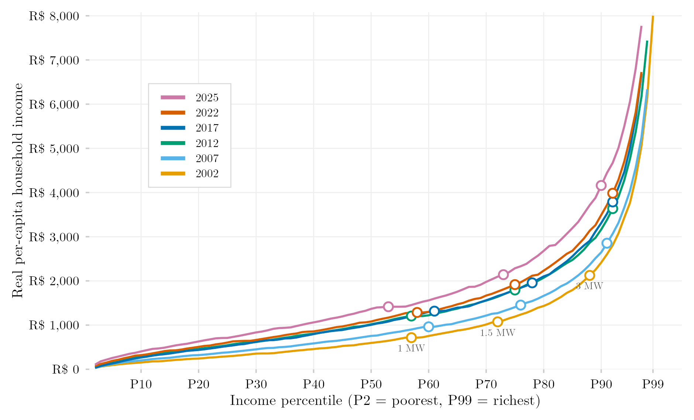

## Visão Geral

Esta figura plota a renda domiciliar média ao longo de toda a distribuição de renda, do centil mais pobre ao mais rico, para um conjunto selecionado de anos. Ela mostra diretamente o formato da desigualdade de renda: uma linha mais achatada na maior parte dos centis seguida de uma subida abrupta bem no topo significa que a renda está concentrada numa pequena elite, enquanto uma inclinação mais gradual e uniforme indica uma distribuição mais igualitária. Marcadores de referência mostram onde a renda cruza uma, uma vez e meia e três vezes o salário mínimo.

## Metodologia

Cada linha mostra a renda domiciliar per capita real média ponderada dentro de cada grupo de centil de renda, para os anos selecionados (2002, 2007, 2012, 2017, 2022, 2025 — recortes quinquenais de uma série anual contínua). A renda é *domiciliar* per capita em toda a série — na PNAD Anual (até 2015) é reconstruída do microdado bruto como o rendimento domiciliar total (`V4721`) dividido pelo número de moradores, excluindo pensionistas, empregados domésticos e seus parentes; na PNAD Contínua (2016 em diante) é a `VD5008` — e os domicílios sem rendimento são mantidos, de modo que a série fica na mesma base das estatísticas oficiais. As rendas são deflacionadas a preços de janeiro de 2024 via IPCA a partir do mês de referência de cada pesquisa (setembro na PNAD Anual, meio do ano na PNAD Contínua). Os centis ordenam os indivíduos com os pesos amostrais; os centis 1 e 100 são descartados por instabilidade amostral, e o eixo Y é truncado em R$ 8.000. Círculos vazados marcam o centil em que a renda domiciliar per capita média se iguala a uma (1 SM), uma vez e meia (1,5 SM) e três (3 SM) vezes o salário mínimo nacional em vigor no mês de referência da pesquisa, deflacionado da mesma data.

Esta versão (16/09/2026) substitui a publicada em 09/08/2026, que ordenava apenas indivíduos com renda estritamente positiva, usava renda familiar (e não domiciliar) nos anos da PNAD Anual e tomava o salário mínimo de janeiro deflacionado de janeiro — incoerências medidas na auditoria do pipeline de 16/09/2026 (o marcador de 1 SM se deslocava em até 4 centis em alguns anos).

## Como Citar

Se você usar esta figura ou o pipeline que a gera, cite tanto a dissertação quanto esta análise específica. As referências seguem a 7ª edição da APA.

**Dissertação (em elaboração; a entrada será atualizada após a defesa):**

> Mançano, T. (2026). *Inequality in access to tertiary education in Brazil: Household incomes, reforming policies, and the politics of who gets in (1990s–2020s)* [Dissertação de mestrado não publicada]. Universidade de São Paulo.

**Esta figura e o pipeline:**

> Mançano, T. (2026, 16 de setembro). *Renda domiciliar média por centil de renda* [Figura e pipeline reprodutível]. Open Data Analysis. https://mancano-tales.github.io/open-data-analysis/pt/posts-pt/renda-media-centil/

**No texto:** (Mançano, 2026) — ao citar várias análises deste catálogo no mesmo trabalho, a APA as distingue como 2026a, 2026b, … na ordem em que aparecem na lista de referências.

**BibTeX:**

```bibtex
@mastersthesis{Mancano2026Thesis,
  author = {Man\c{c}ano, Tales},
  title  = {Inequality in Access to Tertiary Education in Brazil: Household
            Incomes, Reforming Policies, and the Politics of Who Gets In
            (1990s--2020s)},
  school = {University of S\~{a}o Paulo},
  year   = {2026},
  type   = {Master's thesis},
  note   = {Unpublished; Graduate Program in Political Science}
}

@misc{Mancano2026_renda_media_centil_pt,
  author       = {Man\c{c}ano, Tales},
  title        = {Renda domiciliar m\'{e}dia por centil de renda},
  year         = {2026},
  month        = sep,
  howpublished = {Open Data Analysis, \url{https://mancano-tales.github.io/open-data-analysis/pt/posts-pt/renda-media-centil/}},
  note         = {Figura e pipeline reprodutível. Código-fonte: \url{https://github.com/mancano-tales/open-data-analysis}, pasta posts-pt/renda-media-centil/. Acesso em AAAA-MM-DD}
}
```

Uma versão permanente (tag do Git + DOI no Zenodo) será linkada aqui assim que a dissertação for defendida; até lá, cite a URL da página acima e acrescente a data de acesso (código-fonte: https://github.com/mancano-tales/open-data-analysis, pasta `posts-pt/renda-media-centil/`).

## Pipeline

Rode estes scripts nesta ordem, a partir da raiz do projeto (cada um grava em `data-raw/`, de onde o seguinte lê):

1. [`shared-pipeline/pnadc/020_PNAD_Anual_Manual_Import_2001_2015.R`](../../shared-pipeline/pnadc/020_PNAD_Anual_Manual_Import_2001_2015.R) — baixa os microdados brutos da PNAD Anual 2001–2015 (`.txt` de largura fixa + layouts SAS) do FTP do IBGE para `data-raw/pnad_anual_raw/<ano>/` — o `plot.R` lê esses arquivos brutos diretamente
2. [`shared-pipeline/pnadc/000_PNADC_Download_Consolidate.R`](../../shared-pipeline/pnadc/000_PNADC_Download_Consolidate.R) — baixa a PNAD Contínua 2012–2025 (1ª entrevista) com `PNADcIBGE::get_pnadc()` para `data-raw/pnadc_raw/` e a consolida em `data-raw/pnadc_consolidado_2012_2025_interview1.rds`
3. [`plot.R`](../../posts/renda-media-centil/plot.R) — reconstrói a renda domiciliar per capita dos arquivos brutos da PNAD Anual em `data-raw/pnad_anual_raw/` (via `shared-pipeline/utils/renda_domiciliar_pnad.R`) e lê os anos da PNAD Contínua de `data-raw/pnadc_consolidado_2012_2025_interview1.rds`; a série de salário mínimo é buscada online no IPEADATA (`ipeadatar`) na primeira execução; grava a figura em `output/figures/renda-media-centil/` — compare com o `thumbnail.png` deste post

Todas as etapas upstream acima são Tier A e também são executadas, nesta mesma ordem, por [`shared-pipeline/build_public_data.R`](../../shared-pipeline/build_public_data.R).

## Reprodutibilidade

**Tier: A**

Este pipeline usa apenas dados públicos, acessíveis via pacote/API sem necessidade de credencial (PNADcIBGE, censobr, sidrar, ipeadatar). Rode os scripts em `shared-pipeline/` na ordem numérica para reconstruir os dados intermediários.
