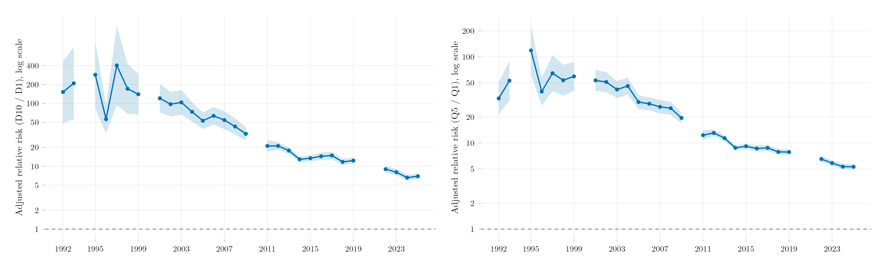

## Visão Geral

Esta figura acompanha o **risco relativo ajustado (RRA)** de já ter ingressado no ensino superior, para brasileiros de 18 a 24 anos, comparando os estratos mais rico e mais pobre da distribuição de renda domiciliar per capita — decil 10 contra decil 1 à esquerda, quintil 5 contra quintil 1 à direita — de 1992 a 2025. O RRA é a razão entre a probabilidade de acesso ajustada pelo modelo para o estrato mais rico e para o mais pobre, mantendo fixos idade, sexo, cor, região e situação urbana/rural entre os estratos. É uma réplica adaptada do painel REN (renda) da Figura 3 de Salata, Bringhenti e Miranda (2025), *Dados*, que usa o mesmo desenho (logit + predições ajustadas) mas uma população mais restrita (jovens de 18-24 que ainda moram com os pais) e para em 2022.

## Metodologia

Para cada ano, um modelo logit de `ens_sup` (já ingressou no ensino superior) é ajustado em função do decil/quintil de renda mais idade, sexo, cor, região e situação urbana/rural, com peso amostral. O RRA é a razão entre a probabilidade média ajustada do estrato mais rico e do mais pobre — calculada com `marginaleffects::avg_predictions()` e `hypotheses()`, o equivalente em R do par `margins`/`nlcom` do Stata usado no artigo original. Os intervalos de confiança são calculados via delta method na escala **log** (`log(topo) - log(base)`, depois exponenciado): aplicar o delta method direto na escala da razão produz intervalos implausíveis — inclusive limites negativos, impossíveis para uma razão de probabilidades — sempre que o acesso estimado do estrato mais pobre está muito perto de zero, o que é comum nos anos 1990 (ex.: a taxa bruta de acesso do decil mais pobre era de 0,1% em 1992). Anos sem uma estimativa utilizável de PNAD/PNADC (1994, 2000, 2010 — sem pesquisa; 2020-2021 — excluídos por razões de qualidade de dados ligadas à pandemia) aparecem como uma quebra na linha, seguindo a mesma convenção do post da [série histórica do índice de Wagstaff](../../posts/wagstaff-rede-publica-privada-timeseries/) deste repositório; o arquivo de dados subjacente carrega um valor interpolado linearmente para esses anos (replicando a nota de rodapé 21 do artigo original), mas ele não é plotado.

**Diferenças em relação a Salata, Bringhenti e Miranda (2025).** Duas escolhas deliberadas de desenho tornam esta uma réplica *adaptada*, não exata, e a magnitude do RRA não bate ponto a ponto com a Figura 3 publicada: (1) esta figura usa a **população geral** de 18-24 anos, não só os que ainda moram com os pais (a restrição `rec_mod` do artigo original, necessária lá porque o modelo também exige as características do responsável pelo domicílio) — por consistência com todas as outras figuras do painel PNAD/PNADC deste repositório; (2) como consequência, os pontos de corte do decil/quintil de renda são calculados sobre a população geral, não dentro dessa subamostra mais restrita, o que — especialmente nos anos 1990, quando o acesso do estrato mais pobre era próximo de zero — pode alargar ainda mais o hiato. Comparando com os valores reportados no próprio artigo, o hiato entre esta réplica e o original é grande nos ruidosos anos 1990 (aproximadamente 3-7×), moderado por volta de 2011 (aproximadamente 2,5×, 12,3 aqui contra 5,0 no artigo) e praticamente desaparece entre 2017 e 2022 (aproximadamente 1,15-1,25×) — a razão não é constante nem cresce ao longo do tempo, ela encolhe conforme as duas séries se aproximam do presente.

## Como Citar

Se você usar esta figura ou o pipeline que a gera, cite tanto a dissertação quanto este repositório.

**Dissertação:**

> Mançano, Tales. 2026. *Inequality in Access to Tertiary Education in Brazil: Household Incomes, Reforming Policies, and the Politics of Who Gets In (1990s–2020s)*. Dissertação de Mestrado, Programa de Pós-Graduação em Ciência Política, Universidade de São Paulo.

```bibtex
@mastersthesis{Mancano2026,
  author = {Man\c{c}ano, Tales},
  title  = {Inequality in Access to Tertiary Education in Brazil: Household
            Incomes, Reforming Policies, and the Politics of Who Gets In
            (1990s--2020s)},
  school = {University of S\~{a}o Paulo},
  year   = {2026},
  type   = {Master's thesis},
  note   = {Graduate Program in Political Science}
}
```

**Esta figura e o pipeline:**

> Mançano, Tales. 2026. "Risco Relativo Ajustado do Acesso ao Ensino Superior por Renda (Decil e Quintil)." Em *Open Data Analysis*. <https://github.com/mancano-tales/open-data-analysis>, `posts/rra-renda-decil-quintil/`.

```bibtex
@misc{Mancano2026OpenDataAnalysis,
  author       = {Man\c{c}ano, Tales},
  title        = {Open Data Analysis: Risco Relativo Ajustado do Acesso ao Ensino Superior por Renda (Decil e Quintil)},
  year         = {2026},
  howpublished = {\url{https://github.com/mancano-tales/open-data-analysis}},
  note         = {posts/rra-renda-decil-quintil/}
}
```

Uma versão permanente (tag Git + DOI Zenodo) será vinculada aqui após a defesa da dissertação; até lá, cite a URL do repositório acima.

**Desenho da figura original replicada aqui:**

> Salata, André Ricardo; Bringhenti, Taiane Fabiele da Silva; Miranda, Ana Carolina Homem de. 2025. "Origem Social e Acesso ao Ensino Superior no Brasil entre 1992 e 2022." *Dados: Revista de Ciências Sociais* 68 (3): e20230188. <https://doi.org/10.1590/dados.2025.68.3.376>.

## Pipeline

Esta figura se apoia no painel de [Harmonização PNAD / PNAD Contínua, 1992–2025](../../posts/harmonizacao-pnad-pnadc/).

Scripts desta análise, na ordem de execução:

1. [`shared-pipeline/pnadc/035_Splice_Microdados.R`](../../shared-pipeline/pnadc/035_Splice_Microdados.R) — monta o painel harmonizado, incluindo decil/quintil de renda e os controles demográficos usados abaixo.
2. [`shared-pipeline/pnadc/037_Modelos_Logit_RRA_Renda.R`](../../shared-pipeline/pnadc/037_Modelos_Logit_RRA_Renda.R) — ajusta os 58 modelos logit anuais (decil e quintil) e calcula o RRA com intervalos de confiança.
3. Plotagem: [`plot.R`](../../posts/rra-renda-decil-quintil/plot.R)

## Reprodutibilidade

**Tier: A**

Este pipeline usa só dado público, acessível via pacote/API sem necessidade de credencial (PNADcIBGE). Rode os scripts em `shared-pipeline/pnadc/` na ordem numérica para reconstruir os dados intermediários, e então o `plot.R`.
