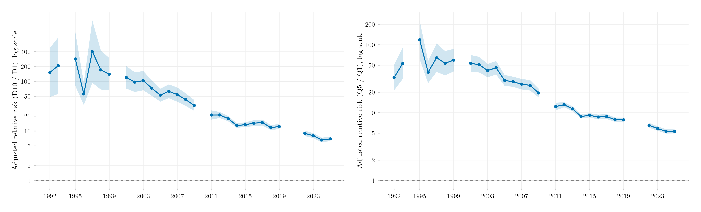

## Visão Geral

Esta figura acompanha o **risco relativo ajustado (RRA)** de já ter ingressado no ensino superior, para brasileiros de 18 a 24 anos, comparando os estratos mais rico e mais pobre da distribuição de renda domiciliar per capita — decil 10 contra decil 1 à esquerda, quintil 5 contra quintil 1 à direita — de 1992 a 2025. O RRA é a razão entre a probabilidade de acesso ajustada pelo modelo para o estrato mais rico e para o mais pobre, mantendo fixos idade, sexo, cor, região e situação urbana/rural entre os estratos. É uma réplica adaptada do painel REN (renda) da Figura 3 de Salata, Bringhenti e Miranda (2025), *Dados*, que usa o mesmo desenho (logit + predições ajustadas) mas uma população mais restrita (jovens de 18-24 que ainda moram com os pais) e para em 2022.

## Metodologia

Para cada ano, um modelo logit de `ens_sup` (já ingressou no ensino superior) é ajustado em função do decil/quintil de renda mais idade, sexo, cor, região e situação urbana/rural, com peso amostral. O RRA é a razão entre a probabilidade média ajustada do estrato mais rico e do mais pobre — calculada com `marginaleffects::avg_predictions()` e `hypotheses()`, o equivalente em R do par `margins`/`nlcom` do Stata usado no artigo original. Os intervalos de confiança são calculados via delta method na escala **log** (`log(topo) - log(base)`, depois exponenciado): aplicar o delta method direto na escala da razão produz intervalos implausíveis — inclusive limites negativos, impossíveis para uma razão de probabilidades — sempre que o acesso estimado do estrato mais pobre está muito perto de zero, o que é comum nos anos 1990 (ex.: a taxa bruta de acesso do decil mais pobre era de 0,1% em 1992). Anos sem uma estimativa utilizável de PNAD/PNADC (1994, 2000, 2010 — sem pesquisa; 2020-2021 — excluídos por razões de qualidade de dados ligadas à pandemia) aparecem como uma quebra na linha, seguindo a mesma convenção do post da [série histórica do índice de Wagstaff](../../posts/wagstaff-rede-publica-privada-timeseries/) deste repositório; o arquivo de dados subjacente carrega um valor interpolado linearmente para esses anos (replicando a nota de rodapé 21 do artigo original), mas ele não é plotado.

**Diferenças em relação a Salata, Bringhenti e Miranda (2025).** Duas escolhas deliberadas de desenho tornam esta uma réplica *adaptada*, não exata, e a magnitude do RRA não bate ponto a ponto com a Figura 3 publicada: (1) esta figura usa a **população geral** de 18-24 anos, não só os que ainda moram com os pais (a restrição `rec_mod` do artigo original, necessária lá porque o modelo também exige as características do responsável pelo domicílio) — por consistência com todas as outras figuras do painel PNAD/PNADC deste repositório; (2) como consequência, os pontos de corte do decil/quintil de renda são calculados sobre a população geral, não dentro dessa subamostra mais restrita, o que — especialmente nos anos 1990, quando o acesso do estrato mais pobre era próximo de zero — pode alargar ainda mais o hiato. Comparando com os valores reportados no próprio artigo, o hiato entre esta réplica e o original é grande nos ruidosos anos 1990 (aproximadamente 3-7×), moderado por volta de 2011 (aproximadamente 2,5×, 12,3 aqui contra 5,0 no artigo) e praticamente desaparece entre 2017 e 2022 (aproximadamente 1,15-1,25×) — a razão não é constante nem cresce ao longo do tempo, ela encolhe conforme as duas séries se aproximam do presente.

## Como Citar

Se você usar esta figura ou o pipeline que a gera, cite tanto a dissertação quanto esta análise específica. As referências seguem a 7ª edição da APA.

**Dissertação (em elaboração; a entrada será atualizada após a defesa):**

> Mançano, T. (2026). *Inequality in access to tertiary education in Brazil: Household incomes, reforming policies, and the politics of who gets in (1990s–2020s)* [Dissertação de mestrado não publicada]. Universidade de São Paulo.

**Esta figura e o pipeline:**

> Mançano, T. (2026, 10 de setembro). *Risco relativo ajustado do acesso ao ensino superior por renda (decil e quintil)* [Figura e pipeline reprodutível]. Open Data Analysis. https://mancano-tales.github.io/open-data-analysis/pt/posts-pt/rra-renda-decil-quintil/

**No texto:** (Mançano, 2026) — ao citar várias análises deste catálogo no mesmo trabalho, a APA as distingue como 2026a, 2026b, … na ordem em que aparecem na lista de referências.

**BibTeX:**

```bibtex
@mastersthesis{Mancano2026Thesis,
  author = {Man\c{c}ano, Tales},
  title  = {Inequality in Access to Tertiary Education in Brazil: Household
            Incomes, Reforming Policies, and the Politics of Who Gets In
            (1990s--2020s)},
  school = {University of S\~{a}o Paulo},
  year   = {2026},
  type   = {Master's thesis},
  note   = {Unpublished; Graduate Program in Political Science}
}

@misc{Mancano2026_rra_renda_decil_quintil_pt,
  author       = {Man\c{c}ano, Tales},
  title        = {Risco relativo ajustado do acesso ao ensino superior por renda (decil e quintil)},
  year         = {2026},
  month        = sep,
  howpublished = {Open Data Analysis, \url{https://mancano-tales.github.io/open-data-analysis/pt/posts-pt/rra-renda-decil-quintil/}},
  note         = {Figura e pipeline reprodutível. Código-fonte: \url{https://github.com/mancano-tales/open-data-analysis}, pasta posts-pt/rra-renda-decil-quintil/. Acesso em AAAA-MM-DD}
}
```

Uma versão permanente (tag do Git + DOI no Zenodo) será linkada aqui assim que a dissertação for defendida; até lá, cite a URL da página acima e acrescente a data de acesso (código-fonte: https://github.com/mancano-tales/open-data-analysis, pasta `posts-pt/rra-renda-decil-quintil/`).

## Pipeline

Esta figura usa o painel da [Harmonização PNAD / PNAD Contínua, 1992–2025](../harmonizacao-pnad-pnadc/).

Rode estes scripts nesta ordem, a partir da raiz do projeto (cada um grava em `data-raw/`, de onde o seguinte lê):

1. [`shared-pipeline/pnadc/000_PNADC_Download_Consolidate.R`](../../shared-pipeline/pnadc/000_PNADC_Download_Consolidate.R) — baixa a PNAD Contínua 2012–2025 (1ª entrevista) com `PNADcIBGE::get_pnadc()` para `data-raw/pnadc_raw/` e a consolida em `data-raw/pnadc_consolidado_2012_2025_interview1.rds`
2. [`shared-pipeline/pnadc/020_PNAD_Anual_Manual_Import_2001_2015.R`](../../shared-pipeline/pnadc/020_PNAD_Anual_Manual_Import_2001_2015.R) — baixa os microdados da PNAD Anual 2001–2015 do FTP do IBGE para `data-raw/pnad_anual_raw/` e os importa em `data-raw/harmonizing-br-data/output/PNAD_Anual_2001_2015.parquet`
3. [`shared-pipeline/pnadc/050_PNAD_Historica_Manual_Import_1992_1999.R`](../../shared-pipeline/pnadc/050_PNAD_Historica_Manual_Import_1992_1999.R) — o mesmo para a PNAD Anual 1992–1999 (`PNAD_Anual_1992_1999.parquet`)
4. [`shared-pipeline/pnadc/035_Splice_Microdados.R`](../../shared-pipeline/pnadc/035_Splice_Microdados.R) — emenda PNAD Anual e PNAD Contínua no painel harmonizado — `Microdados_Todas_Idades_1992_2025.parquet` e `Microdados_Jovens_18_24_1992_2025.parquet` em `data-raw/harmonizing-br-data/output/` (carrega `shared-pipeline/utils/codigos_curso_pnad.R`)
5. [`shared-pipeline/pnadc/037_Modelos_Logit_RRA_Renda.R`](../../shared-pipeline/pnadc/037_Modelos_Logit_RRA_Renda.R) — estima os modelos logit anuais (decil e quintil) e calcula o RRA com intervalos de confiança (`RRA_Renda_1992_2025.csv`)
6. [`plot.R`](../../posts/rra-renda-decil-quintil/plot.R) — lê `RRA_Renda_1992_2025.csv`; grava a figura em `output/figures/rra-renda-decil-quintil/` — compare com o `thumbnail.png` deste post

Todas as etapas upstream acima são Tier A e também são executadas, nesta mesma ordem, por [`shared-pipeline/build_public_data.R`](../../shared-pipeline/build_public_data.R).

## Reprodutibilidade

**Tier: A**

Este pipeline usa só dado público, acessível via pacote/API sem necessidade de credencial (PNADcIBGE). Rode os scripts em `shared-pipeline/pnadc/` na ordem numérica para reconstruir os dados intermediários, e então o `plot.R`.
