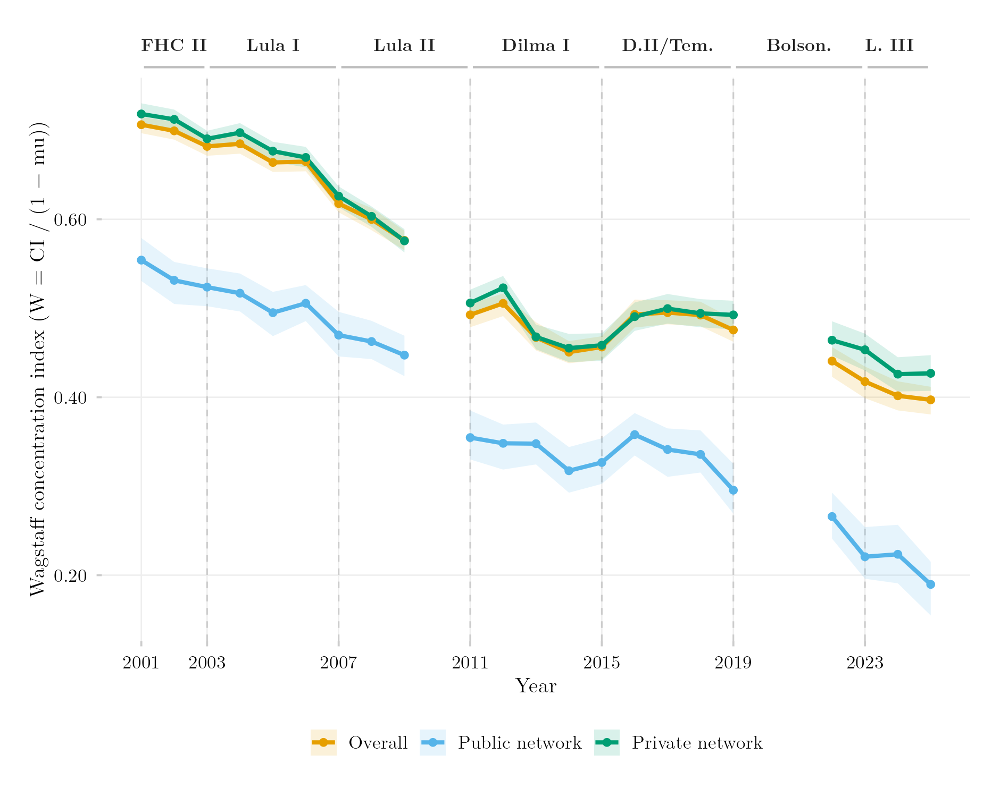

## Visão Geral

Esta figura acompanha, ao longo do tempo, o quão concentrada em domicílios de renda mais alta está a matrícula em cada tipo de rede — ensino superior público vs. privado. Em vez de olhar para o acesso geral, ela aplica o índice de concentração de Wagstaff separadamente à matrícula em cada rede, permitindo comparar diretamente o perfil de renda dos dois setores e acompanhar como ele evolui.

## Metodologia

Série temporal do índice de concentração de Wagstaff aplicado à matrícula por tipo de rede (pública vs. privada), em vez de ao acesso geral — medindo se a matrícula em cada rede está concentrada em domicílios de renda mais alta, e como essa concentração se moveu ao longo do tempo. Calculado diretamente a partir dos microdados da PNAD Anual e da PNAD Contínua, extraídos de forma autônoma neste script, em vez de vir do painel harmonizado compartilhado.

## Como Citar

Se você usar esta figura ou o pipeline que a gera, cite tanto a dissertação quanto este repositório.

**Dissertação:**

> Mançano, Tales. 2026. *Inequality in Access to Tertiary Education in Brazil: Household Incomes, Reforming Policies, and the Politics of Who Gets In (1990s–2020s)*. Dissertação de Mestrado, Programa de Pós-Graduação em Ciência Política, Universidade de São Paulo.

```bibtex
@mastersthesis{Mancano2026,
  author = {Man\c{c}ano, Tales},
  title  = {Inequality in Access to Tertiary Education in Brazil: Household
            Incomes, Reforming Policies, and the Politics of Who Gets In
            (1990s--2020s)},
  school = {University of S\~{a}o Paulo},
  year   = {2026},
  type   = {Master's thesis},
  note   = {Graduate Program in Political Science}
}
```

**Esta figura e o pipeline:**

> Mançano, Tales. 2026. "Desigualdade de Renda na Matrícula por Tipo de Rede, Série Temporal (Índice de Wagstaff)." Em *Open Data Analysis*. <https://github.com/mancano-tales/open-data-analysis>, `posts-pt/wagstaff-rede-publica-privada-timeseries/`.

```bibtex
@misc{Mancano2026OpenDataAnalysis,
  author       = {Man\c{c}ano, Tales},
  title        = {Open Data Analysis: Desigualdade de Renda na Matrícula por Tipo de Rede, Série Temporal (Índice de Wagstaff)},
  year         = {2026},
  howpublished = {\url{https://github.com/mancano-tales/open-data-analysis}},
  note         = {posts/wagstaff-rede-publica-privada-timeseries/}
}
```

Uma versão permanente (tag do Git + DOI no Zenodo) será linkada aqui assim que a dissertação for defendida; até lá, cite a URL do repositório acima.

## Pipeline

Scripts desta análise:

- Plotagem: [`plot.R`](../../posts/wagstaff-rede-publica-privada-timeseries/plot.R) — script autocontido: baixa e processa os microdados diretamente, sem depender de outros scripts deste repositório.
- Fonte de dado de referência: [`shared-pipeline/pnadc/000_PNADC_Download_Consolidate.R`](../../shared-pipeline/pnadc/000_PNADC_Download_Consolidate.R)

## Reprodutibilidade

**Tier: A**

Este pipeline usa apenas dados públicos, acessíveis via pacote/API sem necessidade de credencial (PNADcIBGE, censobr, sidrar, ipeadatar). Rode os scripts em `shared-pipeline/` na ordem numérica para reconstruir os dados intermediários.
