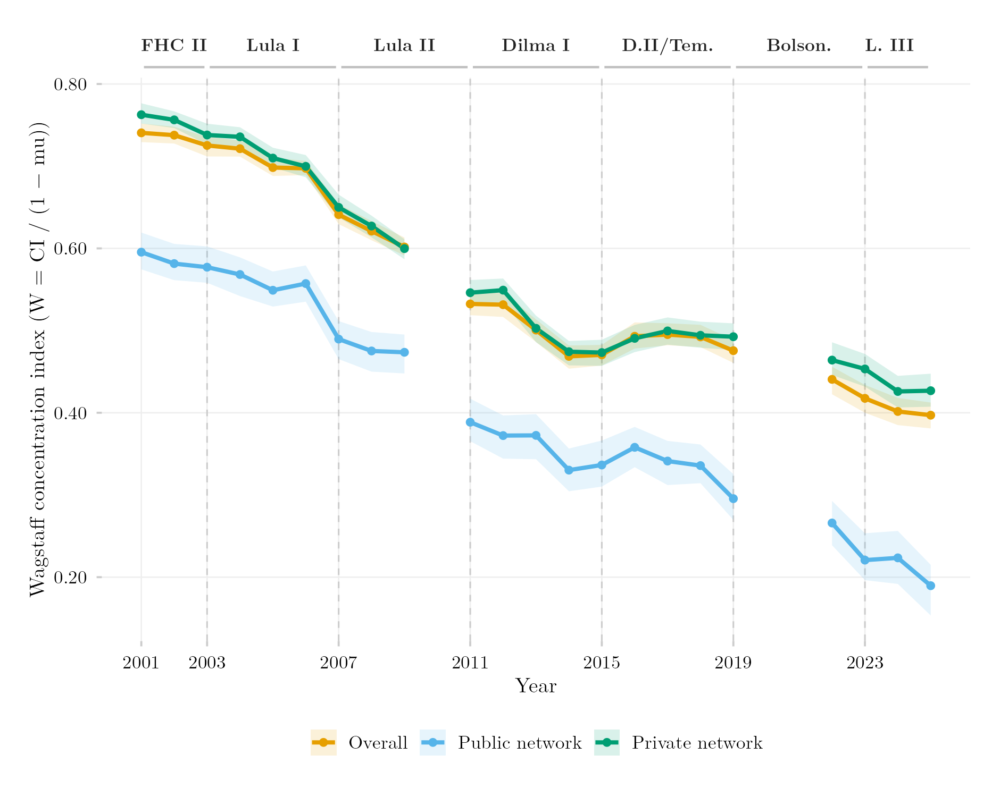

## Visão Geral

Esta figura acompanha, ao longo do tempo, o quão concentrada em domicílios de renda mais alta está a matrícula em cada tipo de rede — ensino superior público vs. privado. Em vez de olhar para o acesso geral, ela aplica o índice de concentração de Wagstaff separadamente à matrícula em cada rede, permitindo comparar diretamente o perfil de renda dos dois setores e acompanhar como ele evolui.

## Metodologia

Série temporal do índice de concentração de Wagstaff aplicado à matrícula por tipo de rede (pública vs. privada), em vez de ao acesso geral — medindo se a matrícula em cada rede está concentrada em domicílios de renda mais alta, e como essa concentração se moveu ao longo do tempo. Calculado diretamente a partir dos microdados da PNAD Anual e da PNAD Contínua, extraídos de forma autônoma neste script, em vez de vir do painel harmonizado compartilhado.

## Como Citar

Se você usar esta figura ou o pipeline que a gera, cite tanto a dissertação quanto esta análise específica. As referências seguem a 7ª edição da APA.

**Dissertação (em elaboração; a entrada será atualizada após a defesa):**

> Mançano, T. (2026). *Inequality in access to tertiary education in Brazil: Household incomes, reforming policies, and the politics of who gets in (1990s–2020s)* [Dissertação de mestrado não publicada]. Universidade de São Paulo.

**Esta figura e o pipeline:**

> Mançano, T. (2026, 10 de agosto). *Desigualdade de renda na matrícula por tipo de rede, série temporal (índice de Wagstaff)* [Figura e pipeline reprodutível]. Open Data Analysis. https://mancano-tales.github.io/open-data-analysis/pt/posts-pt/wagstaff-rede-publica-privada-timeseries/

**No texto:** (Mançano, 2026) — ao citar várias análises deste catálogo no mesmo trabalho, a APA as distingue como 2026a, 2026b, … na ordem em que aparecem na lista de referências.

**BibTeX:**

```bibtex
@mastersthesis{Mancano2026Thesis,
  author = {Man\c{c}ano, Tales},
  title  = {Inequality in Access to Tertiary Education in Brazil: Household
            Incomes, Reforming Policies, and the Politics of Who Gets In
            (1990s--2020s)},
  school = {University of S\~{a}o Paulo},
  year   = {2026},
  type   = {Master's thesis},
  note   = {Unpublished; Graduate Program in Political Science}
}

@misc{Mancano2026_wagstaff_rede_publica_privada_timeseries_pt,
  author       = {Man\c{c}ano, Tales},
  title        = {Desigualdade de renda na matr\'{\i}cula por tipo de rede, s\'{e}rie temporal (\'{\i}ndice de Wagstaff)},
  year         = {2026},
  month        = aug,
  howpublished = {Open Data Analysis, \url{https://mancano-tales.github.io/open-data-analysis/pt/posts-pt/wagstaff-rede-publica-privada-timeseries/}},
  note         = {Figura e pipeline reprodutível. Código-fonte: \url{https://github.com/mancano-tales/open-data-analysis}, pasta posts-pt/wagstaff-rede-publica-privada-timeseries/. Acesso em AAAA-MM-DD}
}
```

Uma versão permanente (tag do Git + DOI no Zenodo) será linkada aqui assim que a dissertação for defendida; até lá, cite a URL da página acima e acrescente a data de acesso (código-fonte: https://github.com/mancano-tales/open-data-analysis, pasta `posts-pt/wagstaff-rede-publica-privada-timeseries/`).

## Pipeline

Rode estes scripts nesta ordem, a partir da raiz do projeto (cada um grava em `data-raw/`, de onde o seguinte lê):

1. [`shared-pipeline/pnadc/020_PNAD_Anual_Manual_Import_2001_2015.R`](../../shared-pipeline/pnadc/020_PNAD_Anual_Manual_Import_2001_2015.R) — baixa os microdados brutos da PNAD Anual 2001–2015 (`.txt` de largura fixa + layouts SAS) do FTP do IBGE para `data-raw/pnad_anual_raw/<ano>/` — o `plot.R` lê esses arquivos brutos diretamente
2. [`shared-pipeline/pnadc/000_PNADC_Download_Consolidate.R`](../../shared-pipeline/pnadc/000_PNADC_Download_Consolidate.R) — *(opcional)* pré-popula o cache da PNAD Contínua em `data-raw/pnadc_raw/`; se pulado, o `plot.R` baixa os anos necessários com `PNADcIBGE::get_pnadc()` para a mesma pasta
3. [`plot.R`](../../posts/wagstaff-rede-publica-privada-timeseries/plot.R) — lê os arquivos brutos da PNAD Anual em `data-raw/pnad_anual_raw/` e os anos da PNAD Contínua em `data-raw/pnadc_raw/`; guarda a extração e o bootstrap em `data-raw/rede-publica-privada/` (carrega `shared-pipeline/utils/codigos_curso_pnad.R`); grava a figura em `output/figures/wagstaff-rede-publica-privada-timeseries/` — compare com o `thumbnail.png` deste post

## Reprodutibilidade

**Tier: A**

Este pipeline usa apenas dados públicos, acessíveis via pacote/API sem necessidade de credencial (PNADcIBGE, censobr, sidrar, ipeadatar). Rode os scripts em `shared-pipeline/` na ordem numérica para reconstruir os dados intermediários.
