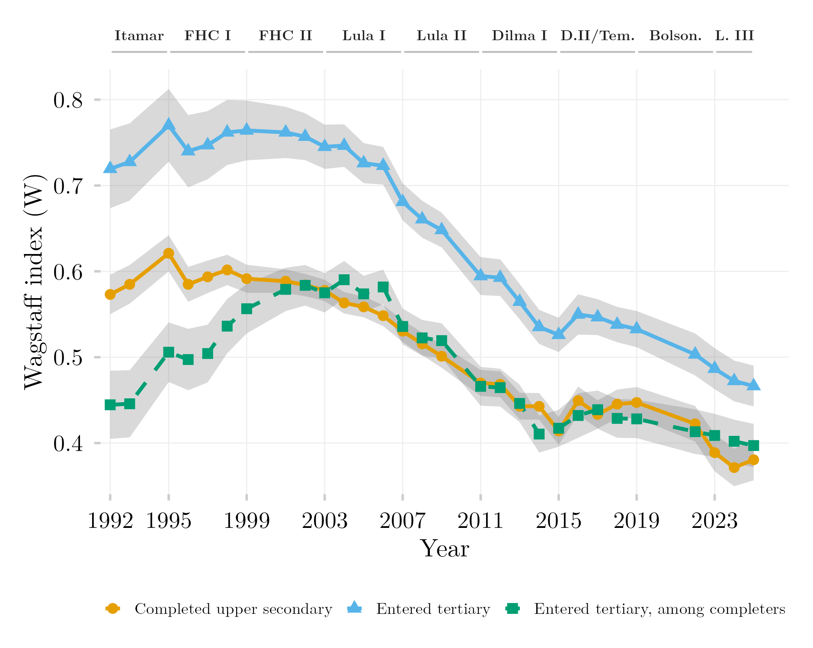

## Visão Geral

Esta figura separa duas fontes de desigualdade de renda no acesso ao ensino superior entre brasileiros de 18 a 24 anos: a desigualdade em *quem conclui o ensino médio* e a desigualdade em *quem segue para o superior entre os que concluíram*. Três séries do índice de concentração de Wagstaff cobrem 1992–2025 — conclusão do ensino médio, ingresso no ensino superior e ingresso no superior condicional à conclusão, com os postos de renda recalculados dentro dos concluintes. A distância entre a segunda e a terceira série é a contribuição do funil do ensino médio para a desigualdade no superior; a terceira série sozinha é o que resta de seletividade por renda no próprio degrau terciário. Os dados vêm da PNAD e da PNAD Contínua (IBGE).

## Metodologia

As três séries usam o mesmo estimador: o índice de Wagstaff ($W = C / (1 - \mu)$), calculado por regressão GLM ponderada pelo desenho amostral sobre postos fracionários de renda, sob uma aproximação uniforme de efeito de delineamento de Kish ($\text{DEFF} = 2{,}0$) na PNAD Anual e na PNAD Contínua, com cada ano vindo de uma única fonte (PNAD Anual até 2015, PNAD Contínua a partir de 2016). A população são os jovens de 18 a 24 anos em domicílios com renda per capita estritamente positiva; a área rural da região Norte está ausente da PNAD Anual em 2004–2015, e 2020–2021 são excluídos. As duas séries sólidas são índices ordinários sobre a coorte inteira: ensino médio concluído (`medio_completo`: onze ou mais anos de estudo ou qualquer matrícula no superior na PNAD Anual, `VD3004` $\geq$ 5 na PNAD Contínua) e ingresso no superior em algum momento (`ens_sup`). A série tracejada restringe a amostra a quem concluiu o ensino médio, recalcula os postos fracionários de renda dentro dessa subpopulação e estima $W$ para o ingresso no superior nessa base — o índice de concentração condicional padrão. Condicionar à conclusão é condicionar a um desfecho que depende da renda, e o conjunto de concluintes cresce de 17,6% da coorte em 1992 para 73,6% em 2025, de modo que a série condicional mistura mudanças na transição com mudanças em quem é elegível: é descritiva e não identifica efeito de política. Em 1992–1995 a variável de anos de estudo da PNAD Anual falta para cerca de 21–22% dos respondentes e é codificada como não concluído a menos que `ens_sup` seja um, o que enviesa o conjunto de concluintes nesses anos; os quatro primeiros anos não devem ser lidos substantivamente. A emenda de instrumentos 2015/2016 aparece como um degrau. As faixas cinza são intervalos de confiança de 95%. Os rótulos de governo indicam o presidente em exercício.

## Como Citar

Se você usar esta figura ou o pipeline que a gera, cite tanto a dissertação quanto esta análise específica. As referências seguem a 7ª edição da APA.

**Dissertação (em elaboração; a entrada será atualizada após a defesa):**

> Mançano, T. (2026). *Inequality in access to tertiary education in Brazil: Household incomes, reforming policies, and the politics of who gets in (1990s–2020s)* [Dissertação de mestrado não publicada]. Universidade de São Paulo.

**Esta figura e o pipeline:**

> Mançano, T. (2026, 16 de setembro). *Funil do ensino médio vs. transição ao superior, índice de Wagstaff* [Figura e pipeline reprodutível]. Open Data Analysis. https://mancano-tales.github.io/open-data-analysis/pt/posts-pt/wagstaff-transicao-condicional/

**No texto:** (Mançano, 2026) — ao citar várias análises deste catálogo no mesmo trabalho, a APA as distingue como 2026a, 2026b, … na ordem em que aparecem na lista de referências.

**BibTeX:**

```bibtex
@mastersthesis{Mancano2026Thesis,
  author = {Man\c{c}ano, Tales},
  title  = {Inequality in Access to Tertiary Education in Brazil: Household
            Incomes, Reforming Policies, and the Politics of Who Gets In
            (1990s--2020s)},
  school = {University of S\~{a}o Paulo},
  year   = {2026},
  type   = {Master's thesis},
  note   = {Unpublished; Graduate Program in Political Science}
}

@misc{Mancano2026_wagstaff_transicao_condicional_pt,
  author       = {Man\c{c}ano, Tales},
  title        = {Funil do ensino m\'{e}dio vs. transi\c{c}\~{a}o ao superior, \'{i}ndice de Wagstaff},
  year         = {2026},
  month        = sep,
  howpublished = {Open Data Analysis, \url{https://mancano-tales.github.io/open-data-analysis/pt/posts-pt/wagstaff-transicao-condicional/}},
  note         = {Figura e pipeline reprodutível. Código-fonte: \url{https://github.com/mancano-tales/open-data-analysis}, pasta posts/wagstaff-transicao-condicional/. Acesso em AAAA-MM-DD}
}
```

Uma versão permanente (tag do Git + DOI no Zenodo) será linkada aqui assim que a dissertação for defendida; até lá, cite a URL da página acima e acrescente a data de acesso (código-fonte: https://github.com/mancano-tales/open-data-analysis, pasta `posts/wagstaff-transicao-condicional/`).

## Pipeline

Esta figura usa o painel da [Harmonização PNAD / PNAD Contínua, 1992–2025](../harmonizacao-pnad-pnadc/).

Rode estes scripts nesta ordem, a partir da raiz do projeto (cada um grava em `data-raw/`, de onde o seguinte lê):

1. [`shared-pipeline/pnadc/000_PNADC_Download_Consolidate.R`](../../shared-pipeline/pnadc/000_PNADC_Download_Consolidate.R) — baixa a PNAD Contínua 2012–2025 (1ª entrevista) com `PNADcIBGE::get_pnadc()` em `data-raw/pnadc_raw/` e consolida em `data-raw/pnadc_consolidado_2012_2025_interview1.rds`
2. [`shared-pipeline/pnadc/020_PNAD_Anual_Manual_Import_2001_2015.R`](../../shared-pipeline/pnadc/020_PNAD_Anual_Manual_Import_2001_2015.R) — baixa os microdados da PNAD Anual 2001–2015 do FTP do IBGE em `data-raw/pnad_anual_raw/` e os importa em `data-raw/harmonizing-br-data/output/PNAD_Anual_2001_2015.parquet`
3. [`shared-pipeline/pnadc/050_PNAD_Historica_Manual_Import_1992_1999.R`](../../shared-pipeline/pnadc/050_PNAD_Historica_Manual_Import_1992_1999.R) — o mesmo para a PNAD Anual 1992–1999 (`PNAD_Anual_1992_1999.parquet`)
4. [`shared-pipeline/pnadc/035_Splice_Microdados.R`](../../shared-pipeline/pnadc/035_Splice_Microdados.R) — emenda PNAD Anual e PNAD Contínua no painel harmonizado — `Microdados_Todas_Idades_1992_2025.parquet` em `data-raw/harmonizing-br-data/output/` (carrega `shared-pipeline/utils/codigos_curso_pnad.R`)
5. [`shared-pipeline/pnadc/097F_Diag_Wagstaff_Transicao_Decomposicao.R`](../../shared-pipeline/pnadc/097F_Diag_Wagstaff_Transicao_Decomposicao.R) — estima as três séries de Wagstaff (e a decomposição) para 18–24 e 25–64 anos a partir de `Microdados_Todas_Idades_1992_2025.parquet` e as guarda em `data-raw/harmonizing-br-data/output/097F_diag_wagstaff_transicao_decomposicao.rds`
6. [`plot.R`](../../posts/wagstaff-transicao-condicional/plot.R) — lê o cache do 097F; grava a figura em `output/figures/wagstaff-transicao-condicional/` — compare com o `thumbnail.png` deste post

Todas as etapas upstream acima são Tier A e também são executadas, nesta mesma ordem, por [`shared-pipeline/build_public_data.R`](../../shared-pipeline/build_public_data.R).

## Reprodutibilidade

**Tier: A**

Esta figura usa apenas dados públicos, acessíveis via pacote/API sem credencial (PNADcIBGE e o FTP do IBGE para a PNAD Anual). Rode os scripts de `shared-pipeline/` na ordem acima para reconstruir os dados intermediários; a cadeia PNAD/PNADC baixa vários GB de microdados e leva horas na primeira execução, e os caches em `data-raw/` evitam repetir downloads.
