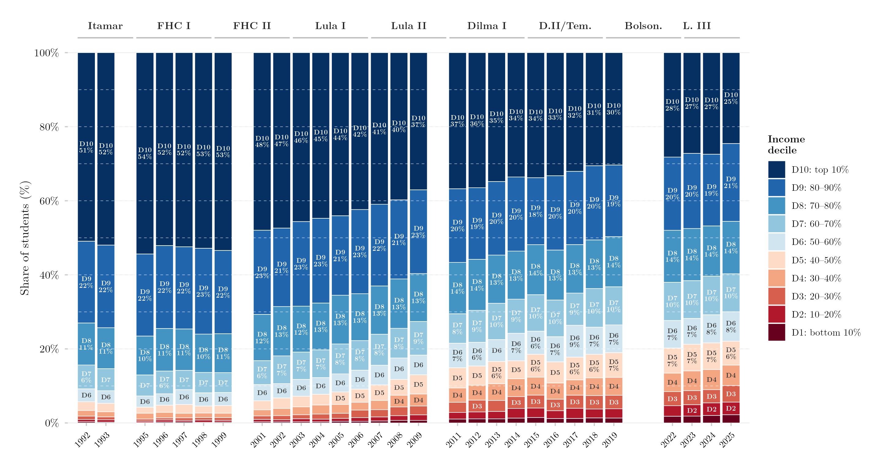

## Overview

This figure shows how the income composition of Brazil's tertiary-education students aged 18–64 has changed over time. Each bar is one year, stacked into ten income deciles of the general population (D1 = poorest tenth, D10 = richest tenth); the height of each segment is that decile's share among people who have ever enrolled in tertiary education. A more even stack — closer to 10% per decile — indicates broader-based access across the income distribution, while segments dominated by upper deciles indicate access concentrated among higher-income households. Using the full working-age range (18–64) rather than the traditional college-age cohort also captures access gained later in life.

## Methodology

Each bar shows the share of students aged 18–64 from each income decile. Variable: `ens_sup` = ever enrolled in tertiary education. Income deciles are computed within each survey year via `Hmisc::wtd.quantile` using sampling weights. Years 2000 and 2010 are excluded because no PNAD was conducted in Census years; 2020–2021 are excluded because of COVID-19 and the Auxílio Emergencial income transfer, which distorts the income distribution. For 2012–2015, only PNAD Anual observations are used to avoid double-counting the PNAD/PNADC overlap years. Percentage labels are shown for deciles with share ≥ 6%; decile labels only (no percentage) for shares ≥ 3%. Dashed horizontal lines indicate perfect equity (each decile = 10%). Government labels indicate the president in office.

## Pipeline

Scripts for this analysis:

- Plotting: [`plot.R`](plot.R)
- Upstream pipeline:
  - [`shared-pipeline/pnadc/000_PNADC_Download_Consolidate.R`](../../shared-pipeline/pnadc/000_PNADC_Download_Consolidate.R)
  - [`shared-pipeline/pnadc/020_PNAD_Anual_Manual_Import_2001_2015.R`](../../shared-pipeline/pnadc/020_PNAD_Anual_Manual_Import_2001_2015.R)
  - [`shared-pipeline/pnadc/021_PNAD_Anual_Import_Com_Renda_Zero.R`](../../shared-pipeline/pnadc/021_PNAD_Anual_Import_Com_Renda_Zero.R)
  - [`shared-pipeline/pnadc/050_PNAD_Historica_Manual_Import_1992_1999.R`](../../shared-pipeline/pnadc/050_PNAD_Historica_Manual_Import_1992_1999.R)
  - [`shared-pipeline/pnadc/035_Splice_Microdados.R`](../../shared-pipeline/pnadc/035_Splice_Microdados.R)

## Reproducibility

**Tier: A**

This pipeline uses only public data, accessible via package/API without any credential (PNADcIBGE, censobr, sidrar, ipeadatar). Run the scripts in `shared-pipeline/` in numeric order to reconstruct the intermediate data.
