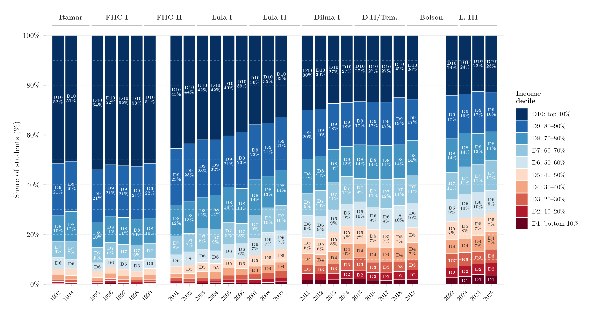

## Overview

This figure shows how the income composition of Brazil's currently (actively) enrolled tertiary students aged 18–24 has changed over time. Each bar is one year, stacked into ten income deciles of the general population (D1 = poorest tenth, D10 = richest tenth); the height of each segment is that decile's share among students currently enrolled. Because this restricts to active enrollment rather than ever having accessed tertiary education, it excludes cohorts who already graduated or withdrew, giving a more current snapshot of who is in the classroom right now.

## Methodology

Each bar shows the share of actively enrolled students aged 18–24 from each income decile. Variable: `ens_sup_a` = currently (actively) enrolled in tertiary education. Income deciles are computed within each survey year via `Hmisc::wtd.quantile` using sampling weights. Years 2000 and 2010 are excluded because no PNAD was conducted in Census years; 2020–2021 are excluded because of COVID-19 and the Auxílio Emergencial income transfer, which distorts the income distribution. For 2012–2015, only PNAD Anual observations are used to avoid double-counting the PNAD/PNADC overlap years. Percentage labels are shown for deciles with share ≥ 6%; decile labels only (no percentage) for shares ≥ 3%. Dashed horizontal lines indicate perfect equity (each decile = 10%). Government labels indicate the president in office.

## How to Cite

If you use this figure or the pipeline behind it, please cite both the dissertation and this specific analysis. References follow APA 7th edition.

**Dissertation (in preparation; the entry will be updated after the defense):**

> Mançano, T. (2026). *Inequality in access to tertiary education in Brazil: Household incomes, reforming policies, and the politics of who gets in (1990s–2020s)* [Unpublished master's thesis]. University of São Paulo.

**This figure and pipeline:**

> Mançano, T. (2026, August 9). *Income composition of actively enrolled tertiary students (ages 18–24)* [Figure and reproducible pipeline]. Open Data Analysis. https://mancano-tales.github.io/open-data-analysis/posts/composicao-decil-ens-sup-a-18-24/

**In text:** (Mançano, 2026) — when citing several analyses from this catalog in the same work, APA distinguishes them as 2026a, 2026b, … in the order they appear in the reference list.

**BibTeX:**

```bibtex
@mastersthesis{Mancano2026Thesis,
  author = {Man\c{c}ano, Tales},
  title  = {Inequality in Access to Tertiary Education in Brazil: Household
            Incomes, Reforming Policies, and the Politics of Who Gets In
            (1990s--2020s)},
  school = {University of S\~{a}o Paulo},
  year   = {2026},
  type   = {Master's thesis},
  note   = {Unpublished; Graduate Program in Political Science}
}

@misc{Mancano2026_composicao_decil_ens_sup_a_18_24,
  author       = {Man\c{c}ano, Tales},
  title        = {Income composition of actively enrolled tertiary students (ages 18--24)},
  year         = {2026},
  month        = aug,
  howpublished = {Open Data Analysis, \url{https://mancano-tales.github.io/open-data-analysis/posts/composicao-decil-ens-sup-a-18-24/}},
  note         = {Figure and reproducible pipeline. Source code: \url{https://github.com/mancano-tales/open-data-analysis}, folder posts/composicao-decil-ens-sup-a-18-24/. Accessed YYYY-MM-DD}
}
```

A permanent version (Git tag + Zenodo DOI) will be linked here once the dissertation is defended; until then, cite the page URL above and add the date you accessed it (source code: https://github.com/mancano-tales/open-data-analysis, folder `posts/composicao-decil-ens-sup-a-18-24/`).

## Pipeline

This figure draws on the [PNAD / PNAD Contínua Harmonization, 1992–2025](../harmonizacao-pnad-pnadc/) panel.

Run these scripts in this order, from the project root (each one writes to `data-raw/`, which the next one reads):

1. [`shared-pipeline/pnadc/000_PNADC_Download_Consolidate.R`](../../shared-pipeline/pnadc/000_PNADC_Download_Consolidate.R) — downloads PNAD Contínua 2012–2025 (1st interview) with `PNADcIBGE::get_pnadc()` into `data-raw/pnadc_raw/` and consolidates it into `data-raw/pnadc_consolidado_2012_2025_interview1.rds`
2. [`shared-pipeline/pnadc/020_PNAD_Anual_Manual_Import_2001_2015.R`](../../shared-pipeline/pnadc/020_PNAD_Anual_Manual_Import_2001_2015.R) — downloads the PNAD Anual 2001–2015 microdata from the IBGE FTP into `data-raw/pnad_anual_raw/` and imports them into `data-raw/harmonizing-br-data/output/PNAD_Anual_2001_2015.parquet`
3. [`shared-pipeline/pnadc/050_PNAD_Historica_Manual_Import_1992_1999.R`](../../shared-pipeline/pnadc/050_PNAD_Historica_Manual_Import_1992_1999.R) — same for PNAD Anual 1992–1999 (`PNAD_Anual_1992_1999.parquet`)
4. [`shared-pipeline/pnadc/035_Splice_Microdados.R`](../../shared-pipeline/pnadc/035_Splice_Microdados.R) — splices PNAD Anual and PNAD Contínua into the harmonized panel — `Microdados_Todas_Idades_1992_2025.parquet` and `Microdados_Jovens_18_24_1992_2025.parquet` in `data-raw/harmonizing-br-data/output/` (sources `shared-pipeline/utils/codigos_curso_pnad.R`)
5. [`plot.R`](plot.R) — reads `Microdados_Jovens_18_24_1992_2025.parquet` and `Microdados_Todas_Idades_1992_2025.parquet`; writes the figure to `output/figures/composicao-decil-ens-sup-a-18-24/` — compare it with this post's `thumbnail.png`

All of the upstream steps above are Tier A and are also run, in this same order, by [`shared-pipeline/build_public_data.R`](../../shared-pipeline/build_public_data.R).

## Reproducibility

**Tier: A**

This pipeline uses only public data, accessible via package/API without any credential (PNADcIBGE, censobr, sidrar, ipeadatar). Run the scripts in `shared-pipeline/` in numeric order to reconstruct the intermediate data.
