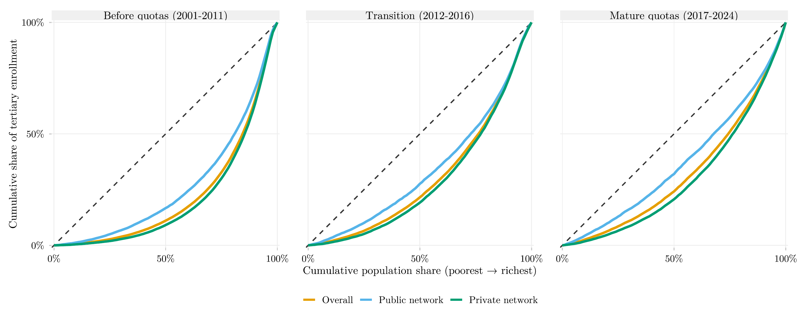

## Overview

This figure shows income concentration curves for access to tertiary education, broken down by network (public vs. private), across three periods relative to Brazil's 2012 Quota Law (Lei de Cotas): before, during the phase-in, and after full implementation. A concentration curve that bows closer to the diagonal indicates access spread more evenly across income levels; one that bows further away indicates access concentrated among higher-income households. The comparison lets the reader see whether, and how much, the concentration of access to each network shifted around the quota law.

## Methodology

Each panel pools the year-specific concentration curves within that period (a simple average across years on a uniform 101-point percentile grid), so each year contributes equally regardless of sample size. "Before quotas" covers 2001–2011 (PNAD Anual, excluding 2010, a census year with no PNAD). "Transition" covers 2012–2016, the Lei de Cotas (12.711/2012) phase-in period, during which the quota share rose linearly toward a minimum of 50% of seats by 2016; 2012–2015 comes from PNAD Anual and 2016 from PNAD Contínua. "Mature quotas" covers 2017–2024 (PNAD Contínua), excluding 2020–2021 (no standard first-interview data available those years, due to COVID-19). The network variable is V6002 for PNAD Anual (2001–2015, coded 2 = public / 4 = private) and V3002A for PNAD Contínua (2016+, coded 1 = private / 2 = public — the coding is reversed between the two sources). The Erreygers concentration index by period, for the population of reference (all 18–24-year-olds), is: overall access, 0.291 (before) / 0.272 (transition) / 0.297 (mature); public network, 0.064 / 0.063 / 0.067; private network, 0.227 / 0.209 / 0.231. The public-network index stays essentially flat across all three periods.

## How to Cite

If you use this figure or its underlying pipeline, please cite both the dissertation and this repository.

**Dissertation:**

> Mançano, Tales. 2026. *Inequality in Access to Tertiary Education in Brazil: Household Incomes, Reforming Policies, and the Politics of Who Gets In (1990s–2020s)*. Master's thesis, Graduate Program in Political Science, University of São Paulo.

```bibtex
@mastersthesis{Mancano2026,
  author = {Man\c{c}ano, Tales},
  title  = {Inequality in Access to Tertiary Education in Brazil: Household
            Incomes, Reforming Policies, and the Politics of Who Gets In
            (1990s--2020s)},
  school = {University of S\~{a}o Paulo},
  year   = {2026},
  type   = {Master's thesis},
  note   = {Graduate Program in Political Science}
}
```

**This figure and pipeline:**

> Mançano, Tales. 2026. "Income Concentration in Enrollment by Network, Before and After the Quota Law." In *Open Data Analysis*. <https://github.com/mancano-tales/open-data-analysis>, `posts/concentracao-rede-antes-depois-cotas/`.

```bibtex
@misc{Mancano2026OpenDataAnalysis,
  author       = {Man\c{c}ano, Tales},
  title        = {Open Data Analysis: Income Concentration in Enrollment by Network, Before and After the Quota Law},
  year         = {2026},
  howpublished = {\url{https://github.com/mancano-tales/open-data-analysis}},
  note         = {posts/concentracao-rede-antes-depois-cotas/}
}
```

A permanent version (Git tag + Zenodo DOI) will be linked here once the dissertation is defended; until then, cite the repository URL above.

## Pipeline

Scripts for this analysis:

- Plotting: [`plot.R`](plot.R) — self-contained script: downloads and processes the microdata directly, without depending on other scripts in this repository.
- Reference data source: [`shared-pipeline/pnadc/000_PNADC_Download_Consolidate.R`](../../shared-pipeline/pnadc/000_PNADC_Download_Consolidate.R)

## Reproducibility

**Tier: A**

This pipeline uses only public data, accessible via package/API without any credential (PNADcIBGE, censobr, sidrar, ipeadatar). Run the scripts in `shared-pipeline/` in numeric order to reconstruct the intermediate data.
