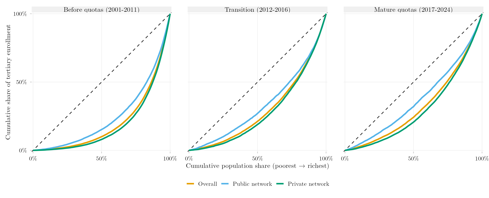

::: {.callout-warning title="Deprecated — do not cite"}
This figure contains known errors in how the PNAD Anual and PNAD Contínua years are made comparable; the year-by-year Wagstaff series supersedes it. The page is kept only for the record and is not listed in the catalog. Use the current analysis instead: [Income Inequality in Tertiary Enrollment by Network Type, Time Series (Wagstaff Index)](../wagstaff-rede-publica-privada-timeseries/).
:::



## Overview

This figure shows income concentration curves for access to tertiary education, broken down by network (public vs. private), across three periods relative to Brazil's 2012 Quota Law (Lei de Cotas): before, during the phase-in, and after full implementation. A concentration curve that bows closer to the diagonal indicates access spread more evenly across income levels; one that bows further away indicates access concentrated among higher-income households. The comparison lets the reader see whether, and how much, the concentration of access to each network shifted around the quota law.

## Methodology

Each panel pools the year-specific concentration curves within that period (a simple average across years on a uniform 101-point percentile grid), so each year contributes equally regardless of sample size. "Before quotas" covers 2001–2011 (PNAD Anual, excluding 2010, a census year with no PNAD). "Transition" covers 2012–2016, the Lei de Cotas (12.711/2012) phase-in period, during which the quota share rose linearly toward a minimum of 50% of seats by 2016; 2012–2015 comes from PNAD Anual and 2016 from PNAD Contínua. "Mature quotas" covers 2017–2024 (PNAD Contínua), excluding 2020–2021 (no standard first-interview data available those years, due to COVID-19). The network variable is V6002 for PNAD Anual (2001–2015, coded 2 = public / 4 = private) and V3002A for PNAD Contínua (2016+, coded 1 = private / 2 = public — the coding is reversed between the two sources). The Erreygers concentration index by period, for the population of reference (all 18–24-year-olds), is: overall access, 0.280 (before) / 0.279 (transition) / 0.297 (mature); public network, 0.066 / 0.065 / 0.067; private network, 0.214 / 0.214 / 0.231. The public-network index stays essentially flat across all three periods.

## How to Cite

If you use this figure or the pipeline behind it, please cite both the dissertation and this specific analysis. References follow APA 7th edition.

**Dissertation (in preparation; the entry will be updated after the defense):**

> Mançano, T. (2026). *Inequality in access to tertiary education in Brazil: Household incomes, reforming policies, and the politics of who gets in (1990s–2020s)* [Unpublished master's thesis]. University of São Paulo.

**This figure and pipeline:**

> Mançano, T. (2026, June 30). *Income concentration in enrollment by network, before and after the Quota Law* [Figure and reproducible pipeline]. Open Data Analysis. https://mancano-tales.github.io/open-data-analysis/posts/concentracao-rede-antes-depois-cotas/

**In text:** (Mançano, 2026) — when citing several analyses from this catalog in the same work, APA distinguishes them as 2026a, 2026b, … in the order they appear in the reference list.

**BibTeX:**

```bibtex
@mastersthesis{Mancano2026Thesis,
  author = {Man\c{c}ano, Tales},
  title  = {Inequality in Access to Tertiary Education in Brazil: Household
            Incomes, Reforming Policies, and the Politics of Who Gets In
            (1990s--2020s)},
  school = {University of S\~{a}o Paulo},
  year   = {2026},
  type   = {Master's thesis},
  note   = {Unpublished; Graduate Program in Political Science}
}

@misc{Mancano2026_concentracao_rede_antes_depois_cotas,
  author       = {Man\c{c}ano, Tales},
  title        = {Income concentration in enrollment by network, before and after the Quota Law},
  year         = {2026},
  month        = jun,
  howpublished = {Open Data Analysis, \url{https://mancano-tales.github.io/open-data-analysis/posts/concentracao-rede-antes-depois-cotas/}},
  note         = {Figure and reproducible pipeline. Source code: \url{https://github.com/mancano-tales/open-data-analysis}, folder posts/concentracao-rede-antes-depois-cotas/. Accessed YYYY-MM-DD}
}
```

A permanent version (Git tag + Zenodo DOI) will be linked here once the dissertation is defended; until then, cite the page URL above and add the date you accessed it (source code: https://github.com/mancano-tales/open-data-analysis, folder `posts/concentracao-rede-antes-depois-cotas/`).

## Pipeline

Run these scripts in this order, from the project root (each one writes to `data-raw/`, which the next one reads):

1. [`shared-pipeline/pnadc/020_PNAD_Anual_Manual_Import_2001_2015.R`](../../shared-pipeline/pnadc/020_PNAD_Anual_Manual_Import_2001_2015.R) — downloads the raw PNAD Anual 2001–2015 microdata (fixed-width `.txt` + SAS layouts) from the IBGE FTP into `data-raw/pnad_anual_raw/<year>/` — `plot.R` reads these raw files directly
2. [`shared-pipeline/pnadc/000_PNADC_Download_Consolidate.R`](../../shared-pipeline/pnadc/000_PNADC_Download_Consolidate.R) — *(optional)* pre-populates the PNAD Contínua cache in `data-raw/pnadc_raw/`; if you skip it, `plot.R` downloads the years it needs with `PNADcIBGE::get_pnadc()` into the same folder
3. [`plot.R`](plot.R) — reads the raw PNAD Anual files in `data-raw/pnad_anual_raw/` and the PNAD Contínua years in `data-raw/pnadc_raw/` (sources `shared-pipeline/utils/codigos_curso_pnad.R`); writes the figure to `output/figures/concentracao-rede-antes-depois-cotas/` — compare it with this post's `thumbnail.png`

## Reproducibility

**Tier: A**

This pipeline uses only public data, accessible via package/API without any credential (PNADcIBGE, censobr, sidrar, ipeadatar). Run the scripts in `shared-pipeline/` in numeric order to reconstruct the intermediate data.
