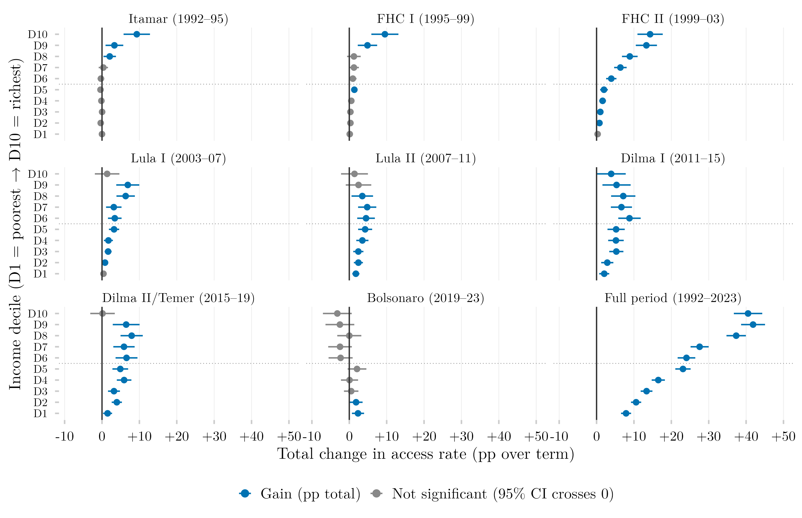

## Overview

This figure measures how much the share of 18–24-year-olds who had ever accessed tertiary education changed during each Brazilian presidential term, broken down by income decile, using a Cleveland dot-plot layout. Each panel is one term, showing one point per income decile for the total percentage-point change in access from the start to the end of that term. It offers a government-by-government view of who gained or lost ground in access to higher education.

## Methodology

Each point shows the total percentage-point change in the share of 18–24-year-olds who had ever accessed tertiary education (`ens_sup`), from the first year of each presidential term to the first year of the next; horizontal lines are 95% confidence intervals. Color encodes statistical significance rather than sign: a point is grey wherever its interval contains zero. The interval is that of the difference itself, with its standard error taken as the root of the sum of the two years' squared standard errors, treating the two surveys as independent — the test is therefore conservative. The two source surveys are spliced by presidential term rather than by year: every term panel draws on a single survey at both endpoints, PNAD Anual through 2015 and PNAD Contínua from 2015 onward, so no difference straddles the change of instrument. The full-period panel is the only one that remains cross-survey.

## How to Cite

If you use this figure or its underlying pipeline, please cite both the dissertation and this repository.

**Dissertation:**

> Mançano, Tales. 2026. *Inequality in Access to Tertiary Education in Brazil: Household Incomes, Reforming Policies, and the Politics of Who Gets In (1990s–2020s)*. Master's thesis, Graduate Program in Political Science, University of São Paulo.

```bibtex
@mastersthesis{Mancano2026,
  author = {Man\c{c}ano, Tales},
  title  = {Inequality in Access to Tertiary Education in Brazil: Household
            Incomes, Reforming Policies, and the Politics of Who Gets In
            (1990s--2020s)},
  school = {University of S\~{a}o Paulo},
  year   = {2026},
  type   = {Master's thesis},
  note   = {Graduate Program in Political Science}
}
```

**This figure and pipeline:**

> Mançano, Tales. 2026. "Change in Tertiary Education Access Rate by Income Decile and Presidential Term." In *Open Data Analysis*. <https://github.com/mancano-tales/open-data-analysis>, `posts/delta-acesso-decil-governo/`.

```bibtex
@misc{Mancano2026OpenDataAnalysis,
  author       = {Man\c{c}ano, Tales},
  title        = {Open Data Analysis: Change in Tertiary Education Access Rate by Income Decile and Presidential Term},
  year         = {2026},
  howpublished = {\url{https://github.com/mancano-tales/open-data-analysis}},
  note         = {posts/delta-acesso-decil-governo/}
}
```

A permanent version (Git tag + Zenodo DOI) will be linked here once the dissertation is defended; until then, cite the repository URL above.

## Pipeline

This figure draws on the [PNAD / PNAD Contínua Harmonization, 1992–2025](../harmonizacao-pnad-pnadc/) panel.


Scripts for this analysis:

- Plotting: [`plot.R`](plot.R)
- Upstream pipeline:
  - [`shared-pipeline/pnadc/035_Splice_Microdados.R`](../../shared-pipeline/pnadc/035_Splice_Microdados.R)

## Reproducibility

**Tier: A**

This pipeline uses only public data, accessible via package/API without any credential (PNADcIBGE, censobr, sidrar, ipeadatar). Run the scripts in `shared-pipeline/` in numeric order to reconstruct the intermediate data.
