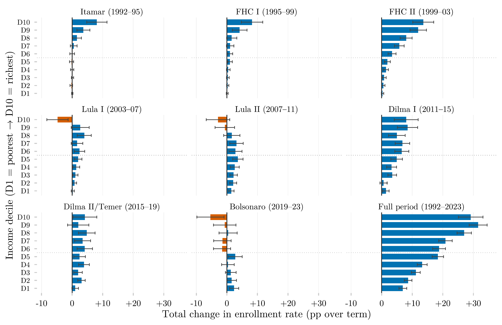

::: {.callout-warning title="Deprecated — do not cite"}
This bar-chart version dates from 2026-07-04 and predates both the extension of the harmonized series to 2025 and the pipeline audit of 2026-09-15; its numbers are known to be wrong. The page is kept only for the record and is not listed in the catalog. Use the current analysis instead: [Change in Higher Education Enrollment Rate by Income Decile and Presidential Term (Dot Plot)](../delta-matriculados-decil-governo-dotplot/).
:::



## Overview

This figure measures how much the share of 18–24-year-olds actively enrolled in tertiary education changed during each Brazilian presidential term, broken down by income decile. Each panel is one term, showing ten bars — one per income decile — for the total percentage-point change in enrollment from the start to the end of that term. It offers a government-by-government view of who gained or lost ground in access to higher education.

## Methodology

Each bar shows the total percentage-point change in the share of 18–24-year-olds actively enrolled in tertiary education (`ens_sup_a`), from the first year of each presidential term to the first year of the next; error bars are 95% confidence intervals. Color encodes statistical significance rather than sign: a bar is grey wherever its interval contains zero. The interval is that of the difference itself, with its standard error taken as the root of the sum of the two years' squared standard errors, treating the two surveys as independent — the test is therefore conservative. The two source surveys are spliced by presidential term rather than by year: every term panel draws on a single survey at both endpoints, PNAD Anual through 2015 and PNAD Contínua from 2015 onward, so no difference straddles the change of instrument. The full-period panel is the only one that remains cross-survey. Active enrollment is a conservative criterion that excludes cohorts who already graduated or withdrew.

## How to Cite

If you use this figure or the pipeline behind it, please cite both the dissertation and this specific analysis. References follow APA 7th edition.

**Dissertation (in preparation; the entry will be updated after the defense):**

> Mançano, T. (2026). *Inequality in access to tertiary education in Brazil: Household incomes, reforming policies, and the politics of who gets in (1990s–2020s)* [Unpublished master's thesis]. University of São Paulo.

**This figure and pipeline:**

> Mançano, T. (2026, July 4). *Change in higher education enrollment rate by income decile and presidential term* [Figure and reproducible pipeline]. Open Data Analysis. https://mancano-tales.github.io/open-data-analysis/posts/delta-matriculados-decil-governo/

**In text:** (Mançano, 2026) — when citing several analyses from this catalog in the same work, APA distinguishes them as 2026a, 2026b, … in the order they appear in the reference list.

**BibTeX:**

```bibtex
@mastersthesis{Mancano2026Thesis,
  author = {Man\c{c}ano, Tales},
  title  = {Inequality in Access to Tertiary Education in Brazil: Household
            Incomes, Reforming Policies, and the Politics of Who Gets In
            (1990s--2020s)},
  school = {University of S\~{a}o Paulo},
  year   = {2026},
  type   = {Master's thesis},
  note   = {Unpublished; Graduate Program in Political Science}
}

@misc{Mancano2026_delta_matriculados_decil_governo,
  author       = {Man\c{c}ano, Tales},
  title        = {Change in higher education enrollment rate by income decile and presidential term},
  year         = {2026},
  month        = jul,
  howpublished = {Open Data Analysis, \url{https://mancano-tales.github.io/open-data-analysis/posts/delta-matriculados-decil-governo/}},
  note         = {Figure and reproducible pipeline. Source code: \url{https://github.com/mancano-tales/open-data-analysis}, folder posts/delta-matriculados-decil-governo/. Accessed YYYY-MM-DD}
}
```

A permanent version (Git tag + Zenodo DOI) will be linked here once the dissertation is defended; until then, cite the page URL above and add the date you accessed it (source code: https://github.com/mancano-tales/open-data-analysis, folder `posts/delta-matriculados-decil-governo/`).

## Pipeline

This figure draws on the [PNAD / PNAD Contínua Harmonization, 1992–2025](../harmonizacao-pnad-pnadc/) panel.

Run these scripts in this order, from the project root (each one writes to `data-raw/`, which the next one reads):

1. [`shared-pipeline/pnadc/000_PNADC_Download_Consolidate.R`](../../shared-pipeline/pnadc/000_PNADC_Download_Consolidate.R) — downloads PNAD Contínua 2012–2025 (1st interview) with `PNADcIBGE::get_pnadc()` into `data-raw/pnadc_raw/` and consolidates it into `data-raw/pnadc_consolidado_2012_2025_interview1.rds`
2. [`shared-pipeline/pnadc/020_PNAD_Anual_Manual_Import_2001_2015.R`](../../shared-pipeline/pnadc/020_PNAD_Anual_Manual_Import_2001_2015.R) — downloads the PNAD Anual 2001–2015 microdata from the IBGE FTP into `data-raw/pnad_anual_raw/` and imports them into `data-raw/harmonizing-br-data/output/PNAD_Anual_2001_2015.parquet`
3. [`shared-pipeline/pnadc/050_PNAD_Historica_Manual_Import_1992_1999.R`](../../shared-pipeline/pnadc/050_PNAD_Historica_Manual_Import_1992_1999.R) — same for PNAD Anual 1992–1999 (`PNAD_Anual_1992_1999.parquet`)
4. [`shared-pipeline/pnadc/035_Splice_Microdados.R`](../../shared-pipeline/pnadc/035_Splice_Microdados.R) — splices PNAD Anual and PNAD Contínua into the harmonized panel — `Microdados_Todas_Idades_1992_2025.parquet` and `Microdados_Jovens_18_24_1992_2025.parquet` in `data-raw/harmonizing-br-data/output/` (sources `shared-pipeline/utils/codigos_curso_pnad.R`)
5. [`plot.R`](plot.R) — reads `Microdados_Jovens_18_24_1992_2025.parquet` plus `data-raw/pnadc_consolidado_2012_2025_interview1.rds` (survey design variables for the PNAD Contínua years); writes the figure to `output/figures/delta-matriculados-decil-governo/` — compare it with this post's `thumbnail.png`

All of the upstream steps above are Tier A and are also run, in this same order, by [`shared-pipeline/build_public_data.R`](../../shared-pipeline/build_public_data.R).

## Reproducibility

**Tier: A**

This pipeline uses only public data, accessible via package/API without any credential (PNADcIBGE, censobr, sidrar, ipeadatar). Run the scripts in `shared-pipeline/` in numeric order to reconstruct the intermediate data.

**Note**: the copy of this script in this post contained an absolute fallback path pointing to the author's local machine (`C:/Users/Mancano/...`); this path was corrected to `here::here("data-raw", ...)` when copied into this repository, following the same convention used in `shared-pipeline/`.
