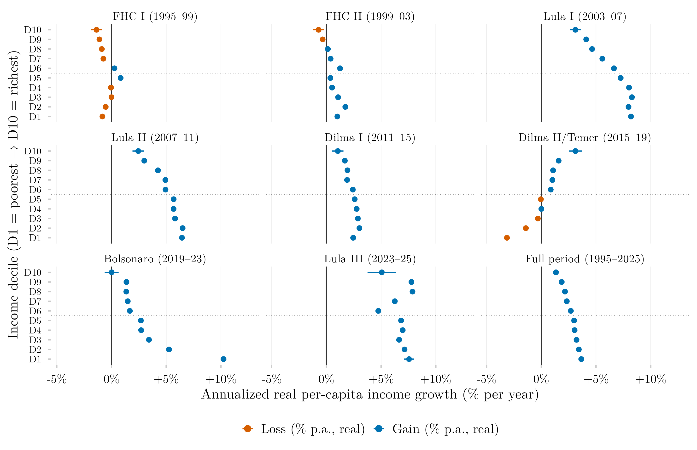

## Overview

This figure measures annualized real income growth by income decile across Brazilian presidential terms, from 1995 to 2025. Expressing growth as a compound annual rate rather than a total change makes terms of very different lengths — a full four years versus, for the most recent term shown, only two — directly comparable.

## Methodology

Each point is the annualized geometric real income growth rate (percent per year, January 2024 prices) for each income decile, from the first available year of a presidential term to the first available year of the next (blue = gain, orange = loss); horizontal lines are 95% confidence intervals. Itamar Franco's term (1992–1995) is omitted, since the series used here starts in 1995. The Lula III panel covers two years of growth (2023–2025). The bottom-right panel covers the full 1995–2025 period. Confidence intervals are computed via the delta method for f(t1,t0) = ((t1/t0)^(1/n) − 1) × 100, where n is the number of years in the term: se = (100/n)·(t1/t0)^(1/n)·√((se₁/t1)² + (se₀/t0)²). The standard error of each endpoint is the weighted sample variance divided by the Kish effective sample size (design effect = 2).

## How to Cite

If you use this figure or its underlying pipeline, please cite both the dissertation and this repository.

**Dissertation:**

> Mançano, Tales. 2026. *Inequality in Access to Tertiary Education in Brazil: Household Incomes, Reforming Policies, and the Politics of Who Gets In (1990s–2020s)*. Master's thesis, Graduate Program in Political Science, University of São Paulo.

```bibtex
@mastersthesis{Mancano2026,
  author = {Man\c{c}ano, Tales},
  title  = {Inequality in Access to Tertiary Education in Brazil: Household
            Incomes, Reforming Policies, and the Politics of Who Gets In
            (1990s--2020s)},
  school = {University of S\~{a}o Paulo},
  year   = {2026},
  type   = {Master's thesis},
  note   = {Graduate Program in Political Science}
}
```

**This figure and pipeline:**

> Mançano, Tales. 2026. "Annualized Real Income Growth by Income Decile and Presidential Term." In *Open Data Analysis*. <https://github.com/mancano-tales/open-data-analysis>, `posts/delta-renda-anualizada-decil-governo/`.

```bibtex
@misc{Mancano2026OpenDataAnalysis,
  author       = {Man\c{c}ano, Tales},
  title        = {Open Data Analysis: Annualized Real Income Growth by Income Decile and Presidential Term},
  year         = {2026},
  howpublished = {\url{https://github.com/mancano-tales/open-data-analysis}},
  note         = {posts/delta-renda-anualizada-decil-governo/}
}
```

A permanent version (Git tag + Zenodo DOI) will be linked here once the dissertation is defended; until then, cite the repository URL above.

## Pipeline

This figure draws on the [PNAD / PNAD Contínua Harmonization, 1992–2025](../harmonizacao-pnad-pnadc/) panel.


Scripts for this analysis:

- Plotting: [`plot.R`](plot.R)
- Upstream pipeline:
  - [`shared-pipeline/pnadc/035_Splice_Microdados.R`](../../shared-pipeline/pnadc/035_Splice_Microdados.R)

## Reproducibility

**Tier: A**

This pipeline uses only public data, accessible via package/API without any credential (PNADcIBGE, censobr, sidrar, ipeadatar). Run the scripts in `shared-pipeline/` in numeric order to reconstruct the intermediate data.
