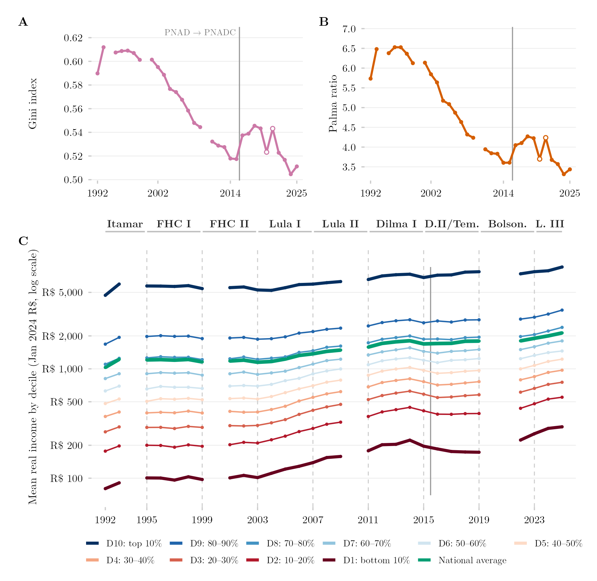

## Overview

This figure combines three views of Brazilian income inequality from 1992 to 2024: (A) the Gini index, a standard scalar summary of overall inequality; (B) the Palma ratio, comparing the income share of the richest tenth against the poorest 40%; and (C) the actual trajectory of mean real income for each individual decile, on a logarithmic scale. Together they move from a single summary number down to the full anatomy of who gained and who fell behind.

## Methodology

Panel A shows the Gini index of real per-capita income. Panel B shows the Palma ratio — the income share of the richest decile divided by that of the poorest four deciles. Panels A and B follow the official universe, which retains households reporting no income, and reproduce IBGE's own published series (mean deviation −0.0001). Panel C shows mean real per-capita income by decile, in January-2024 reais, on a logarithmic axis; here the deciles rest on the working universe of positive incomes only, so panel C's levels are not strictly the official ones. Lines are interrupted in years without a survey (1994, 2000, 2010, 2020–2021); hollow markers in panels A and B mark 2020 and 2021, taken from the telephone-collected fifth visit of PNAD Contínua. The income unit is the family up to 2015 (PNAD) and the household from 2016 onward (PNAD Contínua); the two coincide except where several families share a dwelling, and a solid vertical rule marks that change of source. Because both surveys ran in 2012–2015, the effect of the instrument change can be measured directly rather than assumed: for the same year, PNAD Contínua returns a Gini index higher by 0.008 and a Palma ratio higher by 0.15 on average. Of the step observed between 2015 and 2016 (+0.020 Gini, +0.44 Palma), roughly a third is therefore an artefact of the survey splice rather than a genuine rise in inequality. This vertical rule is distinct from the dashed rules in panel C, which mark changes of government; the 2015–2019 government block joins Dilma Rousseff's second term to Michel Temer's, so the August-2016 impeachment does not appear as a boundary in the figure.

## How to Cite

If you use this figure or the pipeline behind it, please cite both the dissertation and this specific analysis. References follow APA 7th edition.

**Dissertation (in preparation; the entry will be updated after the defense):**

> Mançano, T. (2026). *Inequality in access to tertiary education in Brazil: Household incomes, reforming policies, and the politics of who gets in (1990s–2020s)* [Unpublished master's thesis]. University of São Paulo.

**This figure and pipeline:**

> Mançano, T. (2026, August 9). *Income inequality and real income growth by decile (Gini/Palma panel)* [Figure and reproducible pipeline]. Open Data Analysis. https://mancano-tales.github.io/open-data-analysis/posts/desigualdade-renda-gini-palma-decil/

**In text:** (Mançano, 2026) — when citing several analyses from this catalog in the same work, APA distinguishes them as 2026a, 2026b, … in the order they appear in the reference list.

**BibTeX:**

```bibtex
@mastersthesis{Mancano2026Thesis,
  author = {Man\c{c}ano, Tales},
  title  = {Inequality in Access to Tertiary Education in Brazil: Household
            Incomes, Reforming Policies, and the Politics of Who Gets In
            (1990s--2020s)},
  school = {University of S\~{a}o Paulo},
  year   = {2026},
  type   = {Master's thesis},
  note   = {Unpublished; Graduate Program in Political Science}
}

@misc{Mancano2026_desigualdade_renda_gini_palma_decil,
  author       = {Man\c{c}ano, Tales},
  title        = {Income inequality and real income growth by decile (Gini/Palma panel)},
  year         = {2026},
  month        = aug,
  howpublished = {Open Data Analysis, \url{https://mancano-tales.github.io/open-data-analysis/posts/desigualdade-renda-gini-palma-decil/}},
  note         = {Figure and reproducible pipeline. Source code: \url{https://github.com/mancano-tales/open-data-analysis}, folder posts/desigualdade-renda-gini-palma-decil/. Accessed YYYY-MM-DD}
}
```

A permanent version (Git tag + Zenodo DOI) will be linked here once the dissertation is defended; until then, cite the page URL above and add the date you accessed it (source code: https://github.com/mancano-tales/open-data-analysis, folder `posts/desigualdade-renda-gini-palma-decil/`).

## Pipeline

This figure draws on the [PNAD / PNAD Contínua Harmonization, 1992–2025](../harmonizacao-pnad-pnadc/) panel.

Run these scripts in this order, from the project root (each one writes to `data-raw/`, which the next one reads):

1. [`shared-pipeline/pnadc/000_PNADC_Download_Consolidate.R`](../../shared-pipeline/pnadc/000_PNADC_Download_Consolidate.R) — downloads PNAD Contínua 2012–2025 (1st interview) with `PNADcIBGE::get_pnadc()` into `data-raw/pnadc_raw/` and consolidates it into `data-raw/pnadc_consolidado_2012_2025_interview1.rds`
2. [`shared-pipeline/pnadc/020_PNAD_Anual_Manual_Import_2001_2015.R`](../../shared-pipeline/pnadc/020_PNAD_Anual_Manual_Import_2001_2015.R) — downloads the PNAD Anual 2001–2015 microdata from the IBGE FTP into `data-raw/pnad_anual_raw/` and imports them into `data-raw/harmonizing-br-data/output/PNAD_Anual_2001_2015.parquet`
3. [`shared-pipeline/pnadc/050_PNAD_Historica_Manual_Import_1992_1999.R`](../../shared-pipeline/pnadc/050_PNAD_Historica_Manual_Import_1992_1999.R) — same for PNAD Anual 1992–1999 (`PNAD_Anual_1992_1999.parquet`)
4. [`shared-pipeline/pnadc/021_PNAD_Anual_Import_Com_Renda_Zero.R`](../../shared-pipeline/pnadc/021_PNAD_Anual_Import_Com_Renda_Zero.R) — re-imports PNAD Anual 2001–2015 keeping zero-income households (`PNAD_Anual_2001_2015_com_zero.parquet`), which script 238 needs
5. [`shared-pipeline/pnadc/035_Splice_Microdados.R`](../../shared-pipeline/pnadc/035_Splice_Microdados.R) — splices PNAD Anual and PNAD Contínua into the harmonized panel — `Microdados_Todas_Idades_1992_2025.parquet` and `Microdados_Jovens_18_24_1992_2025.parquet` in `data-raw/harmonizing-br-data/output/` (sources `shared-pipeline/utils/codigos_curso_pnad.R`)
6. [`shared-pipeline/pnadc/238_Serie_Desigualdade_Oficial.R`](../../shared-pipeline/pnadc/238_Serie_Desigualdade_Oficial.R) — derives the official income-inequality series (`238_serie_desigualdade_oficial.rds`). Optional input: `PNADC_Visita5_2019_2022.parquet` (PNAD Contínua 5th-interview microdata, not built by any script in this repository) grafts the 2020–2021 points; without it those two years are simply absent
7. [`plot.R`](plot.R) — reads `Microdados_Todas_Idades_1992_2025.parquet` and `238_serie_desigualdade_oficial.rds`; writes the figure to `output/figures/desigualdade-renda-gini-palma-decil/` — compare it with this post's `thumbnail.png`

All of the upstream steps above are Tier A and are also run, in this same order, by [`shared-pipeline/build_public_data.R`](../../shared-pipeline/build_public_data.R).

## Reproducibility

**Tier: A**

This pipeline uses only public data, accessible via package/API without any credential (PNADcIBGE, censobr, sidrar, ipeadatar). Run the scripts in `shared-pipeline/` in numeric order to reconstruct the intermediate data.
