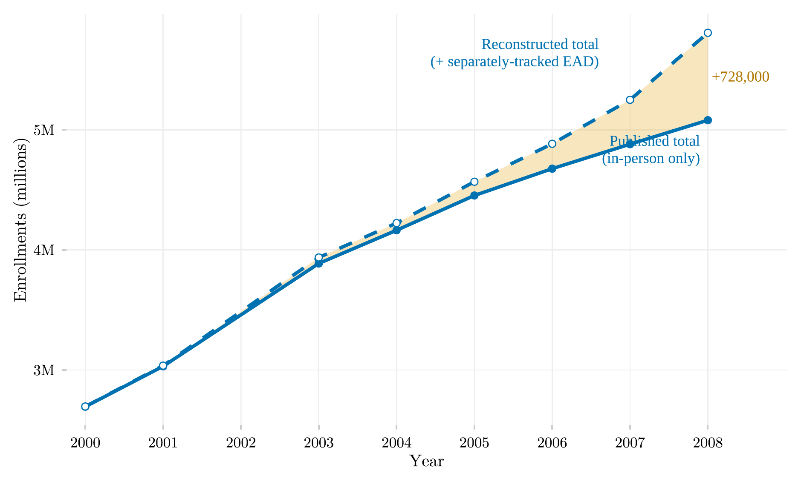

## Overview

This figure documents a gap in Brazil's official higher-education statistics between 2000 and 2008: distance-learning enrollment was tracked separately by INEP but left out of the headline published totals. It shows both the officially published (in-person only) total and a reconstructed total that adds the separately tracked distance-learning enrollment back in, revealing how much bigger the true tertiary system already was.

## Methodology

Between 2000 and 2008, INEP tracked distance enrollment (EAD) in a separate table and excluded it from published headline totals. The shaded band is the resulting undercount, which grows to roughly 700 thousand students by 2008; the dashed line shows the `educabr2` package's reconstructed totals (`is_derived = TRUE`), which add the separately tracked distance-learning figures back into the published in-person total.

## Pipeline

Scripts for this analysis:

- Plotting: [`plot.R`](plot.R)
- Upstream pipeline: no script in this repository — the data comes embedded in the R package [`educabr2`](https://github.com/mancano-tales/educabr2).

## Reproducibility

**Tier: A (cross-repo)**

This pipeline depends on the public R package `educabr2` (`remotes::install_github("mancano-tales/educabr2")`), which already embeds the necessary data.
