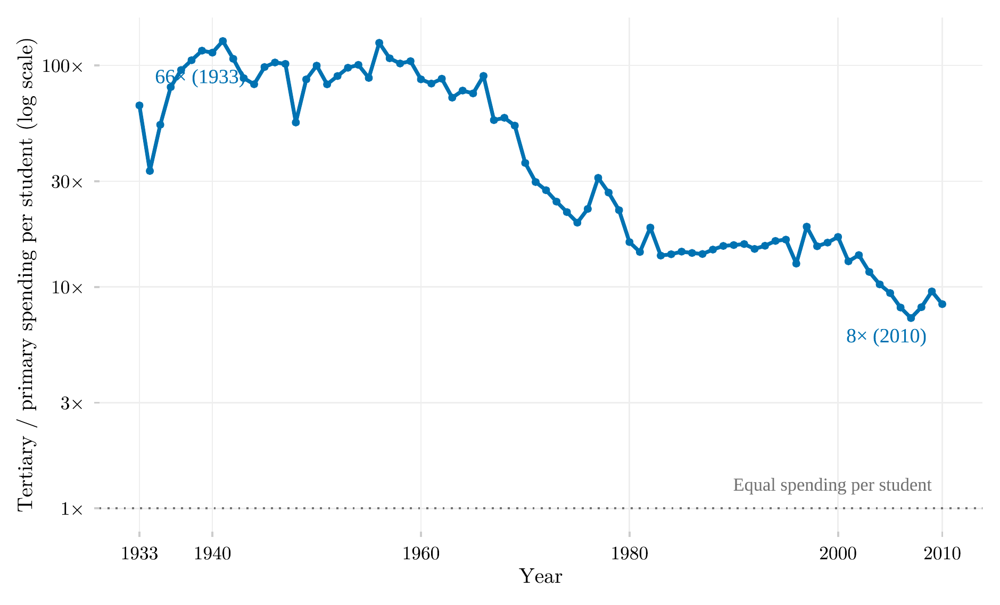

## Overview

This figure tracks how unequal Brazilian public spending on education was, comparing how much the government spent per tertiary student against how much it spent per early-primary pupil, from 1933 to 2010. A ratio far above 1 means tertiary students — historically a small, better-off share of the population — received far more public money per head than primary pupils.

## Methodology

The double ratio divides public spending per tertiary student by spending per pupil in early primary education (EF1); the dotted reference line marks equal per-student spending. On the logarithmic scale, the fall from 66 times in 1933 to under 9 times in 2010 spans nearly an order of magnitude, yet spending never approached parity — the elitist bias in Brazilian public education spending narrowed considerably over the twentieth century without disappearing.

## How to Cite

If you use this figure or its underlying pipeline, please cite both the dissertation and this repository.

**Dissertation:**

> Mançano, Tales. 2026. *Inequality in Access to Tertiary Education in Brazil: Household Incomes, Reforming Policies, and the Politics of Who Gets In (1990s–2020s)*. Master's thesis, Graduate Program in Political Science, University of São Paulo.

```bibtex
@mastersthesis{Mancano2026,
  author = {Man\c{c}ano, Tales},
  title  = {Inequality in Access to Tertiary Education in Brazil: Household
            Incomes, Reforming Policies, and the Politics of Who Gets In
            (1990s--2020s)},
  school = {University of S\~{a}o Paulo},
  year   = {2026},
  type   = {Master's thesis},
  note   = {Graduate Program in Political Science}
}
```

**This figure and pipeline:**

> Mançano, Tales. 2026. "Regressivity of Public Spending: Tertiary vs. Primary Education." In *Open Data Analysis*. <https://github.com/mancano-tales/open-data-analysis>, `posts/educabr2-expenditure-regressivity/`.

```bibtex
@misc{Mancano2026OpenDataAnalysis,
  author       = {Man\c{c}ano, Tales},
  title        = {Open Data Analysis: Regressivity of Public Spending: Tertiary vs. Primary Education},
  year         = {2026},
  howpublished = {\url{https://github.com/mancano-tales/open-data-analysis}},
  note         = {posts/educabr2-expenditure-regressivity/}
}
```

A permanent version (Git tag + Zenodo DOI) will be linked here once the dissertation is defended; until then, cite the repository URL above.

## Pipeline

Scripts for this analysis:

- Plotting: [`plot.R`](plot.R)
- Upstream pipeline: no script in this repository — the data comes embedded in the R package [`educabr2`](https://github.com/mancano-tales/educabr2).

## Reproducibility

**Tier: A (cross-repo)**

This pipeline depends on the public R package `educabr2` (`remotes::install_github("mancano-tales/educabr2")`), which already embeds the necessary data.
