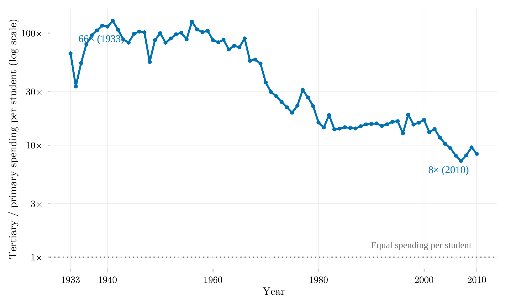

## Overview

This figure tracks how unequal Brazilian public spending on education was, comparing how much the government spent per tertiary student against how much it spent per early-primary pupil, from 1933 to 2010. A ratio far above 1 means tertiary students — historically a small, better-off share of the population — received far more public money per head than primary pupils.

## Methodology

The double ratio divides public spending per tertiary student by spending per pupil in early primary education (EF1); the dotted reference line marks equal per-student spending. On the logarithmic scale, the fall from 66 times in 1933 to under 9 times in 2010 spans nearly an order of magnitude, yet spending never approached parity — the elitist bias in Brazilian public education spending narrowed considerably over the twentieth century without disappearing.

## How to Cite

If you use this figure or the pipeline behind it, please cite both the dissertation and this specific analysis. References follow APA 7th edition.

**Dissertation (in preparation; the entry will be updated after the defense):**

> Mançano, T. (2026). *Inequality in access to tertiary education in Brazil: Household incomes, reforming policies, and the politics of who gets in (1990s–2020s)* [Unpublished master's thesis]. University of São Paulo.

**This figure and pipeline:**

> Mançano, T. (2026, July 12). *Regressivity of public spending: Tertiary vs. primary education* [Figure and reproducible pipeline]. Open Data Analysis. https://mancano-tales.github.io/open-data-analysis/posts/educabr2-expenditure-regressivity/

**In text:** (Mançano, 2026) — when citing several analyses from this catalog in the same work, APA distinguishes them as 2026a, 2026b, … in the order they appear in the reference list.

**BibTeX:**

```bibtex
@mastersthesis{Mancano2026Thesis,
  author = {Man\c{c}ano, Tales},
  title  = {Inequality in Access to Tertiary Education in Brazil: Household
            Incomes, Reforming Policies, and the Politics of Who Gets In
            (1990s--2020s)},
  school = {University of S\~{a}o Paulo},
  year   = {2026},
  type   = {Master's thesis},
  note   = {Unpublished; Graduate Program in Political Science}
}

@misc{Mancano2026_educabr2_expenditure_regressivity,
  author       = {Man\c{c}ano, Tales},
  title        = {Regressivity of public spending: Tertiary vs. primary education},
  year         = {2026},
  month        = jul,
  howpublished = {Open Data Analysis, \url{https://mancano-tales.github.io/open-data-analysis/posts/educabr2-expenditure-regressivity/}},
  note         = {Figure and reproducible pipeline. Source code: \url{https://github.com/mancano-tales/open-data-analysis}, folder posts/educabr2-expenditure-regressivity/. Accessed YYYY-MM-DD}
}
```

A permanent version (Git tag + Zenodo DOI) will be linked here once the dissertation is defended; until then, cite the page URL above and add the date you accessed it (source code: https://github.com/mancano-tales/open-data-analysis, folder `posts/educabr2-expenditure-regressivity/`).

## Pipeline

Scripts for this analysis:

- Plotting: [`plot.R`](plot.R) — writes the figure to `output/figures/educabr2-expenditure-regressivity/` — compare it with this post's `thumbnail.png`
- Upstream pipeline: no upstream script in this repository — the data comes embedded in the R package [`educabr2`](https://github.com/mancano-tales/educabr2) (`remotes::install_github("mancano-tales/educabr2")`).

## Reproducibility

**Tier: A (cross-repo)**

This pipeline depends on the public R package `educabr2` (`remotes::install_github("mancano-tales/educabr2")`), which already embeds the necessary data.
