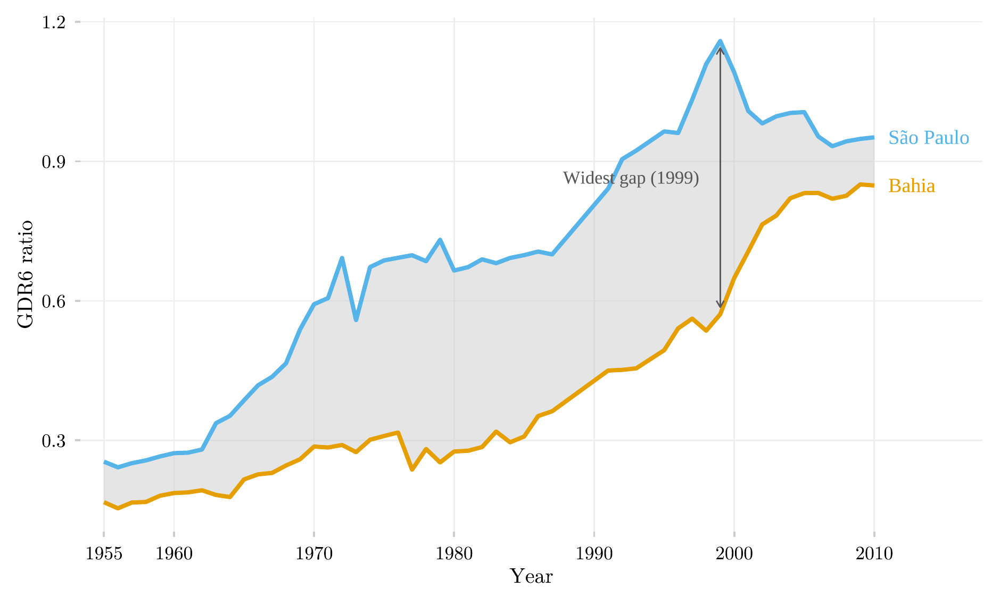

## Overview

This figure compares two Brazilian states, São Paulo and Bahia, on how well children progressed through the early grades of primary school, from 1955 to 2010. It shows a large and persistent regional gap in basic education that narrows only after reforms in the 1990s — long before either state's population would reach the tertiary-education pipelines examined elsewhere in this catalog.

## Methodology

GDR6 proxies early-primary retention: enrollment in grades 4–6 relative to grades 1–3. The grey band is the São Paulo–Bahia gap; it widens through the developmentalist decades and only narrows substantially after the 1990s reforms, tracing half a century of regional educational inequality in a single band.

## Pipeline

Scripts for this analysis:

- Plotting: [`plot.R`](plot.R)
- Upstream pipeline: no script in this repository — the data comes embedded in the R package [`educabr2`](https://github.com/mancano-tales/educabr2).

## Reproducibility

**Tier: A (cross-repo)**

This pipeline depends on the public R package `educabr2` (`remotes::install_github("mancano-tales/educabr2")`), which already embeds the necessary data.
