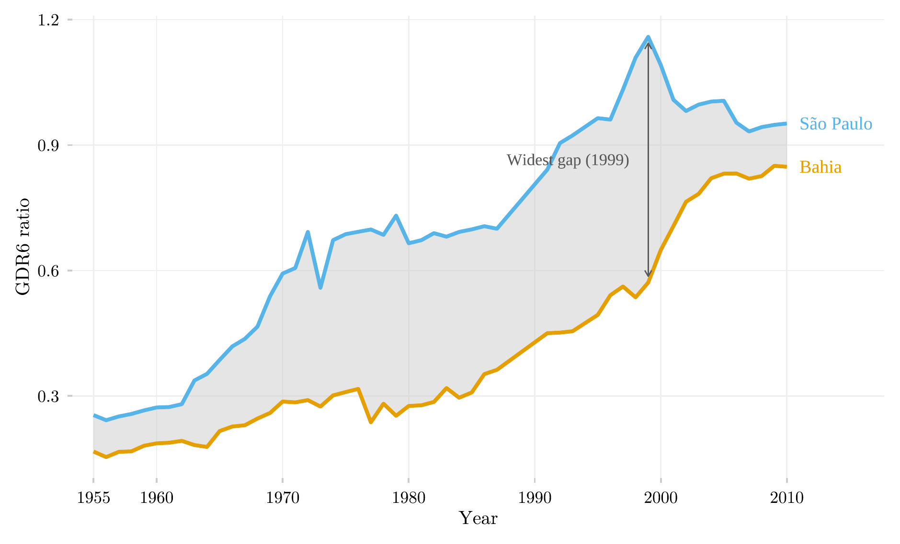

## Overview

This figure compares two Brazilian states, São Paulo and Bahia, on how well children progressed through the early grades of primary school, from 1955 to 2010. It shows a large and persistent regional gap in basic education that narrows only after reforms in the 1990s — long before either state's population would reach the tertiary-education pipelines examined elsewhere in this catalog.

## Methodology

GDR6 proxies early-primary retention: enrollment in grades 4–6 relative to grades 1–3. The grey band is the São Paulo–Bahia gap; it widens through the developmentalist decades and only narrows substantially after the 1990s reforms, tracing half a century of regional educational inequality in a single band.

## How to Cite

If you use this figure or the pipeline behind it, please cite both the dissertation and this specific analysis. References follow APA 7th edition.

**Dissertation (in preparation; the entry will be updated after the defense):**

> Mançano, T. (2026). *Inequality in access to tertiary education in Brazil: Household incomes, reforming policies, and the politics of who gets in (1990s–2020s)* [Unpublished master's thesis]. University of São Paulo.

**This figure and pipeline:**

> Mançano, T. (2026, July 12). *Grade progression ratio (GDR6) in São Paulo and Bahia* [Figure and reproducible pipeline]. Open Data Analysis. https://mancano-tales.github.io/open-data-analysis/posts/educabr2-progression-gdr6/

**In text:** (Mançano, 2026) — when citing several analyses from this catalog in the same work, APA distinguishes them as 2026a, 2026b, … in the order they appear in the reference list.

**BibTeX:**

```bibtex
@mastersthesis{Mancano2026Thesis,
  author = {Man\c{c}ano, Tales},
  title  = {Inequality in Access to Tertiary Education in Brazil: Household
            Incomes, Reforming Policies, and the Politics of Who Gets In
            (1990s--2020s)},
  school = {University of S\~{a}o Paulo},
  year   = {2026},
  type   = {Master's thesis},
  note   = {Unpublished; Graduate Program in Political Science}
}

@misc{Mancano2026_educabr2_progression_gdr6,
  author       = {Man\c{c}ano, Tales},
  title        = {Grade progression ratio (GDR6) in S\~{a}o Paulo and Bahia},
  year         = {2026},
  month        = jul,
  howpublished = {Open Data Analysis, \url{https://mancano-tales.github.io/open-data-analysis/posts/educabr2-progression-gdr6/}},
  note         = {Figure and reproducible pipeline. Source code: \url{https://github.com/mancano-tales/open-data-analysis}, folder posts/educabr2-progression-gdr6/. Accessed YYYY-MM-DD}
}
```

A permanent version (Git tag + Zenodo DOI) will be linked here once the dissertation is defended; until then, cite the page URL above and add the date you accessed it (source code: https://github.com/mancano-tales/open-data-analysis, folder `posts/educabr2-progression-gdr6/`).

## Pipeline

Scripts for this analysis:

- Plotting: [`plot.R`](plot.R) — writes the figure to `output/figures/educabr2-progression-gdr6/` — compare it with this post's `thumbnail.png`
- Upstream pipeline: no upstream script in this repository — the data comes embedded in the R package [`educabr2`](https://github.com/mancano-tales/educabr2) (`remotes::install_github("mancano-tales/educabr2")`).

## Reproducibility

**Tier: A (cross-repo)**

This pipeline depends on the public R package `educabr2` (`remotes::install_github("mancano-tales/educabr2")`), which already embeds the necessary data.
