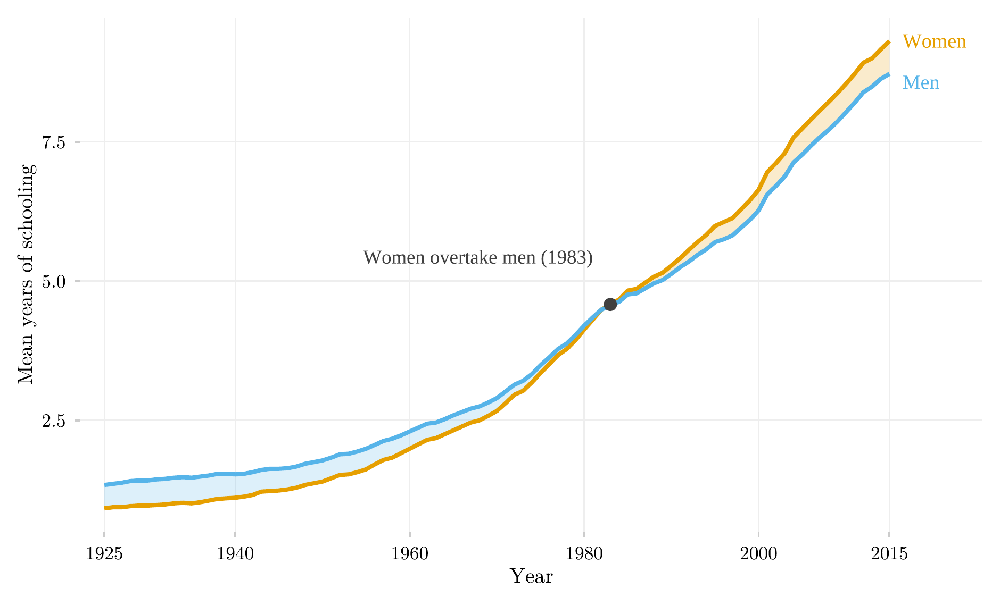

## Overview

This figure tracks average years of schooling for Brazilian women and men, ages 15–64, from 1925 to 2015. It shows a long-run reversal: women started the century with less schooling than men and ended it with more, and the figure marks the exact year that crossover happened.

## Methodology

The shaded band is the schooling gap between the sexes; its color switches when the sign of the gap flips. Brazilian women moved from a persistent schooling deficit to a durable advantage over the twentieth century — the crossover year is marked directly on the series.

## How to Cite

If you use this figure or its underlying pipeline, please cite both the dissertation and this repository.

**Dissertation:**

> Mançano, Tales. 2026. *Inequality in Access to Tertiary Education in Brazil: Household Incomes, Reforming Policies, and the Politics of Who Gets In (1990s–2020s)*. Master's thesis, Graduate Program in Political Science, University of São Paulo.

```bibtex
@mastersthesis{Mancano2026,
  author = {Man\c{c}ano, Tales},
  title  = {Inequality in Access to Tertiary Education in Brazil: Household
            Incomes, Reforming Policies, and the Politics of Who Gets In
            (1990s--2020s)},
  school = {University of S\~{a}o Paulo},
  year   = {2026},
  type   = {Master's thesis},
  note   = {Graduate Program in Political Science}
}
```

**This figure and pipeline:**

> Mançano, Tales. 2026. "Average Years of Schooling by Sex." In *Open Data Analysis*. <https://github.com/mancano-tales/open-data-analysis>, `posts/educabr2-schooling-sex/`.

```bibtex
@misc{Mancano2026OpenDataAnalysis,
  author       = {Man\c{c}ano, Tales},
  title        = {Open Data Analysis: Average Years of Schooling by Sex},
  year         = {2026},
  howpublished = {\url{https://github.com/mancano-tales/open-data-analysis}},
  note         = {posts/educabr2-schooling-sex/}
}
```

A permanent version (Git tag + Zenodo DOI) will be linked here once the dissertation is defended; until then, cite the repository URL above.

## Pipeline

Scripts for this analysis:

- Plotting: [`plot.R`](plot.R)
- Upstream pipeline: no script in this repository — the data comes embedded in the R package [`educabr2`](https://github.com/mancano-tales/educabr2).

## Reproducibility

**Tier: A (cross-repo)**

This pipeline depends on the public R package `educabr2` (`remotes::install_github("mancano-tales/educabr2")`), which already embeds the necessary data.
