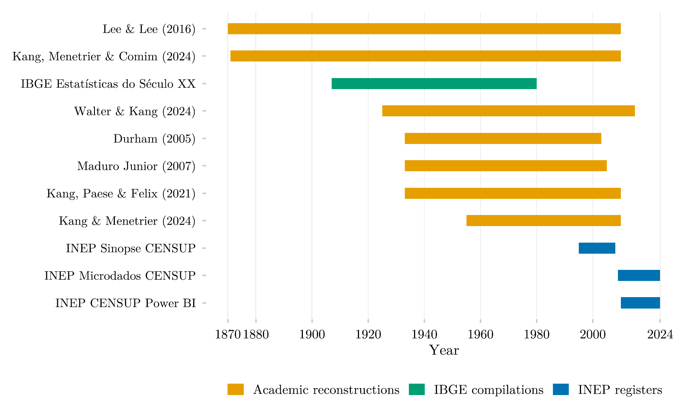

## Overview

This figure explains why the `educabr2` package exists in the first place: it shows the eleven historical data sources it harmonizes, and exactly which years each one covers, from 1870 to 2024. No single source spans the whole period — the package's job is to stitch together official registers, historical compilations, and academic reconstructions into one continuous panel.

## Methodology

Each bar spans the years covered by one bundled source. No single source covers the full century: official registers begin only in 1995, historical compilations stop in 1980, and the gap between them is bridged by academic reconstructions. Harmonizing these overlapping, partial series into one continuous panel is the package's reason to exist.

## How to Cite

If you use this figure or the pipeline behind it, please cite both the dissertation and this specific analysis. References follow APA 7th edition.

**Dissertation (in preparation; the entry will be updated after the defense):**

> Mançano, T. (2026). *Inequality in access to tertiary education in Brazil: Household incomes, reforming policies, and the politics of who gets in (1990s–2020s)* [Unpublished master's thesis]. University of São Paulo.

**This figure and pipeline:**

> Mançano, T. (2026, July 12). *Temporal coverage of sources harmonized by educabr2* [Figure and reproducible pipeline]. Open Data Analysis. https://mancano-tales.github.io/open-data-analysis/posts/educabr2-source-coverage/

**In text:** (Mançano, 2026) — when citing several analyses from this catalog in the same work, APA distinguishes them as 2026a, 2026b, … in the order they appear in the reference list.

**BibTeX:**

```bibtex
@mastersthesis{Mancano2026Thesis,
  author = {Man\c{c}ano, Tales},
  title  = {Inequality in Access to Tertiary Education in Brazil: Household
            Incomes, Reforming Policies, and the Politics of Who Gets In
            (1990s--2020s)},
  school = {University of S\~{a}o Paulo},
  year   = {2026},
  type   = {Master's thesis},
  note   = {Unpublished; Graduate Program in Political Science}
}

@misc{Mancano2026_educabr2_source_coverage,
  author       = {Man\c{c}ano, Tales},
  title        = {Temporal coverage of sources harmonized by educabr2},
  year         = {2026},
  month        = jul,
  howpublished = {Open Data Analysis, \url{https://mancano-tales.github.io/open-data-analysis/posts/educabr2-source-coverage/}},
  note         = {Figure and reproducible pipeline. Source code: \url{https://github.com/mancano-tales/open-data-analysis}, folder posts/educabr2-source-coverage/. Accessed YYYY-MM-DD}
}
```

A permanent version (Git tag + Zenodo DOI) will be linked here once the dissertation is defended; until then, cite the page URL above and add the date you accessed it (source code: https://github.com/mancano-tales/open-data-analysis, folder `posts/educabr2-source-coverage/`).

## Pipeline

Scripts for this analysis:

- Plotting: [`plot.R`](plot.R) — writes the figure to `output/figures/educabr2-source-coverage/` — compare it with this post's `thumbnail.png`
- Upstream pipeline: no upstream script in this repository — the data comes embedded in the R package [`educabr2`](https://github.com/mancano-tales/educabr2) (`remotes::install_github("mancano-tales/educabr2")`).

## Reproducibility

**Tier: A (cross-repo)**

This pipeline depends on the public R package `educabr2` (`remotes::install_github("mancano-tales/educabr2")`), which already embeds the necessary data.
