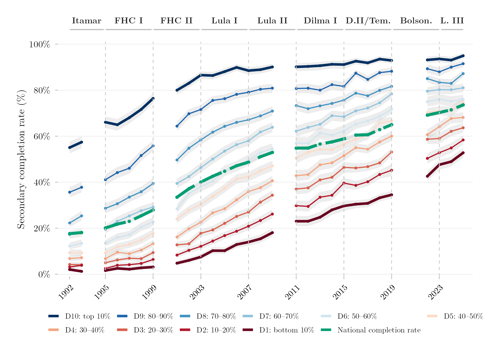

## Overview

This figure tracks the share of Brazilians who completed upper-secondary education (Ensino Médio) over time, by household income decile. Because completing upper-secondary school is the main prerequisite for accessing tertiary education, this series provides useful context for the tertiary-access figures elsewhere in this catalog: it shows how much of the gap in higher-education access originates further back, at the level below it.

## Methodology

Share of the population who completed upper-secondary education (Ensino Médio), by income decile, computed the same way as the tertiary-access series: within-year, within-source deciles from strictly positive per-capita household income, harmonized across PNAD Anual (through 2015) and PNAD Contínua (2016 onward), with 2000/2010 (census years, no PNAD fielded) and 2020–2021 (pandemic) excluded.

## How to Cite

If you use this figure or its underlying pipeline, please cite both the dissertation and this repository.

**Dissertation:**

> Mançano, Tales. 2026. *Inequality in Access to Tertiary Education in Brazil: Household Incomes, Reforming Policies, and the Politics of Who Gets In (1990s–2020s)*. Master's thesis, Graduate Program in Political Science, University of São Paulo.

```bibtex
@mastersthesis{Mancano2026,
  author = {Man\c{c}ano, Tales},
  title  = {Inequality in Access to Tertiary Education in Brazil: Household
            Incomes, Reforming Policies, and the Politics of Who Gets In
            (1990s--2020s)},
  school = {University of S\~{a}o Paulo},
  year   = {2026},
  type   = {Master's thesis},
  note   = {Graduate Program in Political Science}
}
```

**This figure and pipeline:**

> Mançano, Tales. 2026. "Secondary Education Completion Rate by Income Decile." In *Open Data Analysis*. <https://github.com/mancano-tales/open-data-analysis>, `posts/em-conclusao-decil/`.

```bibtex
@misc{Mancano2026OpenDataAnalysis,
  author       = {Man\c{c}ano, Tales},
  title        = {Open Data Analysis: Secondary Education Completion Rate by Income Decile},
  year         = {2026},
  howpublished = {\url{https://github.com/mancano-tales/open-data-analysis}},
  note         = {posts/em-conclusao-decil/}
}
```

A permanent version (Git tag + Zenodo DOI) will be linked here once the dissertation is defended; until then, cite the repository URL above.

## Pipeline

Scripts for this analysis:

- Plotting: [`plot.R`](plot.R)
- Upstream pipeline:
  - [`shared-pipeline/pnadc/035_Splice_Microdados.R`](../../shared-pipeline/pnadc/035_Splice_Microdados.R)

## Reproducibility

**Tier: A**

This pipeline uses only public data, accessible via package/API without any credential (PNADcIBGE, censobr, sidrar, ipeadatar). Run the scripts in `shared-pipeline/` in numeric order to reconstruct the intermediate data.
