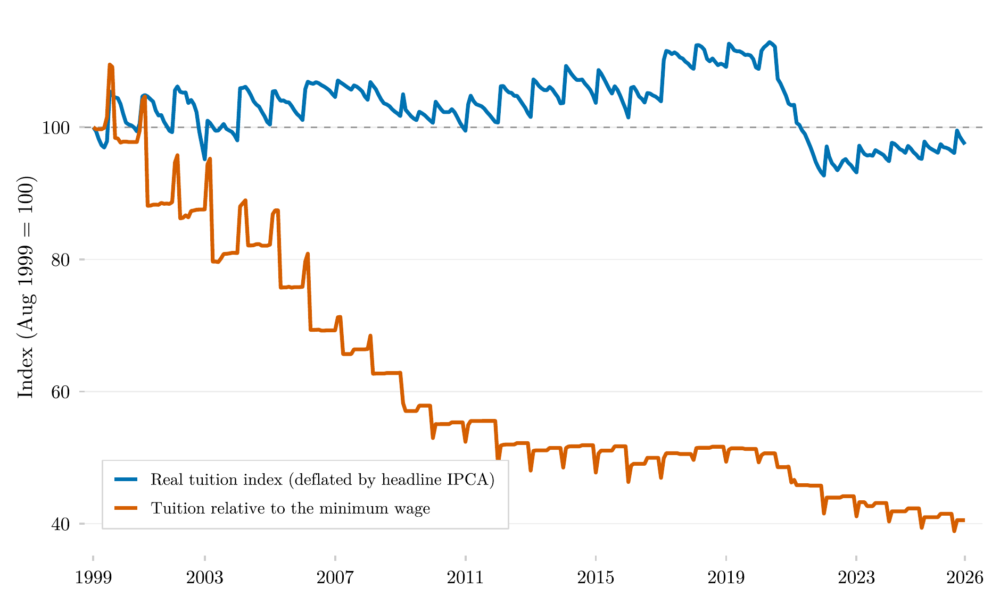

## Overview

This figure tracks how the cost of higher-education tuition in Brazil moved relative to two benchmarks since 1999: overall consumer price inflation, and the minimum wage. It shows whether tuition became more or less expensive in real terms, and, separately, whether it became more or less affordable relative to the wage floor that a large share of Brazilian households' income is anchored to.

## Methodology

Both series track the higher-education tuition subitem of the IPCA, Brazil's headline consumer price index, spliced from the four vintages of the subitem-level SIDRA series (tables 655, 2938, 1419, and 7060) and expressed as a cumulative index with August 1999 = 100. The blue series deflates cumulative tuition readjustments by the headline IPCA: values above 100 indicate tuition rose faster than overall consumer prices after August 1999. The orange series divides the same tuition index by the nominal minimum wage (IPEADATA series `MTE12_SALMIN12`), measuring how the cost of the same tuition bill evolved relative to the wage floor. The IPCA subitem is a price-change index computed over a fixed panel of institutions: it measures readjustment, not the price level or the average market ticket, and does not capture compositional cheapening through migration toward distance learning and lower-priced institutions. In real terms, tuition tracked or exceeded headline inflation until 2020 and fell below the 1999 benchmark only after the nominal tuition cuts of 2021; relative to the minimum wage, tuition fell by roughly 60%, with most of the decline concentrated in 2001–2012.

## Pipeline

Scripts for this analysis:

- Plotting: [`plot.R`](plot.R) — this script is itself the pipeline's canonical script, also available at [`shared-pipeline/ipca/010_IPCA_Curso_Superior_Series.R`](../../shared-pipeline/ipca/010_IPCA_Curso_Superior_Series.R).

## Reproducibility

**Tier: A**

This pipeline uses only public data, accessible via package/API without any credential (PNADcIBGE, censobr, sidrar, ipeadatar). Run the scripts in `shared-pipeline/` in numeric order to reconstruct the intermediate data.
