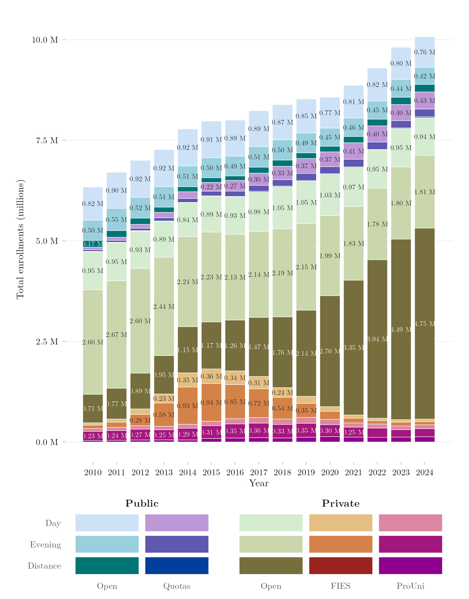

## Overview

This figure breaks down Brazilian higher-education enrollment by sector (public vs. private), access route (how the student got their seat — scholarship, loan, reserved quota, or open admission), and time of day (morning/evening in-person, or distance learning). It offers a detailed map of the different doors through which students enter the system, and how the size of each door has changed.

## Methodology

Built from student-level records of the Higher Education Census (Censo da Educação Superior), extracted via INEP's protected-access platform SEDAP+ (Serviço de Acesso a Dados Protegidos), because INEP stopped publishing the full student-level microdata after 2019. Sector follows the institution's administrative category (public vs. private). Access route is assigned by precedence within the private sector — ProUni scholarship first, then FIES loan among those without ProUni, then open admission — so categories are disjoint by construction. Within the public sector the split is reserved seat (affirmative-action quota) versus open admission. SEDAP+ answers only aggregate queries and applies differential privacy, which in practice suppresses cells with few individuals rather than adding appreciable noise; the extraction groups at exactly the granularity the figure displays, at which no cell is suppressed. Against published microdata for years where both exist, SEDAP+ totals run 0.6% to 1.1% low, a small and systematic gap.

## Pipeline

Scripts for this analysis:

- Plotting: [`plot.R`](plot.R)
- Upstream pipeline:
  - [`shared-pipeline/sedap/020_Extrair_Nicho_2020_2024.R`](../../shared-pipeline/sedap/020_Extrair_Nicho_2020_2024.R)
  - [`shared-pipeline/sedap/010_SEDAP_Cliente.R`](../../shared-pipeline/sedap/010_SEDAP_Cliente.R)

## Reproducibility

**Tier: B**

This pipeline depends on restricted INEP data accessible via SEDAP+ credentials (`SEDAP_TOKEN` environment variable). Without an approved credential, the scripts in `shared-pipeline/sedap/` will not run — the logic remains available for audit, but full reproduction requires requesting access.
